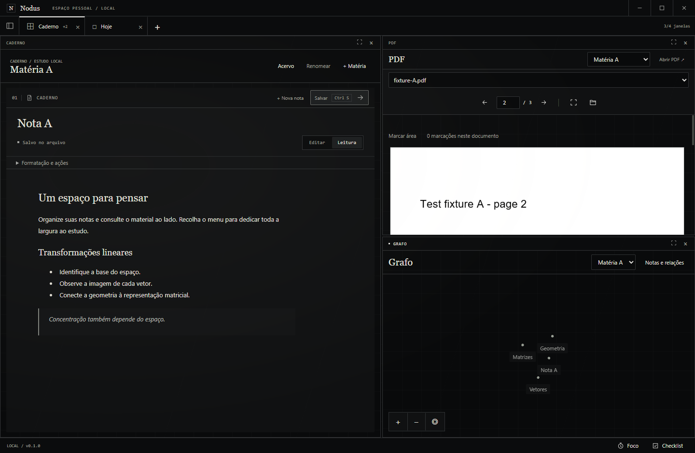
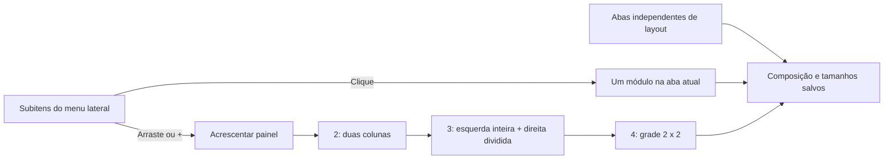
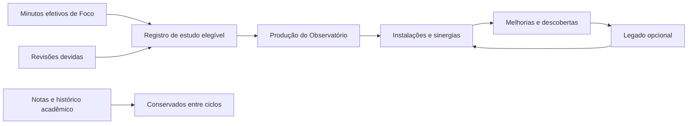
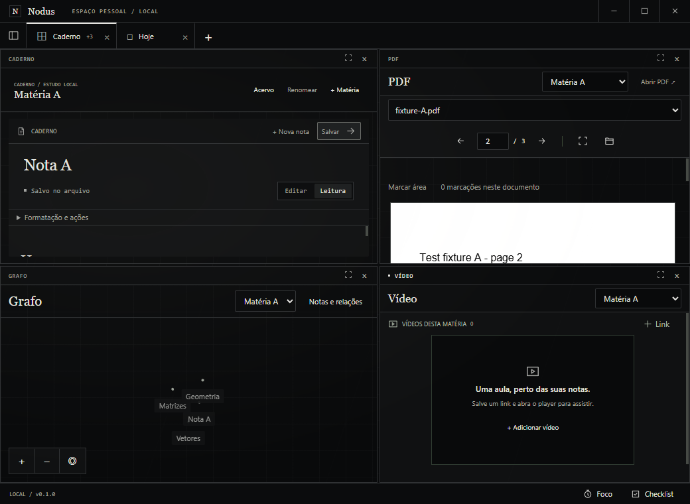
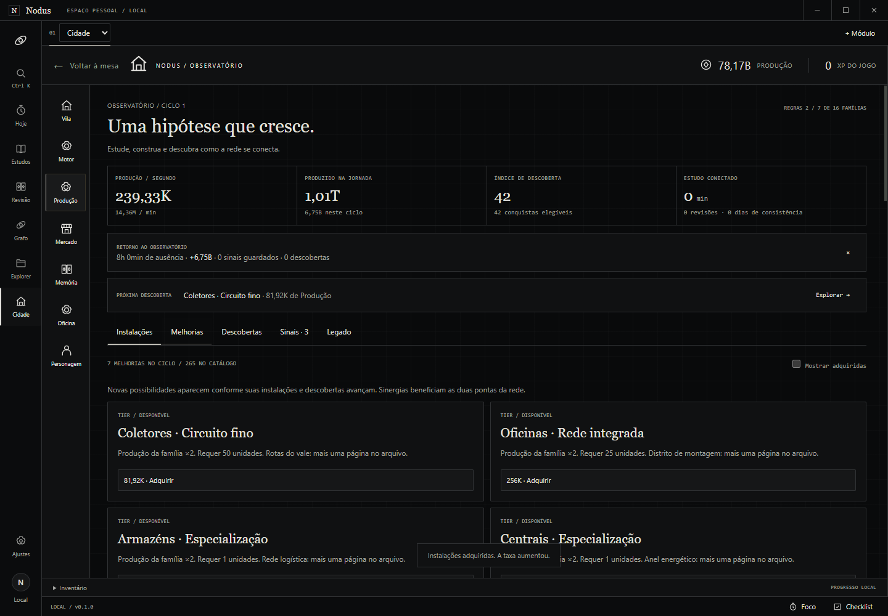
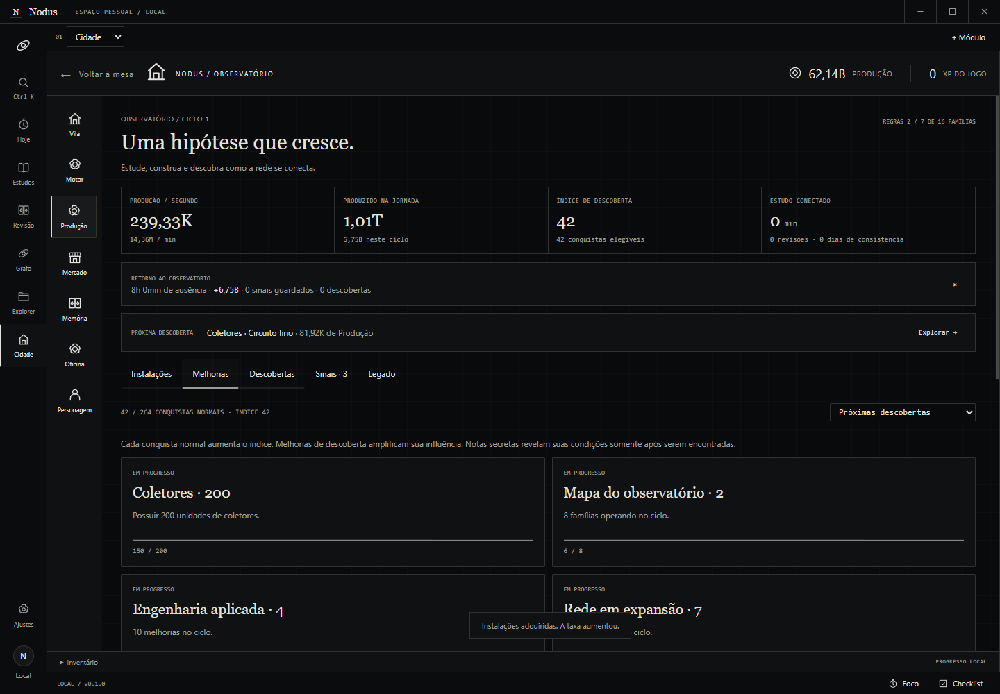
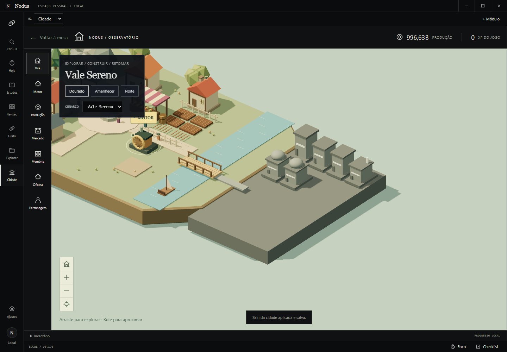
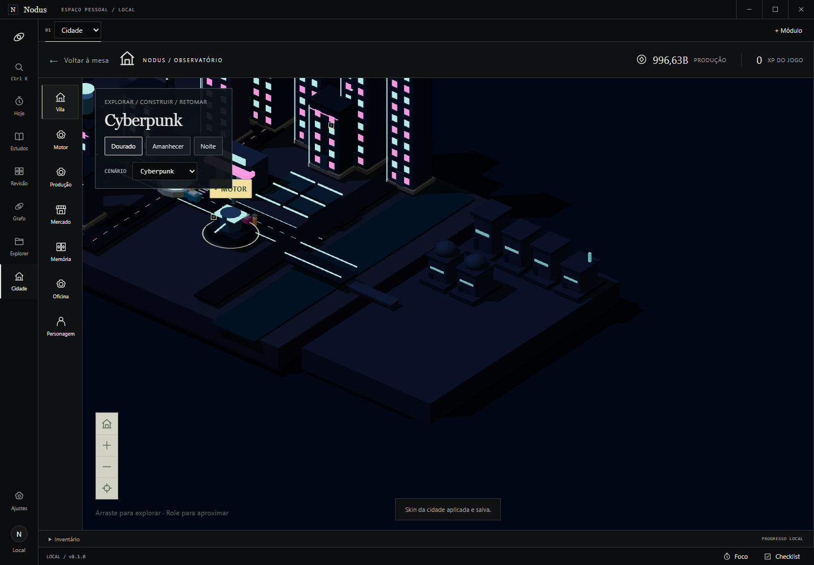
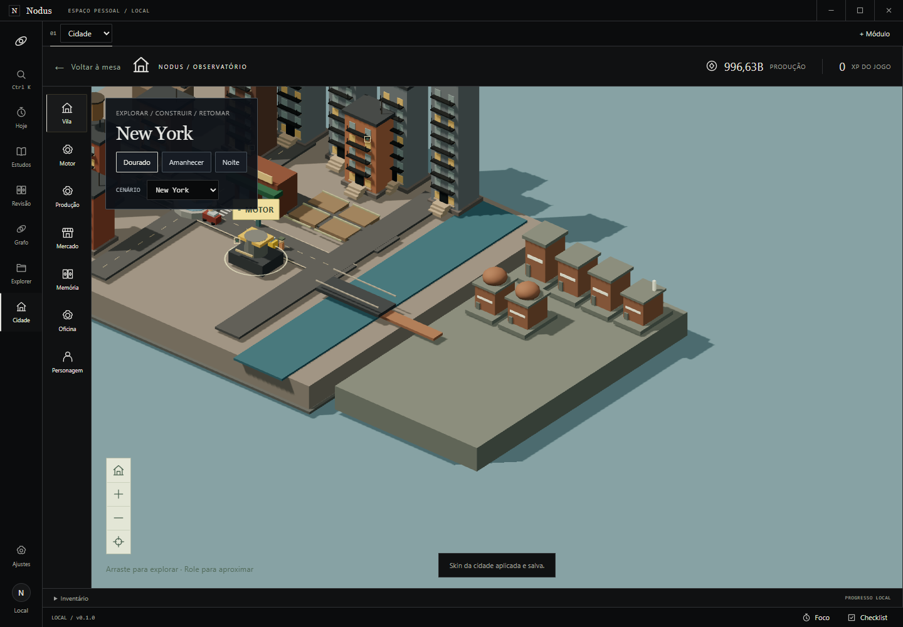
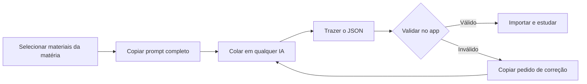

<div align="center">

<h1>Nodus</h1>
<p><strong>Um espaço para estudar, conectar ideias e construir sua rotina.</strong></p>
<p>Notas, PDFs, aulas, revisão e uma cidade que cresce com seu estudo.<br>Uma mesa local, organizada do seu jeito, no Windows.</p>

<p>
  <a href="docs/validation/ALPHA.md"></a>
  <a href="docs/validation/SIDEBAR.md"></a>
  <a href="docs/architecture/data-model.md"></a>
</p>
<p>
  
  
  
  
  
</p>

<p>
  <a href="#funcionalidades">Funcionalidades</a> ·
  <a href="#galeria">Galeria</a> ·
  <a href="#ia-externa">IA externa</a> ·
  <a href="#começar-no-windows">Começar</a> ·
  <a href="#arquitetura">Arquitetura</a> ·
  <a href="docs/GUIA_DE_USO.md">Guia de uso</a>
</p>

<a href="docs/validation/evidence/sidebar/collapsed-three.png">
  
</a>
<p><sub>Caderno, PDF e grafo lado a lado. Menu recolhido para liberar a mesa. Captura real no Windows com materiais de demonstração.</sub></p>

</div>

---

## Funcionalidades

O Nodus reúne o material da matéria e o contexto que você precisa para retomar. Comece com um módulo; abra mais painéis quando fizer sentido. As funcionalidades abaixo já estão integradas à `main`.

### Uma mesa para estudar

| Área | O que você pode fazer |
| :--- | :--- |
| **Matérias e notas** | Organizar o acervo, editar Markdown com CodeMirror, alternar fonte/prévia e salvar com `Ctrl+S`. Conflitos externos conservam as duas versões; rascunhos são recuperáveis. |
| **Abas e painéis** | Manter até **quatro módulos por aba**, arrastar subitens laterais para dividir a tela e ajustar os separadores. Clicar no menu deixa a aba atual somente com o módulo escolhido. |
| **PDF** | Ler arquivos locais, retomar a página, ajustar o documento à área e guardar marcações com comentários vinculados às notas. |
| **Aulas em vídeo** | Salvar links YouTube por matéria, anotar momentos e usar cinema ou PiP interno arrastável. O player oficial abre por ação do usuário e precisa de internet. |
| **Flashcards e revisão** | Criar cartões manualmente, revelar o verso e registrar autoavaliação. A revisão espaçada acompanha o próximo vencimento. |
| **Grafo de notas** | Explorar relações manuais entre notas reais, focar um conceito e abrir sua fonte; câmera com pan/zoom e movimento reduzido. |
| **Foco, checklist e Hoje** | Planejar etapas e próxima ação, escolher a duração do foco, pausar/retomar e consultar o resumo da rotina. Foco e checklist ficam em ferramentas suspensas. |
| **Busca** | Usar `Ctrl+K` para localizar notas e materiais do catálogo local. |
| **Explorer** | Registrar pastas, organizar projetos principais/secundários e editar arquivos UTF-8 existentes em abas, com conflito e recuperação. |
| **Exportação e backup** | Exportar notas/pastas para PDF preto com capa e sumário. Criar snapshots locais e restaurar em uma cópia separada, preservando o perfil original. |

<table>
  <tr>
    <td width="50%" valign="top">
      <h3>Editorial, com espaço para o conteúdo</h3>
      <p>Fundo quase preto, grid visível, bordas finas, títulos serifados e informação compacta. Oliva, Grafite e Azul noite continuam disponíveis.</p>
    </td>
    <td width="50%" valign="top">
      <h3>Seu espaço, sua escolha</h3>
      <p>Recolha o menu inteiro, use uma janela ou componha a grade. Fundo Editorial animado e animações da interface podem ser desligados; o movimento reduzido do Windows é respeitado.</p>
    </td>
  </tr>
</table>

Com três painéis, a esquerda ocupa toda a altura e a direita fica dividida. Com quatro, a grade vira **2×2**. Abas preservam composição, foco e tamanhos; matéria, documento e player continuam compartilhados entre elas.



### Uma cidade que acompanha a rotina

O **Observatório** conecta minutos efetivos de Foco e revisões elegíveis à produção da cidade. XP e moedas pertencem ao jogo; não são uma medida de domínio acadêmico.

| Sistema | Experiência disponível |
| :--- | :--- |
| **Produção** | **16 famílias de instalações**, compras ×1/×10/×100/MAX, participação na taxa e conexões entre produtores. |
| **Melhorias e descobertas** | Catálogo de **305 melhorias** e **284 conquistas**, com requisitos, especializações, sinergias e marcos progressivos. |
| **Sinais e combinações** | Oportunidades guardadas durante o foco, efeitos temporários e combinação de tipos diferentes depois de estudar. |
| **Produção offline** | Até sete dias por padrão, com extensão pelo legado e resumo do retorno. |
| **Prestígio opcional** | Prévia do novo ciclo e bônus permanentes. Notas, materiais e histórico de estudo são preservados. Você pode continuar sem reiniciar. |
| **Motor e Oficina** | Cliques consecutivos com feedback; QTE e calibração com **36 etapas** e dificuldade crescente, preparo somente antes de começar. |
| **Vila e personagem** | Cultivo, coleta, mercado, Memória de Conceitos e distribuição gratuita de pontos da build. |
| **Cenários completos** | Vale Sereno, **Cyberpunk** e **New York**, com construções, iluminação e atmosfera próprias. |



[Regras atuais da economia](docs/architecture/economy.md) · [Modelos de equilíbrio e limites](docs/decisions/deep-production-balance.md).

## Galeria

Capturas do executável real no Windows, com **fixtures de demonstração**. Saldo e progresso de jogo foram preparados para mostrar sistemas avançados; não representam tempo de estudo humano. Clique nas imagens para ampliar. A interface de algumas capturas anteriores conserva a navegação da versão em que foram registradas.

<table>
  <tr>
    <td width="50%" align="center" valign="top">
      <a href="docs/validation/evidence/study-tabs/four.png"></a>
      <p><strong>Quatro painéis por aba</strong><br><sub>Material e ferramentas juntos, com divisores ajustáveis.</sub></p>
    </td>
    <td width="50%" align="center" valign="top">
      <a href="docs/validation/evidence/sidebar/compact-four.png"></a>
      <p><strong>Mesa compacta</strong><br><sub>Menu recolhido e módulos adaptados a 1040×760.</sub></p>
    </td>
  </tr>
  <tr>
    <td width="50%" align="center" valign="top">
      <a href="docs/evidence/gam-04/upgrades.png"></a>
      <p><strong>Produção e melhorias</strong><br><sub>Requisitos, especializações e sinergias entre instalações.</sub></p>
    </td>
    <td width="50%" align="center" valign="top">
      <a href="docs/evidence/gam-04/achievements.png"></a>
      <p><strong>Descobertas</strong><br><sub>Marcos do ciclo, progresso e conquistas já reveladas.</sub></p>
    </td>
  </tr>
</table>

<details>
<summary><strong>Explorar os três cenários da cidade</strong></summary>

<table>
  <tr>
    <td width="33%" align="center">
      <a href="docs/evidence/gam-04/district-original.png"></a>
      <p><strong>Vale Sereno</strong><br><sub>Casas, jardins e luz natural.</sub></p>
    </td>
    <td width="33%" align="center">
      <a href="docs/evidence/gam-04/district-cyberpunk.png"></a>
      <p><strong>Cyberpunk</strong><br><sub>Torres, néon e infraestrutura futurista.</sub></p>
    </td>
    <td width="33%" align="center">
      <a href="docs/evidence/gam-04/district-newyork.png"></a>
      <p><strong>New York</strong><br><sub>Avenidas, brownstones e skyline urbano.</sub></p>
    </td>
  </tr>
</table>

</details>

<div align="center">
  <p><sub>Provas: <a href="docs/validation/STUDY_TABS.md">abas e grade</a> · <a href="docs/validation/SIDEBAR.md">menu recolhível</a> · <a href="docs/validation/DEEP_PRODUCTION.md">Observatório e cenários</a></sub></p>
</div>

## IA externa

<div align="center">
  <a href="https://github.com/rafafrd/Nodus/pull/13"></a>
  <p><strong>Escolha sua IA. Traga a atividade de volta ao Nodus.</strong></p>
</div>

**Implementado e validado na branch `codex/external-study-activities`; ainda não integrado à `main`.** O [PR #13](https://github.com/rafafrd/Nodus/pull/13) entrega questionários e flashcards a partir das fontes selecionadas, por um fluxo manual sem chave de API nem chamadas automáticas.



| Atividade | Como funciona no PR |
| :--- | :--- |
| **Questionário** | Dez questões, quatro alternativas A–D e uma correta. Respostas retomáveis; gabarito, explicações e KPIs ao finalizar. |
| **Flashcards** | Dez cartões com frente, verso e explicação, revelação manual e autoavaliação integrada à revisão existente. |
| **Importação e correção** | Colagem ou arquivo JSON, prévia, validação estrita e pedido de correção com problemas concretos. Original preservado e reimportação sem duplicar a atividade. |
| **Fontes conferíveis** | Snapshot com conteúdo integral, IDs e localizações; complementos de conhecimento geral identificados e acesso ao trecho original. |

<table>
  <tr>
    <td width="50%" align="center" valign="top">
      <a href="https://raw.githubusercontent.com/rafafrd/Nodus/6396e3246ac342027df86437d1458b190693c53a/docs/validation/evidence/external-activities/prompt.png"></a>
      <p><strong>Preparar o prompt</strong><br><sub>Prévia do PR #13, com fontes de demonstração.</sub></p>
    </td>
    <td width="50%" align="center" valign="top">
      <a href="https://raw.githubusercontent.com/rafafrd/Nodus/6396e3246ac342027df86437d1458b190693c53a/docs/validation/evidence/external-activities/results.png"></a>
      <p><strong>Estudar e conferir o resultado</strong><br><sub>Atividade real importada a partir de uma fixture JSON.</sub></p>
    </td>
  </tr>
</table>

[Fluxo e limites do PR](https://github.com/rafafrd/Nodus/blob/6396e3246ac342027df86437d1458b190693c53a/docs/features/atividades-ia-externa.md) · [Contrato JSON 1.0](https://github.com/rafafrd/Nodus/blob/6396e3246ac342027df86437d1458b190693c53a/docs/contracts/study-activity-v1.md). Validar o formato não certifica correção acadêmica; as referências permitem conferir o material.

## Começar no Windows

Use **Node.js 24** e npm. O `package-lock.json` fixa as dependências; não é necessário configurar uma chave de IA para iniciar a mesa local.

```powershell
git clone https://github.com/rafafrd/Nodus.git
cd Nodus
npm.cmd ci
npm.cmd run dev
```

| Objetivo | Comando |
| :--- | :--- |
| Desenvolver | `npm.cmd run dev` |
| Gerar a build local | `npm.cmd run build` |
| Abrir a build local | `npm.cmd run start` |
| Conferir TypeScript | `npm.cmd run typecheck` |
| Executar testes | `npm.cmd test` |
| Conferir documentação | `npm.cmd run check:docs` |
| Gerar o pacote Windows | `npm.cmd run package:win` |

O pacote é gerado em `release/win-unpacked/App Estudos.exe`. Para mover a build, copie a pasta **win-unpacked inteira**. O executável ainda se chama **App Estudos**; esta entrega é um pacote local, sem instalador, assinatura ou release publicada.

### Seu primeiro estudo

1. Abra **Caderno**, crie uma matéria e escolha a pasta de notas, o vault.
2. Crie ou importe uma nota Markdown. Edite, use `Ctrl+S` e alterne para Leitura quando quiser consultar a prévia.
3. Clique em **PDF** ou **Vídeo** para usar o módulo sozinho; arraste um subitem lateral para o centro para adicioná-lo à aba atual.
4. Crie outras abas pelo `+`, ajuste os divisores e recolha o menu para liberar espaço.
5. Abra as ferramentas de **Foco** e **Checklist**, ou visite Revisão para criar e estudar cartões.
6. Volte depois: matéria, página, layout e rascunhos são retomados. O foco pausa no fechamento normal.

| Atalho | Ação |
| :--- | :--- |
| `Ctrl+S` | Salvar a nota ou arquivo em edição |
| `Ctrl+K` | Buscar no catálogo local |
| `Ctrl+T` / `Ctrl+W` | Criar / fechar aba da mesa |
| `Ctrl+Tab` / `Ctrl+Shift+Tab` | Trocar aba da mesa |
| `Ctrl+1` … `Ctrl+9` | Selecionar aba da mesa |
| `Esc` no cinema | Voltar para a mesa |

[Guia completo: estudar, jogar, exportar e restaurar](docs/GUIA_DE_USO.md).

## Arquitetura

| Camada | Tecnologias e responsabilidade |
| :--- | :--- |
| **Interface** | React 19.3, TypeScript 5.9.3, CodeMirror 6 e CSS próprio; módulos e preferências locais. |
| **Desktop** | Electron 44.5.1; main/preload com operações específicas, IPC tipado e validação de argumentos/remetente. |
| **Persistência** | Markdown canônico no vault; SQLite para estado, relações, sessões e operações. Migrações aditivas. |
| **Documentos** | PDF.js 6.3.289, prévia Markdown e exportação PDF pelo Electron. |
| **Visualização** | Three.js 0.186.1 para grafo/cidade e GSAP 3.15.0 para transições, com movimento reduzido. |
| **Domínio e build** | Zod 4.6.5, Decimal.js 10.6.0, Vite 8.3.2, esbuild e electron-builder. |

Código e versões exatas em [package.json](package.json) e [package-lock.json](package-lock.json). [Arquitetura](docs/architecture/README.md) · [Modelo de dados](docs/architecture/data-model.md) · [Decisões](docs/adr/README.md).

## Estado do projeto

| Situação | Escopo |
| :--- | :--- |
| **Disponível na main** | Mesa Windows, notas/PDF/vídeos, revisão, abas/grade, grafo, Explorer, temas, exportação, backup e cidade com produção profunda. |
| **Em revisão** | Atividades importadas de IA externa, [PR #13](https://github.com/rafafrd/Nodus/pull/13). |
| **Ainda pendente** | Consulta autenticada no celular com PC desligado, integração de agenda, tutor com geração automática, execução/Git de projetos e extração automática de relações. |

A alpha integral permanece **parcial**. A consulta em nuvem, parte da prova de edição externa e a jornada completa desktop/mobile continuam em seus tickets. Nome definitivo, licença pública e hospedagem ainda não foram definidos. As funcionalidades locais têm evidências próprias; os testes deste repositório não substituem uma prova externa pendente.

Notas ficam nas pastas escolhidas. Banco e rascunhos ficam no perfil local do app; cópias de segurança são privadas, sem criptografia própria. Faça backup antes de migrar versões. YouTube usa rede após abertura explícita; o núcleo de notas, PDF, foco e jogo funciona localmente. Explorer edita arquivos existentes, sem executá-los.

## Documentação

| Preciso de… | Documento |
| :--- | :--- |
| **Usar o aplicativo** | [Guia de uso](docs/GUIA_DE_USO.md) |
| **Saber o que está concluído** | [Estado e próxima ação](docs/status/ALPHA_STATE.md) · [Quadro de tickets](docs/tasks/README.md) |
| **Conferir provas e limitações** | [Validação da alpha](docs/validation/ALPHA.md) · [Histórico de execução](docs/status/RUN_LOG.md) |
| **Entender estudo e navegação** | [Abas e grade](docs/validation/STUDY_TABS.md) · [Menu lateral](docs/validation/SIDEBAR.md) |
| **Entender o jogo** | [Economia atual](docs/architecture/economy.md) · [Provas Windows](docs/validation/DEEP_PRODUCTION.md) |
| **Entender o código** | [Arquitetura](docs/architecture/README.md) · [SDD](docs/sdd.md) · [ADRs](docs/adr/README.md) |
| **Contribuir com contexto** | [AGENTS.md](AGENTS.md) · [CLAUDE.md](CLAUDE.md) · [Gotchas observados](gotcha.md) |

<div align="center">
  <hr>
  <p><strong>Abra um material. Conecte uma ideia. Retome de onde parou.</strong></p>
  <p><sub>Projeto pessoal em evolução · Windows primeiro · Dados locais · Estudo e jogo com progressos distintos</sub></p>
</div>
