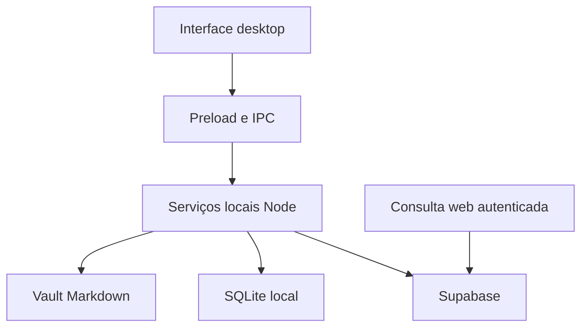

# Arquitetura ativa

Estado: desenho de implementação, sem aplicação existente neste bootstrap. Decisões aceitas indicam direção; entrega exige evidência no ticket.

## Estrutura proposta

Monólito modular com desktop e uma interface web complementar. Crie diretórios e abstrações quando o ticket precisar deles, evitando pacotes vazios para módulos futuros.

| Camada | Papel | Etapa |
| --- | --- | --- |
| Electron main/preload | Arquivos, SQLite e operações locais específicas | ALP-01/03/04 |
| React/TypeScript | Mesa e controles próprios | ALP-01/05 |
| Vault | Conteúdo canônico das notas | ALP-02/04 |
| SQLite | Identidade, referências, layout, foco, tarefas e operações | ALP-03 em diante |
| PDF | Leitura local com arquivo/página no checkpoint | ALP-06 |
| Supabase + web | Snapshot de nota, Auth e acesso por proprietário | ALP-09 |

## Limites importantes

A interface não recebe acesso genérico ao sistema. Previews de código futuros ficam separados das APIs privilegiadas. Contratos são tipados e validados na fronteira; adaptadores de arquivos/banco ficam fora dos componentes.

Markdown e metadados portáveis devem ser preservados. SQLite pode guardar rascunho para recuperação, separado da nota canônica. Alteração externa limpa atualiza a visão; conflito mantém as versões.

Na alpha, SQLite guarda matérias/estado local e Supabase recebe apenas snapshots de notas. No desenho completo, dados selecionados de planejamento/progresso/jogo terão sincronização própria; essa expansão não torna o banco da alpha automaticamente sincronizado.

## Próximas fronteiras

IA/OpenRouter, agenda Google, notificações, grafo Three.js, farm e programação seguem o roadmap. Serviços locais continuam com Node; funções de nuvem devem respeitar seu runtime próprio. Não partilhe dependências de runtime no domínio apenas porque ambas usam TypeScript.

Veja [modelo de dados](data-model.md), [SDD](../sdd.md), [ADRs](../adr/README.md) e [arquitetura completa de concepção](../planning/ARQUITETURA_APP_ESTUDOS.md).
