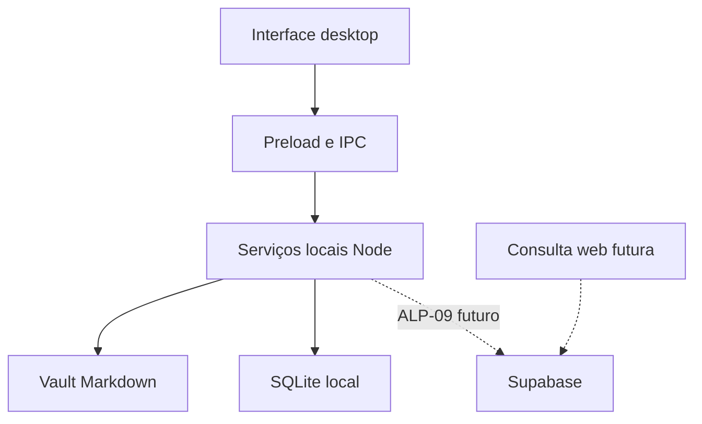

# Arquitetura ativa

Estado em 04/10/2026: Electron/React/TypeScript, editor assistido, SQLite, vault, mesa por matéria, PDF, foco e checklist implementados no MVP local. GAM-01 acrescenta cidade Three.js e economia local, conforme regras específicas. GAM-02 acrescenta motor/desafios e Explorer/editor local de arquivos. MED-01 acrescenta links YouTube por matéria e um player remoto isolado com cinema/PiP. CFG-01 acrescenta perfil/preferências locais e gestão pela área Configurações. NXT-01 conecta busca, Hoje, flashcards, marcações, momentos, grafo e cópias locais; as provas ficam na validação específica. Supabase e consulta web ainda não implementados. Evidências em docs/validation/ALPHA.md.

## Estrutura proposta

IA-01 acrescenta atividades manuais por IA externa: Zod4/JSON Schema compartilhado, parser estrito, seleção explícita e snapshots locais. StudyActivities no main transaciona importação/revisões/tentativas; Study.review continua responsável pelos cartões. PDF.js existente extrai páginas em sessão/BrowserWindow efêmeras sem IPC privilegiado e com rede negada. SQLite7 é aditivo; backups5/6/7 conservados. [Contrato](../contracts/study-activity-v1.md), [fluxo](../features/atividades-ia-externa.md), [ADR-0017](../adr/0017-atividades-ia-externa.md). Não há chamada automática de IA ou chave neste fluxo.

NXT-01 usa schema5 aditivo, catálogo/Hoje/revisão/annotations no main e grafo Three.js sobre notas/relações reais. IPCs específicos guardados cobrem essas operações, export ampliado e snapshots locais. Backups em Documentos são dados privados; importação valida manifest/hash/schema/paths e restaura roots/perfil separados. Ativação usa fechamento/drafts e relaunch, sem trocar o perfil aberto silenciosamente. Decorações/ambiente são estado cosmético na economia existente. [ADR-0011](../adr/0011-expansao-estudo-local.md), [provas](../validation/STUDY_EXPANSION.md); nuvem/ALP-09 continua futura.

Monólito modular com desktop e uma interface web complementar. Crie diretórios e abstrações quando o ticket precisar deles, evitando pacotes vazios para módulos futuros.

| Camada | Papel | Etapa |
| --- | --- | --- |
| Electron main/preload | Arquivos, SQLite e operações locais específicas | ALP-01/03/04 |
| React/TypeScript | Mesa e controles próprios | ALP-01/05 |
| Vault | Conteúdo canônico das notas | ALP-02/04 |
| SQLite | Identidade, referências, layout, foco, tarefas e operações | ALP-03 em diante |
| PDF | Leitura local com arquivo/página no checkpoint | ALP-06 |
| Jogo | Cidade/farm/loja/memória/build; economia autoritativa no main | GAM-01 |
| Explorer | Pastas reais, árvore, abas, fonte UTF-8, save/conflito/recuperação; sem execução | GAM-02 |
| Configurações | SQLite settings/contratos específicos, foto raster preparada no main, paletas CSS/observador comum de movimento | CFG-01 |
| Exportação PDF | Markdown salvo/SSR seguro, Chromium isolado, A4 preto, imagens locais opcionais, Downloads/pasta escolhida e evento opaco | EXP-01/NXT-01 |
| Vídeos | Links locais por matéria; WebContentsView remoto isolado, cinema/PiP interno | MED-01 |
| Estudo conectado | Catálogo/busca, Hoje, flashcards, marcações PDF, momentos e relações manuais por matéria | NXT-01 |
| Backups | Snapshot local limitado, hash/schema/paths validados e restauração em outro perfil | NXT-01 |
| Supabase + web | Snapshot de nota, Auth e acesso por proprietário | ALP-09 |

## Limites importantes

A interface não recebe acesso genérico ao sistema. Previews de código futuros ficam separados das APIs privilegiadas. Contratos são tipados e validados na fronteira; adaptadores de arquivos/banco ficam fora dos componentes.

Markdown e metadados portáveis devem ser preservados. SQLite pode guardar rascunho para recuperação, separado da nota canônica. Alteração externa limpa atualiza a visão; conflito mantém as versões.

No MVP local, SQLite guarda matérias/estado local; Markdown fica no vault e PDFs permanecem locais. Em ALP-09, Supabase receberá apenas snapshots de notas. No desenho completo, dados selecionados de planejamento/progresso/jogo terão sincronização própria; essa expansão não torna o banco da alpha automaticamente sincronizado.

## Próximas fronteiras

IA integrada/OpenRouter, agenda Google, notificações e execução/Git de projetos seguem o roadmap. Navegação e edição de projetos foram antecipadas em GAM-02. NXT-01 implementa grafo Three.js com relações manuais; extração automática de relações e IA continuam futuras. Farm/loja/build têm um primeiro incremento local GAM-01; integração com notas e sincronização do jogo continuam futuras. Serviços locais continuam com Node; funções de nuvem devem respeitar seu runtime próprio. Não partilhe dependências de runtime no domínio apenas porque ambas usam TypeScript.

Veja [modelo de dados](data-model.md), [SDD](../sdd.md), [ADRs](../adr/README.md) e [arquitetura completa de concepção](../planning/ARQUITETURA_APP_ESTUDOS.md).

YouTube usa sessão efêmera separada, sem preload/Node/bridge/protocolo study; CSP da mesa continua sem frames. Só abrir um vídeo registrado inicia rede. URL/bounds específicos passam validação no main. A reprodução usa o mesmo guest entre modos, e fechar o destrói. [ADR-0008](../adr/0008-video-isolado.md) e [provas](../validation/YOUTUBE.md).

EXP-01 acrescenta export-notes/pdf-document/pdf-export/export-output: fontes registradas são lidas sem alteração, template SSR inerte e BrowserWindow efêmero com JavaScript/Node/preload ausentes. PDF vai para Downloads após gravação e audit de sucesso; rollback de falha remove apenas a nova saída. Sender/mainFrame/origem/contratos existentes conservados. [ADR-0010](../adr/0010-exportacao-pdf.md) e [provas](../validation/PDF_EXPORT.md).

GAM-04 conecta registros reais de Foco/revisão ao Game existente, sem mudar XP ou duplicar árvores de habilidades. Engine, catálogo validado, números grandes e curvas ficam separados; schema6 conserva carteira/ledger e backups5/6. Distrito agregado usa o loop Three.js existente. [Arquitetura econômica](economy.md), [ADR-0015](../adr/0015-producao-declarativa.md), [provas](../validation/DEEP_PRODUCTION.md).
