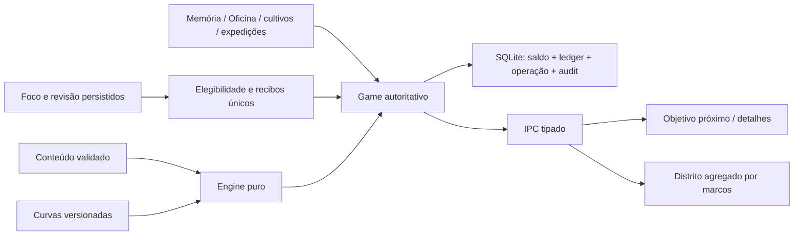

# Economia do observatório — GAM-04

Regras econômicas2, schema6, ledger novo4. O nome de produto é **Produção**; `coins` permanece no contrato e banco para evitar uma moeda/ledger paralelo. XP não mede domínio acadêmico.

## Mapa real e fases

Auditoria inicial: cinco famílias,21 tecnologias,27 conquistas, quatro permanentes, motor ilimitado, Oficina36 contínua, Memória, farm/loja e quatro builds já existiam. Foco/revisões eram reais sem crédito econômico. Mantidos Game, preload limitado, Zod strict, game_operations e ledger. Após a auditoria foi validada uma fatia de quatro famílias com matemática/efeitos/sinergia/evento; somente depois o catálogo cresceu. Os testes puros também demonstram uma17ª família sem alteração de componentes. Missões semanais/coleções/platinums não existem no código executável e não foram inventados neste incremento.

## Arquivos e extensão

| Responsabilidade | Fonte |
| --- | --- |
| Valores, representação e formatação | `src/shared/amount.ts` |
| Tipos de condição/efeito/atividade | `economy-types.ts`, `economic-activities.ts` |
| Curvas, caps e probabilidades básicas | `economy-balance.ts` |
| Famílias, templates, lore, pesos dos sinais | `economy-content.ts` |
| IDs/referências/valores finitos validados | `economy-validation.ts` |
| Efeitos, custo, MAX, pipeline, índice, prestígio | `economy.ts` |
| Transação, autoridade, tempo e recompensas | `src/main/game.ts`, `economic-study.ts` |
| Apresentação progressiva / agregados Three.js | `EconomyWorkspace.tsx`, `ProductionDistrict.ts` |

Para acrescentar uma família: registrar ID/descritivo/visual e custo/taxa na configuração, gerar seus templates e validar referências. Quantidades e cotações são derivadas do catálogo. Um upgrade com efeito existente requer somente definição, condições e parâmetros; um tipo novo de efeito requer uma implementação central do tipo, não condicionais por upgrade em componentes. Fontes futuras devem chamar o contrato de recompensa com um tipo conhecido e uma origem idempotente no Game, depois de comprovar a atividade no serviço responsável. Não enviar XP, score, preço ou tempo informado pelo renderer como autoridade.

Catálogo:16×12tiers=192;16×2sinergias=32;16especiais;25globais;40permanentes: **305**. Tiers usam1/5/25/50/100/150/200/250/300/350/400/500. Alguns dão×2, outros custo−5%/×1,5 ou ganho por unidade. Sinergias têm duas pontas e são multiplicativas.264 normais incluem quantidade/lifetime/estudo/builds/memória/Oficina/eventos;20 secretas têm progresso/condição ocultos na UI até descoberta. IDs anteriores conservados.

## Custos e números

GAM-05 amplia Game/JSON/IPC sem nova tabela: [ADR-0019](../adr/0019-projetos-e-postos-da-farm.md). `farm.ts` contém custos/objetivo/integração de estoque; `motor.ts` fornece a cotação decimal usada pelo main e simulador. `FarmProjects.tsx`/`FarmScene.ts` apresentam um objetivo e construções nas skins. Taxas/custos das famílias GAM-04 permanecem iguais. O cap anterior de64/pulso e orçamento1.200/dia agora são pisos da escala proporcional; UI em descanso não oferece ganho fictício.

`g=1,15`, `n=quantidade`, `b=base×descontos`. `C(n)=ceil(b×(g^n−1)/(g−1))`; compra `q` custa `C(n+q)−C(n)`. Arredondar o custo acumulado faz compras repartidas telescoparem:×100 tem o mesmo custo de100×1 sob os mesmos modificadores. MAX usa busca binária limitada a10.000unidades/família; não itera cada unidade. Planejamento reduz custo em1%/ponto, teto20%; efeitos de tecnologia/evento se multiplicam. Cada ação recalcula no main, antes de gastar.

Inteiros de carteira/ledger são exatos até o limite representável configurado. Cálculos de taxas/potências têm80algarismos significativos: isso é precisão finita declarada, não matemática de precisão ilimitada. NaN/Infinity/expoente fora de±1000 são rejeitados; IPC de prestígio limita tamanho e formato. Valores acima de Number seguro viajam como strings; UI usa K/M/B/T/Q e depois engenharia `eN`. Não converter saldo grande com Number, nem somar ledger grande em SQL.

## Pipeline inspecionável

Por família: `base×quantidade×tiers×bônus próprios×sinergias`. Total da rede recebe `descoberta×Foco×rede global×sinais×legado`. Breakdown expõe base, fatores ponderados, taxa individual/total, participação, parceiros e melhorias. Índice conta só conquistas elegíveis normais: fator inicial `1+índice×0,002×melhorias de descoberta`. Foco fortalece rede em1,5%/ponto, teto30%; legado dá5%/insígnia mais efeitos permanentes. O moinho existente continua parte da base.

Atividades: `floor(max(piso, taxa×minutos equivalentes)×desempenho×unidades×consistência×build×efeitos ativos)`. Foco: piso24/min ou2min de produção; revisão devida: piso40 ou0,5min. Memória/Oficina/colheita/expedição:3/5/0,3/0,05min equivalentes, com pisos e desempenho existentes. Revisão fortalece revisões/Memória; Prática fortalece minigames/expedições. Não alteramos XP, cartas, score ou timing. Partidas antigas de Memória e Oficina1/2 mantêm recompensa; novas usam versão3.

Consistência: dia com10min efetivos ou5revisões, +3%/dia, teto30%. Não retira recompensas acumuladas. Minutos vêm de elapsed_ms monotônico persistido; revisão precisa estar devida, até uma recompensa/cartão/dia e100revisões econômicas/dia. Elegibilidade e consumos têm IDs estáveis, sem depender de rowid que possa ser reutilizado. Reenvio/audit falho não duplica crédito.

## Tempo, sinais e legado

Sinais: intervalo45min ajustável, pesos/raridade em dados, seis efeitos (rede×3, família×5, cache10min, desconto20%, recompensa ativa, sinergias). Até24 guardados, sem expirar; até dois tipos temporários ativos. Durante Foco, nada exige reação e ativação é negada. Ativar é uma transação; replay não reaplica cache nem conta combo novamente. A UI só mostra contagem no espaço do jogo.

Offline: timestamp e carry de Produção×ms, quantum1s com instalações/60s sem elas; liquidação antes de compra/build/evento/prestígio. Integra segmentos em cada expiração: sinal de5min não multiplica um dia inteiro. Cap7dias ampliável até14; report mostra ausência real, produção creditada, cap, sinais e descobertas. Sem processo produtivo contínuo com app fechado. Relógio regressivo não gera crédito; perfil local continua editável pelo usuário.

Prestígio: `floor(sqrt(lifetime/1e12))−insígnias já ganhas` (mínimo0, mais direitos antigos preservados). A UI expõe próxima insígnia e confere ganho/ciclo ao confirmar. Reinicia saldo, unidades, tecnologias do ciclo, sinais ativos, nível do motor e encerra Oficina ativa. Conserva notas, materiais, projetos, revisão, Foco, XP, builds, cultivos, inventário, mercado, Memória, skins, conquistas, sinais guardados, unlocks e permanentes. Migração liquida a taxa histórica antes de adotar novas curvas e não reescreve ledger antigo.

SQLite6 reconstrói apenas game_player/game_ledger dentro da migration para INTEGER→TEXT, conserva PKs/XP/JSON/versões e acrescenta economic_receipts. Backups5/6 são validados contra seu schema canônico antes de restauração; migração ocorre somente na cópia restaurada. Fontes Markdown/projetos/PDF não são regravadas por economia.

Distrito:16agregados,103meshes compartilhando geometria/material. Marcos1/10/50/100/250/500 mudam presença/altura. Skins alteram materiais sem recriar locais. Usa o loop/demanda/movimento reduzido existente, sem timer extra. [ADR](../adr/0015-producao-declarativa.md), [modelo/simulações](../decisions/deep-production-balance.md), [provas](../validation/DEEP_PRODUCTION.md).
