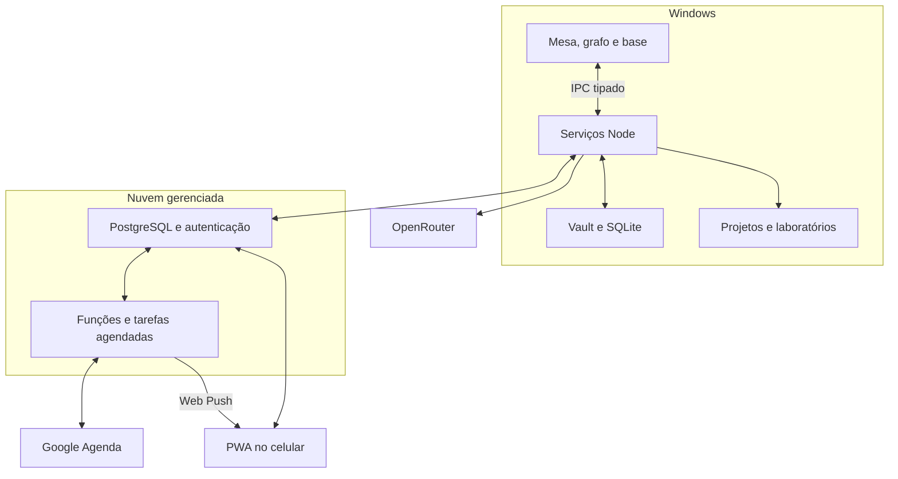
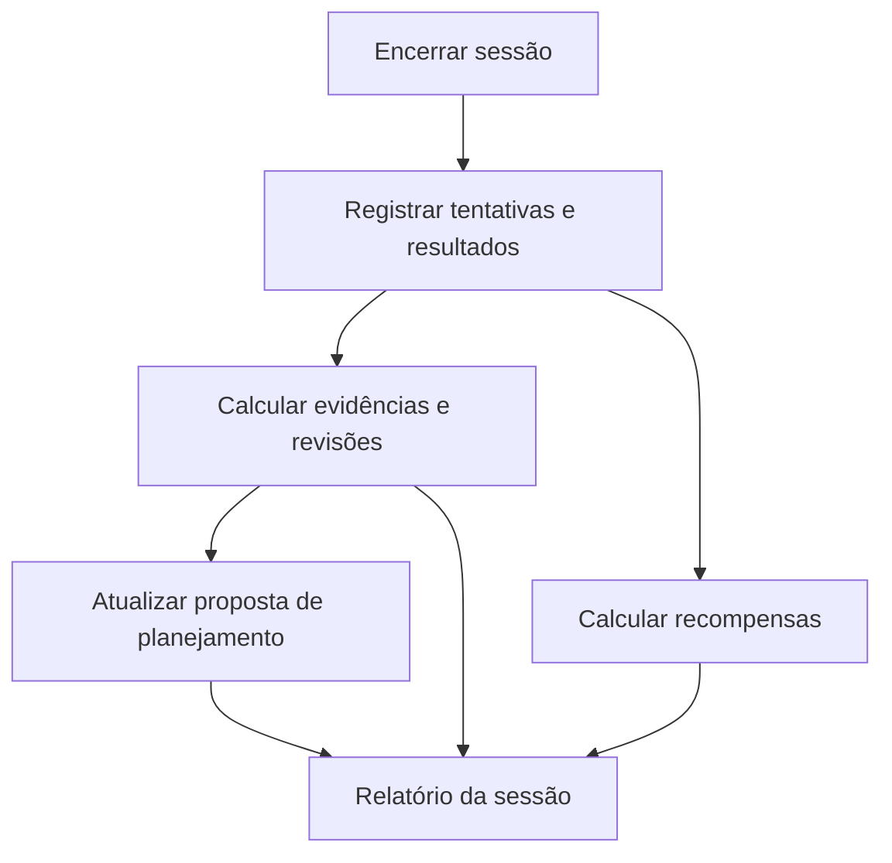

# Arquitetura consolidada — app de estudos e produtividade

Versão: 0.1 — concepção arquitetural  
Data: 01/10/2026, America/Sao_Paulo  
Status: proposta para orientar implementação. Este documento consolida os requisitos escolhidos e apresenta decisões técnicas recomendadas; ainda não há aplicação implementada ou repositório criado.

## 1. Objetivo e decisões do produto

Construir um espaço pessoal de estudos para organizar materiais, planejar a preparação para provas, retomar sessões e praticar com acompanhamento por matéria. O projeto deve também oferecer programação local, laboratórios técnicos e uma camada extensa de jogo, com identidade visual própria e futura publicação open source.

| Área | Decisão confirmada |
| --- | --- |
| Plataforma | Aplicativo instalado no Windows primeiro; expansão posterior |
| Integrações locais | Priorizar JavaScript/TypeScript e Node |
| Celular | Consultar notas, links, agenda e progresso; receber lembretes com o PC desligado |
| Hospedagem | Plataforma gerenciada |
| Materiais originais | PDFs, slides, apostilas e arquivos dos projetos permanecem no PC |
| Notas | Editor visual, arquivos Markdown e compatibilidade com outros editores, incluindo Obsidian |
| Git | Um repositório para o vault; cada projeto mantém seu próprio repositório; revisão, commit e push manuais |
| Agenda | Google Agenda; suas sessões também aparecem e podem ser editadas no Calendário do iPhone |
| Mudanças externas | Adotar o novo horário, permitindo futuros reagendamentos automáticos |
| IA | OpenRouter, usando chave própria; perfis distintos para preparação e tutor/correções |
| Preparação | Resumos, tópicos e sugestões de exercícios em segundo plano ao importar materiais |
| Consumo de IA | Limites por importação e por mês |
| Laboratórios | O usuário instala Docker e WSL2; o app verifica os pré-requisitos e prepara os ambientes |
| Público inicial | Espaço individual de estudos |
| Destino do projeto | Open source e destaque no portfólio |

NotebookLM entra como ferramenta complementar, acessada por um link associado à matéria ou ao tópico. Seu armazenamento não é uma dependência do app.

## 2. Desenho geral

A recomendação é um monólito modular com duas aplicações: desktop e acesso web para celular. Elas compartilham tipos e regras de domínio, com adaptadores diferentes para arquivos, bancos e integrações.

O desktop concentra conteúdo local, execução de projetos e processamento de materiais. A nuvem mantém a visão sincronizada do usuário, a integração de calendário e a entrega de lembretes.

O grafo de conhecimento e o cenário do jogo são duas visualizações conectadas ao mesmo domínio de estudos. Os objetos 3D representam entidades existentes; documentos e progresso continuam disponíveis por interfaces de lista, busca e painéis.

### Stack proposta

| Camada | Tecnologia ou abordagem | Situação |
| --- | --- | --- |
| Desktop | Electron | Recomendação alinhada à preferência por Node e TypeScript |
| Interface | React e TypeScript | Base proposta |
| Design | Componentes próprios, com navegação por teclado e controles acessíveis | Direção visual confirmada |
| Movimento | GSAP para transições, painéis e celebrações | Preferência confirmada |
| Cenários | Three.js para grafo e base isométrica | Preferência confirmada |
| Notas | Markdown como conteúdo principal; editor visual com conversão preservadora | Formato confirmado; editor pendente |
| Persistência local | SQLite para estado local, fila e índices; FTS5 para busca textual | Recomendação técnica |
| Nuvem | Supabase gerenciado: Auth, PostgreSQL e funções | Recomendação para atender à hospedagem gerenciada |
| Tarefas de nuvem | Supabase Cron e funções TypeScript curtas | Recomendação técnica |
| Mobile | PWA responsiva, com service worker e Web Push | Base proposta |
| Hospedagem da PWA | Serviço web gerenciado com HTTPS | Fornecedor a definir |
| IA | Adaptador OpenRouter com perfis configuráveis | Integração confirmada |
| Execução | Processos Node/Python e ambientes SQL configurados localmente | Requisito confirmado |
| Laboratórios | Docker, com backend WSL2 no Windows | Requisito confirmado |

O Electron possui processo principal com APIs Node, renderers web e comunicação por preload/IPC [S1]. Funções do Supabase usam TypeScript em runtime compatível com Deno [S4]: Node continua sendo o runtime das integrações locais. O domínio compartilhado deve evitar dependência direta de APIs específicas de Node ou Deno.

As versões das dependências serão fixadas na implementação, após verificar compatibilidade com empacotamento Windows.

## 3. Módulos e responsabilidades

| Módulo | Responsabilidade | Dados principais |
| --- | --- | --- |
| Matérias e tópicos | Estrutura curricular, provas, entregas e relações com projetos | Matéria, tópico, avaliação |
| Mesa de estudo | Painéis encaixados, ferramentas flutuantes, dock e retomada por matéria | Layout, documento aberto, posição de leitura, próxima ação |
| Vault e conhecimento | Notas Markdown, busca, conexões aprovadas e grafo | Nota, ligação, sugestão de ligação |
| Materiais | Importação, extração, referências e identificação de versões | Material, trecho, localizador de fonte |
| Planejamento | Disponibilidade, prioridades, checklist, revisões e reagendamento | Tarefa, etapa, sessão planejada, compromisso fixo |
| Sessões e foco | Duração escolhida, pausas, checkpoint e encerramento | Sessão realizada, tempo ativo, resultado |
| Aprendizagem | Quizzes, respostas abertas, matemática, código, revisões e insights | Questão, tentativa, avaliação, evidência de aprendizagem |
| IA | Preparação automática, tutor, ações em seleção e controle de consumo | Perfil, prompt, trabalho de IA, uso e orçamento |
| Desenvolvimento | Editor de projetos, execução, terminal, testes, preview e Git | Projeto, repositório, processo, execução de teste |
| Laboratórios | Catálogo local, preparação de desafios e evidências técnicas | Definição de laboratório, instância, relatório, evidência |
| Jogo | XP, moedas, conquistas, habilidades, classes, farm, loja e minigames | Evento de recompensa, carteira, build, instalação, rodada |
| Sincronização e integrações | Replicação, autenticação, calendário e notificações | Revisão, operação pendente, vínculo de evento, entrega |

As regras de cada módulo ficam em funções e serviços de domínio. A interface chama casos de uso; adaptadores traduzem esses casos de uso para arquivos, SQL, IPC, OpenRouter, Git e Google Agenda.

Um evento de sessão encerrada conecta os módulos: registra evidências de aprendizagem, atualiza planejamento e gera recompensas. Cada módulo mantém suas regras explícitas e versionadas.

## 4. Dados e autoridade de cada armazenamento

| Informação | Fonte principal | Visão no desktop | Visão na nuvem/celular |
| --- | --- | --- | --- |
| Corpo das notas | Arquivos Markdown do vault | Leitura e edição visual; índice local | Cópia versionada para consulta |
| Metadados portáveis da nota | Frontmatter do Markdown | Identidade, matéria, tópicos e referências | Espelho dos campos necessários |
| Matérias, tópicos, tarefas e agenda | Estado sincronizado no PostgreSQL | Cache local e operações com revisão | Dados persistentes independentes do PC |
| Histórico de sessões e tentativas | Registros sincronizados com IDs estáveis | Registro local antes do envio | Histórico e projeções de progresso |
| Estado do jogo e recompensas | Transações e histórico de eventos no PostgreSQL | Cache e interface do observatório | Progresso disponível para consulta |
| Layout da mesa e checkpoints | Estado local por matéria | Restauração da mesa | Apenas campos úteis de progresso; formato de backup a decidir |
| PDFs, slides e anexos de arquivo | Sistema de arquivos do PC | Leitor e extração local | Metadados e referências necessários; arquivos permanecem no PC |
| Texto extraído e índice dos materiais | Cache local reconstruível | Busca e recuperação de contexto | Sem sincronização integral do índice por padrão |
| Resumos gerados | Nota Markdown salva no vault | Edição e uso no estudo | Cópia sincronizada da nota |
| Questões e avaliações geradas | Registros de aprendizagem | Prática no desktop | Projeções e resultados; prática no celular a definir depois |
| Código e dependências | Diretórios dos projetos | Edição e execução local | Links e metadados de progresso |
| Histórico Git | Repositórios locais e seus remotes | Diff, stage, commit e push explícitos | A sincronização do app opera separadamente do Git |
| Chave OpenRouter | Cofre local protegido por mecanismos do sistema | Uso pelos serviços locais | A chave não faz parte dos dados sincronizados |
| Autorização Google | Armazenamento protegido no servidor | Estado da conexão | Usada pelo conector de calendário |
| Logs dos processos e dos laboratórios | Armazenamento local | Diagnóstico e produção de evidências | Resumos e links selecionados; exportação explícita |

A gravação local permite retomada e recuperação após falhas, mesmo que operação offline não seja um requisito essencial do produto.

### Regras das notas

- Um ID persistente identifica cada nota, mesmo se o título ou o caminho mudar.
- Frontmatter contém metadados portáveis; campos desconhecidos trazidos do Obsidian devem ser preservados.
- Ligações entre notas usam caminhos compatíveis com Markdown; suporte a wikilinks e renomeação será validado no editor escolhido.
- Relações com tarefas, exercícios e projetos usam IDs estáveis. Referências portáveis podem acompanhar a nota no frontmatter.
- O app monitora alterações externas e atualiza o índice e as ligações conhecidas.
- Alterar uma nota já modificada externamente exige reconciliar as duas versões antes de substituir o arquivo.
- Dados do editor em JSON são uma representação de trabalho. O corpo Markdown permanece o conteúdo persistido principal.
- Tabelas, fórmulas, código, referências e links devem sobreviver ao ciclo de abrir, editar e salvar.

Tiptap é um candidato de editor visual. Sua integração Markdown está em beta e possui limitações de representação [S5]. A escolha depende de uma prova de compatibilidade com um vault real, antes de incorporar extensões específicas.

### Modelo lógico inicial

Os nomes abaixo descrevem entidades; ainda não são um esquema SQL definitivo.

| Grupo | Entidades sugeridas | Relações relevantes |
| --- | --- | --- |
| Identidade | Workspace, Device, UserPreferences | Um espaço pessoal; dispositivos autorizados |
| Conteúdo | Subject, Topic, Note, KnowledgeRelation | Notas ligadas a matérias/tópicos e conexões aprovadas |
| Fontes | Material, SourceChunk, SourceReference | Uma referência aponta para material, versão e localizador |
| Planejamento | Assessment, AvailabilityWindow, FixedCommitment, StudyTask, TaskStep | Provas e entregas orientam prioridades; etapas pertencem às tarefas |
| Sessões | PlannedSession, StudySession, SessionCheckpoint | Uma execução registra progresso de uma sessão planejada |
| Prática | Exercise, ExerciseSet, Attempt, AttemptEvaluation | Tentativas vinculam formato, dificuldade, fontes e critérios |
| Revisão | TopicEvidence, ReviewSchedule, TopicStatusProjection | Evidências calculam status e datas de revisão |
| IA | AIProfile, PromptTemplate, AIJob, AIUsage, BudgetReservation | Trabalhos usam perfis e reservam consumo |
| Desenvolvimento | Project, RepositoryLink, RunRecord, TestResult | Projeto vinculado à matéria e ao seu repositório |
| Laboratórios | LabDefinition, LabInstance, ChallengeResult, Evidence | Instâncias são derivadas de definições versionadas |
| Jogo | RewardEvent, WalletEntry, SkillBuild, ClassProjection, Achievement | Recompensas têm origem e unicidade; classe deriva da build |
| Farm e loja | Installation, Upgrade, ShopItem, Purchase, PassiveAccrual | Compras e produção alteram a carteira por transações |
| Minigames | GameDefinition, GameRound, RoundResult | Cada rodada legítima tem ID e cálculo de recompensa |
| Integrações | CalendarConnection, CalendarEventLink, PushSubscription, NotificationDelivery | Sessões mapeiam eventos e entregas externas |
| Sincronização | PendingOperation, ChangeRevision, ProcessingReceipt | Operações podem ser reenviadas sem repetir efeitos |

## 5. Sincronização, versões e recuperação

### Fluxo proposto

1. A ação no desktop grava o resultado local e uma operação pendente com ID único.
2. O servidor recebe a operação, verifica identidade e revisão, aplica a mudança e devolve a versão resultante.
3. A operação é marcada como confirmada. Uma nova tentativa usa o mesmo ID.
4. O celular lê a visão persistida na nuvem.
5. Mudanças de calendário ou regras de planejamento feitas na nuvem retornam ao desktop na próxima sincronização.

Para notas, o desktop publica snapshots do Markdown com ID, hash e revisão. O celular inicialmente consulta esses snapshots. Edição de notas pelo celular não foi incluída no requisito atual.

O app deve reconhecer alterações de arquivos feitas pelo Obsidian, Git ou restauração de backup. O hash do conteúdo orienta a atualização do índice e invalida resultados derivados de versões antigas.

### Conflitos concretos a tratar

| Situação | Comportamento proposto |
| --- | --- |
| Nota muda no Obsidian enquanto está aberta | Preservar o texto em edição e apresentar reconciliação de versões |
| Evento muda no Google e há atualização pendente do app | Buscar a versão atual, comparar campos modificados e reconciliar |
| Processo cai durante uma importação | Retomar a partir do último estágio persistido |
| Encerramento de sessão é enviado novamente | Reconhecer o ID processado e devolver o mesmo resultado |
| Nota é apagada ou renomeada | Propagar a revisão correspondente e atualizar ligações; retenção a definir |
| O serviço de nuvem fica indisponível | Conservar operações pendentes e mostrar estado de sincronização |

A regra de reenviar operações sem repetir efeitos deve ser usada também nas recompensas e nos vínculos de eventos do calendário.

## 6. Planejamento, Google Agenda e lembretes

O planejador recebe provas, entregas, tópicos, estimativas de esforço, revisões devidas, horários livres e compromissos fixos. Ele produz uma proposta ajustável com tarefas concretas e sessões de duração escolhida.

### Regras confirmadas

- Priorizar provas e entregas mais próximas quando faltar capacidade.
- Redistribuir sessões perdidas dentro dos horários livres.
- Preservar compromissos fixos.
- Apresentar um plano essencial quando a capacidade for insuficiente, mostrando o conteúdo que ficou de fora.
- Reservar revisões automaticamente, com intervalos ajustados pelo desempenho.
- Acompanhar tarefas longas por checklist de etapas.
- Retomar o estudo com documentos, painéis e próxima ação salvos.

### Integração externa

Recomenda-se um calendário dedicado a estudos. Os demais calendários selecionados fornecem compromissos; o app publica e atualiza as sessões no calendário de estudos.

Cada sessão mantém o vínculo com calendarId e eventId. Reagendamentos atualizam esse evento. A API Google possui operações de criação/atualização e sincronização incremental de mudanças [S8].

Ao editar uma sessão no Google ou no Calendário do iPhone, o novo horário passa a compor o plano e continua elegível para futuros reagendamentos. Um compromisso importado como fixo continua protegido.

Eventos do Google podem ser exibidos e editados pelo Calendário do iPhone após conectar a conta Google [S9]. A arquitetura atual usa esse caminho.

### Execução com PC desligado

O conector de calendário e o serviço de lembretes funcionam na nuvem. A lógica compartilhada de planejamento pode ser executada por funções curtas, usando os dados sincronizados. A nuvem pode reconciliar alterações e atualizar uma proposta de plano sem acessar arquivos do PC.

Supabase Cron pode executar SQL ou chamar funções HTTP [S3]. As funções de integração devem operar em lotes curtos, com retomada e registros de execução.

As notificações possuem horários escolhidos e modos configuráveis: lembrete de sessão, resumo diário e consulta apenas pela agenda. Recomenda-se identificar a origem do alerta para coordenar lembretes do app e do calendário.

O resumo diário pode ser calculado a partir das prioridades e pendências sincronizadas, usando as regras do planejador. Sua entrega funciona com o PC desligado e dispensa chamadas ao perfil de IA local.

A PWA do iPhone precisa ser adicionada à Tela de Início e ter permissão de notificações para usar Web Push no caminho documentado pela Apple [S10]. O servidor agenda a tentativa de entrega; as configurações e condições do dispositivo afetam quando o alerta aparece.

## 7. Materiais, recuperação de contexto e IA

### Importação em segundo plano

A fila é local e persistida. Os estágios propostos são:

| Estágio | Resultado |
| --- | --- |
| Registrar | ID do material, versão/hash, matéria e caminho ou URL |
| Extrair | Texto e localizadores preservando origem |
| Indexar | Trechos pesquisáveis e ligações com fontes |
| Planejar consumo | Estimativa e reserva dentro dos limites |
| Preparar com IA | Resumo, tópicos e propostas de questões |
| Validar e persistir | Estrutura, IDs de fontes e resultados utilizáveis |
| Sincronizar | Notas geradas e projeções selecionadas |

A execução requer o desktop ligado e os serviços do app em funcionamento. O celular consulta o que já foi sincronizado. PDFs completos e índice local permanecem no PC; trechos necessários à preparação e ao tutor são enviados ao OpenRouter.

Extração e preparação rodam em processos utilitários Node supervisionados pelo Electron, com fila persistida no SQLite. Os estágios mais pesados têm concorrência limitada e checkpoint; a interface recebe progresso por IPC.

Arquivos com texto selecionável são o caminho inicial mais simples. OCR de PDFs escaneados e tratamento de slides devem ser definidos no adaptador de extração. Vídeos precisam de transcrição acessível ou fornecida para fundamentar respostas; um link isolado é registrado como link.

### Busca e citações

Recomenda-se começar com busca textual local usando SQLite FTS5, que oferece busca em texto completo [S2]. O adaptador de recuperação pode receber busca semântica posteriormente, se a qualidade medida justificar.

Cada trecho carrega materialId, versão, page/section ou timestamp disponível, texto e ID estável. O tutor recebe os trechos recuperados com esses identificadores.

A saída deve distinguir:
- informação sustentada pelos materiais;
- complemento de conhecimento geral;
- pontos em que as fontes não bastam.

Referências a PDFs abrem a página no desktop. No celular, a nota pode mostrar título e página da referência; o arquivo original continua disponível no PC.

Validar que uma fonte existe, pertence ao contexto e tem localizador válido evita referências estruturalmente inventadas. Essa verificação, por si só, não comprova que a resposta está correta ou que o trecho sustenta a conclusão. O usuário deve conseguir conferir a fonte e sinalizar uma questão problemática.

### Perfis OpenRouter

| Perfil | Uso | Configuração |
| --- | --- | --- |
| Preparação | Resumos, tópicos, sugestões de relações e exercícios | Modelo econômico compatível com os formatos necessários |
| Tutor e correção | Explicações, pistas, avaliação de respostas abertas e matemática | Modelo escolhido para essas tarefas, com avaliação de qualidade |

Os modelos específicos ainda serão selecionados. O app deve consultar capacidades e preços atuais, registrar o modelo efetivamente usado e aplicar os limites de consumo aos dois perfis.

Saídas estruturadas são úteis para questões e tópicos. O OpenRouter suporta JSON Schema em endpoints compatíveis; suporte e grau de cumprimento dependem do endpoint [S6]. O app valida respostas recebidas e trata erro ou conteúdo incompleto antes de disponibilizar o resultado.

Prompts prontos são templates editáveis e versionados. A arquitetura prevê configuração de instruções e contexto, sem treinamento de modelos.

### Tutor e prática

- Chat contextual à matéria, com referências.
- Quando o aluno trava: explicar o conceito com outro exemplo e voltar ao exercício.
- Pistas graduais antes de mostrar a resposta.
- Ações em uma seleção: explicar, resumir e gerar exemplos.
- Escolha manual de dificuldade antes da prática.
- Questões de alternativas, respostas abertas, matemática por etapas, código e SQL.
- Correção e explicação consolidadas ao final da sessão.

Durante a sessão, o app persiste respostas. Saídas de terminal, execução e feedback de pareamento dos minigames continuam visíveis quando fazem parte da atividade; o relatório pedagógico consolidado aparece no encerramento.

### Limites por importação e por mês

Cada trabalho recebe uma estimativa, uma reserva e o gasto real conhecido. Antes de iniciar uma chamada, o sistema considera gastos registrados mais reservas das chamadas em andamento.

- O teto da importação acompanha o conjunto de trabalhos daquele material.
- O teto mensal cobre preparação, tutor e correções.
- Se o saldo disponível não cobrir o trabalho, ele fica pausado com o motivo e o resultado parcial preservado.
- Reprocessamento usa a versão do material e do prompt para aproveitar resultados existentes.
- Tentativas após falha também precisam caber no orçamento.
- Respostas com estado de cobrança incerto conservam a reserva até reconciliação ou decisão explícita.

O limite do app é um controle de agendamento baseado em estimativas e uso registrado. Valores finais dependem das cobranças do provedor; a interface deve distinguir consumo confirmado, reservado e estimado.

Recomenda-se uma chave dedicada ao app com limite também configurado no OpenRouter. A documentação oferece limite por chave e resets diário, semanal ou mensal em UTC [S7]. O controle mensal do app pode seguir o fuso do usuário, exibindo claramente essa diferença. Os valores dos tetos permanecem a definir.

## 8. Encerramento de sessão, revisão e insights

O encerramento é uma operação identificada e reexecutável sem duplicação de recompensas.

As avaliações guardam origem, versão dos critérios e status de processamento. Código e SQL usam testes definidos para o exercício; respostas abertas e matemática podem usar rubricas assistidas por IA. O app deve separar esses resultados das questões objetivas.

Se uma correção por IA ainda estiver pendente, o relatório mostra quais indicadores estão completos e quais aguardam avaliação. Um trabalho retomado atualiza esse mesmo relatório.

### KPIs e estado por tópico

O relatório inclui etapas concluídas, tempo ativo, dificuldades anotadas, desempenho por formato, ajuda solicitada, evolução por tópico e próximas revisões.

O status automático é calculado com evidências de aprendizagem e critérios visíveis. A confiança autodeclarada aparece separadamente. XP, moedas e tempo estudado não comprovam domínio de um tópico.

Intervalos de revisão se ajustam ao desempenho. A próxima sessão mistura questões anteriores e novas variações. O algoritmo e os limiares de evidência devem ser definidos e versionados.

A proposta é permitir sinalizar questões com fonte incorreta, ambígua ou insuficiente e suspender seu efeito nas projeções enquanto são revisadas.

## 9. Desenvolvimento, Git e laboratórios

### Projetos de programação

O módulo oferece clone, modelos por linguagem e exercícios com projeto inicial e critérios de conclusão. Um projeto é vinculado à matéria e ao seu diretório/repositório.

O app usa os ambientes instalados:
- Node para JavaScript e TypeScript;
- Python e seus ambientes de projeto;
- ambientes SQL identificados por perfil.

O catálogo de bancos SQL e os comandos de execução são decisões de implementação pendentes. Os perfis de projeto guardam comandos, diretórios e critérios; o usuário inicia a execução.

Processos têm identificação, diretório de trabalho, portas, saída e comando de encerramento. O app deve conseguir retomar a visão de um processo ainda ativo ou informar que ele terminou.

O painel Git lista mudanças, permite revisar diff e stage, e executa commit/push por ação do usuário. Ele atua no vault ou no repositório do projeto selecionado.

### Laboratórios técnicos

O fluxo é: verificar Docker/WSL2, preparar ambiente, iniciar desafio, acompanhar execução, registrar resultado e produzir evidências.

A definição de laboratório versionada deve conter:
- imagem e versão/digest;
- serviços e portas;
- arquivos necessários ao desafio;
- critérios de reprodução e de correção;
- testes verificáveis;
- instruções de limpeza;
- modelo de relatório e fontes do desafio.

Os desafios de CVE têm como escopo investigar e reproduzir vulnerabilidades conhecidas em laboratórios locais. As evidências podem incluir reprodução, causa, impacto, correção, código, testes e links do repositório.

Instâncias são preparadas com acesso limitado aos arquivos necessários ao exercício, portas locais e processos identificados. Conteúdo de um laboratório e previews de projetos usam uma superfície separada dos serviços privilegiados do app.

Docker oferece mecanismos de isolamento, cujo resultado depende de mounts, permissões e configuração [S12]. O app deve guardar definições revisáveis do laboratório e evitar conceder acesso ao vault e às chaves de IA aos ambientes do desafio.

## 10. Jogo e economia

O jogo recebe eventos de atividades verificadas e aplica regras versionadas. O estado econômico deve usar transações e registros de origem, permitindo reconstruir o saldo e identificar recompensas repetidas por erro de sincronização.

| Sistema | Comportamento confirmado |
| --- | --- |
| XP e moedas | Estudo e minigames podem gerar recompensas livremente |
| Repetição | Novas rodadas legítimas rendem recompensas por dificuldade e desempenho |
| Missões | Missões semanais baseadas nas tarefas reais |
| Habilidades | Foco, revisão, planejamento e prática; pontos ganhos por nível |
| Builds | Distribuição livre e redistribuição gratuita |
| Classes | Derivadas da distribuição de pontos e alteradas com a build |
| Farm | Produção passiva, recebimento automático e bônus por interação/eventos |
| Construção | Gastar moedas e escolher melhorias simples |
| Loja | Personalizações, instalações, bônus, itens e recompensas reais cadastradas |
| Conquistas | XP, níveis, títulos, conquistas, platinums, coleções, histórias e easter eggs |
| Retorno | Preservar progresso e oferecer uma missão curta após afastamento |
| Celebrações | Conquista marcante na hora, com opção de pular |

A deduplicação de eventos protege contra repetir o crédito de uma mesma conclusão; as recompensas de rodadas novas permanecem livres.

Recomenda-se calcular a produção passiva pelo tempo decorrido e histórico das melhorias, usando horários persistidos do servidor. Isso permite continuar a progressão passiva com o PC desligado sem manter um processo de jogo continuamente ativo.

Preço de itens, multiplicadores, curva de XP, pontos por nível, combinação de classes e efeitos das builds permanecem em tabelas de regras a definir.

### Primeiro minigame completo: Memória de Conceitos

- Pares: conceito/definição, conceito/exemplo e fórmula/situação de uso.
- Escolha de matéria, conteúdo, dificuldade e build.
- Rodada sem limite de tempo.
- Desempenho considera acertos, tentativas e combos.
- Tempo aparece como informação da sessão, sem exigência de velocidade.
- Fontes e explicações acompanham o relatório final.
- Resultado tem ID de rodada e registra as regras usadas no cálculo das recompensas.

Os pares devem se apoiar em conteúdos preparados e validáveis. O motor de pareamento e pontuação funciona com regras do jogo, enquanto a IA auxilia a criar o conteúdo.

Recompensas reais cadastradas na loja são itens pessoais com compra e registro de utilização; ações fora do app dependem do usuário.

## 11. Interface e execução gráfica

O design usa observatório espacial, com barra lateral e dock de ferramentas. Cada matéria guarda sua própria mesa.

| Vista | Direção |
| --- | --- |
| Mesa | Superfícies escuras sóbrias, materiais grandes, brilho discreto e indicadores compactos |
| Grafo | Cenário mais expressivo, conexões exploráveis e prévia lateral da nota |
| Base | Vista isométrica para construir e administrar o farm |
| Ferramentas | Painéis encaixados e janelas flutuantes com posição e tamanho persistidos |
| Mobile | Consulta responsiva de notas, links, agenda e progresso |

GSAP controla transições e celebrações. Three.js representa grafo e base. Essas cenas devem ser carregadas ao entrar na vista e liberadas ao sair, preservando o estado de domínio.

Recomenda-se oferecer intensidade de movimento e pausar renderização de cenas escondidas. Os limites de desempenho serão definidos com medição em um PC Windows e um iPhone representativos.

Ao clicar em uma nota no grafo, abre-se uma prévia lateral; a ação de levar para a mesa restaura a matéria e seus painéis.

## 12. Fronteiras de execução e segredos

Essas fronteiras são parte do funcionamento do produto, pois ele combina materiais externos, código executável e credenciais.

| Fronteira | Contrato proposto |
| --- | --- |
| Renderer para Node | Preload expõe operações específicas e tipadas; handlers validam argumentos e origem |
| Preview para aplicativo | Página do projeto recebe apenas capacidades do preview; o app hospedeiro conserva arquivos e segredos |
| Material para IA | Conteúdo do material é contexto de estudo; ações locais são casos de uso explícitos |
| Processo para arquivos | Perfil de execução define diretório e recursos necessários |
| Laboratório para PC | Volumes e serviços vinculados ao exercício; instância rastreável e removível |
| Cliente para nuvem | Identidade autenticada e políticas por proprietário |
| Chave OpenRouter | Armazenamento local protegido; mensagens, logs e sincronização excluem o segredo |
| OAuth Google | Tokens e renovação no conector de nuvem, com armazenamento protegido |

A documentação Electron recomenda contextIsolation, sandboxing e isolamento de conteúdo remoto das APIs privilegiadas [S11]. O armazenamento local de segredos pode usar safeStorage; no Windows ele usa proteção do sistema e possui limitações contra outros processos do mesmo usuário [S13].

O modo de publicação open source deve distinguir código do app, dados pessoais, materiais da faculdade e evidências escolhidas para o portfólio.

## 13. Organização sugerida do repositório

| Caminho sugerido | Conteúdo |
| --- | --- |
| apps/desktop | Electron: processo principal, preload e interface desktop |
| apps/mobile-web | PWA para consulta e notificações |
| packages/domain | Regras de estudo, planejamento, aprendizagem e jogo |
| packages/contracts | Tipos de domínio, schemas, DTOs e contratos de integração |
| packages/ui | Componentes próprios e identidade visual compartilhada |
| packages/local-adapters | Vault, SQLite, Git, execução, importação e Docker |
| packages/cloud-adapters | Sincronização e clientes dos serviços gerenciados |
| packages/ai | Perfis, prompts, validação, uso e adaptador OpenRouter |
| supabase | Migrações, políticas de acesso, funções e tarefas agendadas |
| labs | Definições versionadas e arquivos dos desafios |
| templates | Projetos iniciais de estudo |
| docs | Arquitetura, decisões, setup, fluxos e documentação de contribuição |

Essa estrutura é uma proposta para criar o repositório futuramente. O domínio pode ser organizado por módulos internos antes de separar mais pacotes.

A nuvem deve ter configuração documentada. O uso público pode permitir que cada instalação aponte para seu próprio projeto Supabase; oferecer um serviço compartilhado administrado pelo autor exige uma decisão adicional de operação e custos.

A licença do projeto permanece pendente. Dependências e assets mantêm seus próprios termos. GSAP usa atualmente uma licença específica sem cobrança, com restrições definidas pelo fornecedor [S14]; a licença do repositório deve preservar esse aviso na documentação de terceiros.

## 14. Verificações que tornam a arquitetura demonstrável

Antes de uma versão pública, estes fluxos precisam funcionar com dados reais ou uma base demonstrativa claramente identificada:

| Fluxo | Evidência esperada |
| --- | --- |
| Portabilidade | Abrir, editar e salvar notas no app e no Obsidian preservando links, fórmulas, tabelas e código |
| Importação | Material preparado com fonte conferível; retomada após falha aproveita etapas concluídas |
| Consumo | Dois trabalhos simultâneos respeitam reservas e tetos; gasto confirmado fica auditável |
| Planejamento | Prova próxima e semana cheia produzem plano essencial com omissões explícitas |
| Agenda | Sessão criada no app aparece no iPhone; alteração externa retorna; reagendamento atualiza o vínculo |
| Independência do PC | Com desktop desligado, notas/progresso já sincronizados e agenda permanecem consultáveis; entrega de lembrete é demonstrada |
| Aprendizagem | Relatório final separa tipos de avaliação e mostra critérios do status do tópico |
| Economia | Reenviar uma conclusão conserva saldo; duas rodadas distintas rendem suas próprias recompensas |
| Desenvolvimento | Projeto JS/TS, Python e SQL escolhido executa, apresenta resultados e permite revisão de mudanças no Git |
| Laboratório | App prepara desafio, registra reprodução, verifica correção e gera evidência exportável |
| Retomada | Fechar e abrir o app restaura matéria, documentos, posição e próxima ação |
| UI | Mesa mantém legibilidade; grafo/base liberam recursos ao sair; celebração pode ser pulada |

Esse conjunto é um plano de validação, sem alegação de que as verificações já foram executadas. O conteúdo exato da primeira versão pública ainda será definido no roadmap.

## 15. Decisões ainda em aberto

| Decisão | Por que importa |
| --- | --- |
| Editor visual e formato de extensões | Compatibilidade real do Markdown e do vault |
| Modelos dos dois perfis e valores dos tetos | Qualidade, custo e latência |
| Extração, OCR e transcrições | Cobertura dos materiais e precisão das referências |
| Algoritmo de revisão e critérios de status | Comportamento do planejamento e explicabilidade |
| Banco/perfil SQL inicial | Preparação e critérios dos exercícios |
| Política de retenção, exclusões e backup | Recuperação de conteúdo e dados do app |
| Regras da economia, habilidades e classes | Balanceamento e previsibilidade do jogo |
| Catálogo inicial de labs e modelos de projeto | Instalação reproduzível e qualidade das evidências |
| Serviço público ou configuração por instalação | Responsabilidade operacional do projeto open source |
| Nome, licença e identidade | Publicação e apresentação no portfólio |
| Escopo e ordem de entregas | Primeira versão completa e utilizável |

Nenhum desses pontos impede começar a detalhar o primeiro fluxo. A fundação técnica proposta já tem limites de responsabilidade e contratos de dados claros.

## 16. Referências técnicas

Documentação oficial consultada em 02/10/2026 UTC. As decisões de organização, sincronização e dados deste documento são propostas de projeto; as fontes abaixo fundamentam capacidades e limitações das tecnologias.

- [S1 — Electron: modelo de processos](https://www.electronjs.org/docs/latest/tutorial/process-model)
- [S2 — SQLite: FTS5](https://sqlite.org/fts5.html)
- [S3 — Supabase: Cron](https://supabase.com/docs/guides/cron)
- [S4 — Supabase: Edge Functions](https://supabase.com/docs/guides/functions)
- [S5 — Tiptap: Markdown](https://tiptap.dev/docs/editor/markdown)
- [S6 — OpenRouter: saídas estruturadas](https://openrouter.ai/docs/guides/features/structured-outputs)
- [S7 — OpenRouter: limite e reset de chave](https://openrouter.ai/docs/api/api-reference/api-keys/create-a-new-api-key)
- [S8 — Google Calendar: sincronização incremental](https://developers.google.com/workspace/calendar/api/guides/sync)
- [S8a — Google Calendar: criar eventos](https://developers.google.com/workspace/calendar/api/guides/create-events)
- [S8b — Google Calendar: atualizar eventos](https://developers.google.com/workspace/calendar/api/v3/reference/events/update)
- [S9 — Google Calendar no Calendário da Apple](https://support.google.com/calendar/answer/99358?co=GENIE.Platform%3DiOS&hl=en)
- [S10 — WebKit: Web Push em apps da Tela de Início](https://webkit.org/blog/13878/web-push-for-web-apps-on-ios-and-ipados/)
- [S11 — Electron: recomendações de segurança](https://www.electronjs.org/docs/latest/tutorial/security)
- [S12 — Docker: segurança do Engine](https://docs.docker.com/engine/security/)
- [S12a — Docker Desktop: WSL2](https://docs.docker.com/desktop/features/wsl/)
- [S13 — Electron: safeStorage](https://www.electronjs.org/docs/latest/api/safe-storage)
- [S14 — GSAP: licença padrão](https://gsap.com/community/standard-license/)
- [S15 — Supabase: arquitetura](https://supabase.com/docs/guides/getting-started/architecture)
