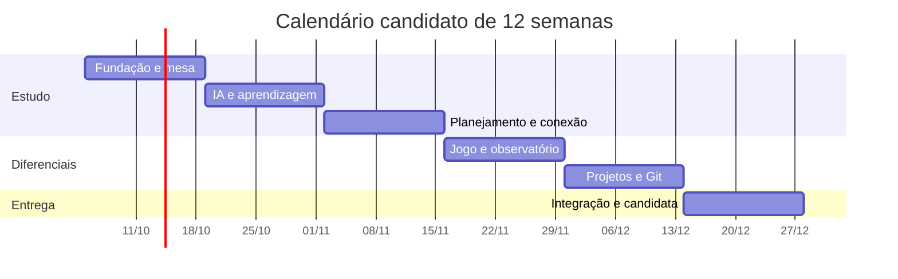

# Roadmap — primeira versão pública do app de estudos

Versão do plano: 0.2  
Data: 01/10/2026, America/Sao_Paulo  
Base: ARQUITETURA_APP_ESTUDOS.md  
Status: proposta de escopo e calendário; implementação ainda não iniciada nesta conversa.

## 1. Meta, capacidade e premissas

O objetivo é publicar uma primeira versão Windows que combine um ciclo completo de estudo com três frentes escolhidas: grafo 3D interativo, farm/loja/builds e programação com execução local e Git.

A janela desejada é de 2–3 meses, com até 3 horas semanais de dedicação humana, incluindo orientação da IA, revisão, configuração e testes.

A prioridade confirmada é preservar as funcionalidades escolhidas. Se os checkpoints mostrarem esforço maior, o prazo será estendido para concluir o escopo, mantendo a primeira publicação vinculada aos critérios de entrega.

Para um plano de 12 semanas, o teto é de 36 horas de dedicação, supondo 3 horas em todas as semanas. Geração de código por IA pode ocorrer além desses períodos, mas sua qualidade precisa ser verificada dentro da capacidade disponível.

Esse prazo é agressivo para o conjunto de funcionalidades. O calendário abaixo é uma hipótese inicial para uma versão com recortes pequenos e funcionais. A velocidade das primeiras duas semanas será usada para revisar a previsão.

### Premissas do recorte proposto

| Premissa | Situação |
| --- | --- |
| Windows como plataforma inicial | Confirmada |
| Grafo, farm/loja/builds e programação na primeira pública | Confirmada |
| Memória de Conceitos como primeiro jogo completo | Confirmada |
| Núcleo de estudo, IA, planejamento e celular | Mantido no plano |
| Primeiro fluxo de programação em JS/TS com Node | Confirmado para a v0.1 |
| Python e SQL nos incrementos seguintes | Sequência confirmada |
| Laboratórios CVE/CTF após a primeira pública | Sequência proposta; não foram selecionados para esse lançamento |
| Configuração individual de serviços e chaves | Proposta compatível com o espaço pessoal e open source |
| Início em 05/10/2026 | Data assumida para visualizar o calendário |
| Candidata pública ao final de dezembro | Meta condicional aos critérios de qualidade |
| Atraso nos checkpoints | Preservar funcionalidades e estender o prazo |

As datas mudam se o início for diferente, houver semanas sem disponibilidade ou os primeiros ciclos mostrarem esforço maior. O escopo implementado deve ser reportado com precisão.

## 2. O que a v0.1 entrega

A primeira versão deve permitir quatro jornadas reais:

1. Importar um material, receber preparação, estudar, praticar, fechar a sessão e consultar as próximas revisões.
2. Explorar as notas no grafo, criar ou aceitar uma relação e levar uma nota para a mesa da matéria.
3. Receber recompensas, jogar Memória de Conceitos, comprar uma melhoria e redistribuir a build.
4. Vincular um projeto à matéria, editar, executar, conferir resultados e revisar as mudanças antes de commit/push.

A consulta de notas, links, agenda e progresso pelo celular complementa essas jornadas. Sessões aparecem no Google Agenda e no Calendário do iPhone, conforme a arquitetura.

### Escopo funcional inicial

| Frente | Conteúdo proposto para a v0.1 | Critério de entrega |
| --- | --- | --- |
| Mesa | Uma mesa persistente por matéria; painéis de PDF, nota e tutor; ferramentas de foco e busca | Fechar e abrir conserva documento, posição, layout e próxima ação |
| Vault | Edição visual de Markdown, leitura de alterações externas e ligações entre notas | Arquivos usados no app continuam utilizáveis no Obsidian |
| Materiais | PDFs com texto selecionável, links e notas; fila de importação com fontes | Preparação tem progresso, pausa, retomada e página conferível |
| IA | OpenRouter; perfis de preparação e tutor/correção; resumo, tópicos e sugestões de exercícios | Perfis e limites são configuráveis; erro ou limite atingido conserva resultado parcial |
| Prática | Questões de alternativas e Memória de Conceitos; dificuldade escolhida | Respostas registradas; explicações e KPIs consolidados no fim |
| Aprendizagem | Status por tópico com critérios visíveis e revisões ajustadas ao desempenho | Evidências acadêmicas e XP têm registros separados |
| Planejamento | Provas, entregas, disponibilidade, tarefas com etapas e sessões ajustáveis | Reagendamento preserva compromissos fixos e indica conteúdos que não couberam |
| Agenda | Ler compromissos selecionados; publicar/atualizar sessões em calendário de estudos | Alteração pelo iPhone retorna ao plano; vínculo evita duplicação por reenvio |
| Celular | Consulta de notas, links, agenda e progresso; lembretes e resumo diário | Dados já sincronizados e serviço de notificações funcionam com PC desligado |
| Grafo 3D | Visualização por matéria, navegação, seleção, prévia lateral e criação/aprovação de ligações | Relações do grafo são persistentes e correspondem aos dados das notas |
| Farm | Pequeno conjunto de instalações, melhoria por moedas e produção passiva automática | Carteira e produção podem ser reconstruídas a partir dos eventos |
| Loja | Catálogo inicial de personalizações/melhorias; cadastro simples de recompensa real | Comprar e registrar uso tem efeito persistente no saldo |
| Habilidades | Quatro caminhos: foco, revisão, planejamento e prática; pontos, classes derivadas e respec gratuito | Redistribuição muda os efeitos e a classe conforme regra visível |
| Memória | Pares de conceito/definição, conceito/exemplo e fórmula/situação | Sem limite de tempo; recompensa considera dificuldade, acertos, tentativas e combos |
| Desenvolvimento | Projeto JS/TS local, clone/vínculo, edição, execução, logs, testes e preview | Aplicação Node/web funciona localmente e pode ser encerrada pelo app |
| Git | Vault e repositórios dos projetos; diff, stage, commit e push manuais | Mudança feita no app aparece no repositório correto |
| Visual | Mesa sóbria; grafo/base expressivos; GSAP e Three.js; celebração pulável | Legibilidade e estado persistente acompanham as animações |
| Publicação | Instalador Windows, código, licença, setup, documentação, demo e vídeo | Uma instalação externa reproduz os fluxos anunciados |

Esse escopo é uma proposta de primeira versão, com profundidade limitada por sistema. As quantidades de instalações, itens e habilidades devem ser fechadas durante a implementação; sugere-se um conjunto pequeno suficiente para demonstrar o ciclo completo.

O editor deve preservar inicialmente títulos, listas, tarefas, links, tabelas, blocos de código e fórmulas usadas na base demonstrativa. Extensões que não preservem o Markdown exigem decisão explícita de compatibilidade.

### Expansões depois da v0.1

| Incremento sugerido | Conteúdo |
| --- | --- |
| v0.2 — prática e projetos | Python, SQL, templates adicionais, desafios de código/SQL com critérios e testes |
| v0.3 — laboratórios | Verificação Docker/WSL2, ambientes de CVE/CTF, reprodução, correção e relatórios |
| Aprendizagem ampliada | Respostas abertas, matemática por etapas, rubricas mais completas e revisão refinada |
| Materiais ampliados | OCR, transcrições e extração mais abrangente de formatos |
| Jogo ampliado | Mais instalações, itens, eventos, lore, platinums, minigames e combinações de builds |
| Plataforma ampliada | Outros sistemas desktop e novas ações no celular |

Os números das versões representam uma ordem candidata, sem prazo definido para essas expansões. As funcionalidades permanecem no objetivo completo do produto.

## 3. Calendário candidato de 12 semanas

As semanas são janelas de foco e revisão. Cada entrega precisa passar pelo critério descrito; uma semana encerrada no calendário não torna a funcionalidade concluída.

| Semana | Janela de 2026 | Entrega candidata | Prova de funcionamento |
| --- | --- | --- | --- |
| 1 | 05–11/out | Fundação: estrutura de módulos, persistência, contratos, editor e configuração dos serviços | App abre no Windows; uma nota é salva e reaberta; prova inicial de Markdown preserva o arquivo |
| 2 | 12–18/out | Mesa de matéria, leitor PDF, foco, checklist, checkpoint e primeiro espelho na nuvem | Uma sessão real pode ser retomada; nota sincronizada é consultável pela interface web |
| 3 | 19–25/out | Fila de importação e OpenRouter: preparação, fontes, perfis e limites | Um PDF produz resumo/tópicos/questões; pausa e retomada conservam dados; limites consideram reservas |
| 4 | 26/out–01/nov | Tutor, alternativas, relatório final, status básico e revisões | Estudar uma matéria produz resultados conferíveis e uma próxima revisão |
| 5 | 02–08/nov | Planejador, provas, disponibilidade, etapas e plano essencial | Semana sem capacidade informa omissões; sessão perdida é redistribuída sem mover compromissos fixos |
| 6 | 09–15/nov | Google Agenda, PWA e lembretes | Sessão muda pelo iPhone e retorna ao app; consulta e tentativa de entrega de alerta funcionam com PC desligado |
| 7 | 16–22/nov | Memória de Conceitos, XP, carteira, conquistas, árvore e classes iniciais | Rodada e sessão geram créditos persistentes; reenvio conserva saldo; nova rodada gera nova recompensa |
| 8 | 23–29/nov | Grafo 3D, base isométrica, produção passiva e loja inicial | Nota abre em prévia; conexão é salva; compra/melhoria muda produção e saldo |
| 9 | 30/nov–06/dez | Git compartilhado entre vault/projetos; vínculo e editor de projeto JS/TS | Dois repositórios são distinguidos; edição aparece no diff correto e pode ser commitada |
| 10 | 07–13/dez | Execução de projeto Node/web, logs, testes e preview | Projeto completo executa com o ambiente instalado; preview e encerramento funcionam |
| 11 | 14–20/dez | Reserva para integração, correções e teste do instalador em outro ambiente Windows | Jornadas principais passam na build empacotada; falhas relevantes são corrigidas |
| 12 | 21–27/dez | Candidata pública, setup, licença, demonstração, vídeo e notas de versão | Outra instalação consegue repetir o fluxo documentado; status de cada recurso é declarado |

OAuth, configuração de nuvem e empacotamento devem ser investigados na semana 1, mesmo que os fluxos completos cheguem depois. Uma build Windows deve ser produzida cedo para detectar diferenças entre desenvolvimento e aplicação instalada.

O Google pode exigir verificação para acesso público com escopos sensíveis, conforme uso e exceções aplicáveis. Isso precisa entrar no planejamento do conector, separado da publicação do código open source [R1]. Empacotamento e assinatura também têm etapas próprias na distribuição Electron [R2].

### Linha do tempo



Essa visualização representa a hipótese de calendário, sem afirmar duração suficiente para cada implementação.

## 4. Checkpoints e política de replanejamento

### Ao final da semana 2: viabilidade da fundação

Verificar:
- A mesa já serve a uma sessão pessoal?
- Markdown preserva conteúdo ao alternar com Obsidian?
- A gravação local e a consulta de uma nota sincronizada funcionam?
- Configuração dos serviços e geração de build estão compreendidas?
- Quanto das 6 horas máximas foi consumido por configuração, revisão e correção?

Se a fundação não estiver estável, priorizar sua conclusão e atualizar a previsão das entregas seguintes.

### Ao final da semana 4: primeiro ciclo completo

Uma matéria deve percorrer importação, preparação, tutor/prática, relatório e revisão. Registrar tempo humano real, falhas recorrentes e volume de retrabalho.

Nesse ponto, revisar o alvo de dezembro. O critério é a velocidade observada, incluindo correções e configuração, e não o número de arquivos gerados por IA.

### Ao final da semana 8: diferenciais funcionando

Verificar Memória, recompensas, respec/classes, grafo, compra, produção passiva e efeitos das melhorias.

É o momento de congelar a expansão de catálogo e de efeitos para concentrar a capacidade restante em projetos e integração.

### Ao final da semana 10: entrada em estabilização

As jornadas de programação e Git precisam estar demonstráveis. Semanas 11 e 12 ficam reservadas para correção, instalação e documentação.

Uma data de publicação definitiva é escolhida após verificar o estado dos fluxos e das dependências externas.

### Se o cronograma atrasar

1. Comparar o que funciona, o que falhou e o esforço restante.
2. Reduzir primeiro a variedade: menos objetos, itens, modelos, templates e efeitos.
3. Preservar o funcionamento das jornadas e a integridade dos dados.
4. Se ainda faltar capacidade, estender a data para concluir as funcionalidades escolhidas e atualizar a previsão de lançamento.
5. Registrar qualquer mudança de escopo no roadmap e na documentação.

Grafo, farm/builds e programação permanecem na primeira versão pública. Os checkpoints orientam a revisão do prazo e da variedade inicial dos catálogos, preservando as jornadas e os critérios de entrega.

## 5. Como usar as 3 horas semanais

Uma divisão inicial possível:

| Bloco | Tempo | Objetivo |
| --- | --- | --- |
| Preparar a tarefa | 20 min | Definir uma entrega, dados de exemplo e critério de conclusão |
| Acompanhar e revisar | 80 min | Orientar implementação por IA, conferir mudanças e resolver dúvidas |
| Usar e verificar | 60 min | Rodar o fluxo, investigar falhas e confirmar persistência/integração |
| Registrar e retomar | 20 min | Atualizar documentação, guardar evidências e deixar a próxima ação |

Se aparecer uma falha de integração, usar a capacidade da semana para resolvê-la e atualizar o plano. A divisão é uma proposta de rotina, não uma cota rígida.

Tarefas para IA devem ter um objetivo observável. Cada uma registra problema, escopo, arquivos relevantes, contratos, critério de conclusão, validação executada e pendências.

### Modelo de tarefa

```text
Objetivo: permitir [ação] no fluxo [nome].
Entrada real: [arquivo, projeto, matéria ou evento].
Resultado esperado: [comportamento observável].
Contratos: [dados, IDs, revisão e regras aplicáveis].
Limites: [recorte desta tarefa e dependências existentes].
Validação: [passos e evidência exigida].
Conclusão: [mudanças, verificações executadas, resultado e pendências].
Documentação: atualizar os arquivos afetados pelo comportamento final.
Retomada: registrar o próximo passo e qualquer falha ainda aberta.
```

Uma tarefa cuja integração externa ainda falha permanece parcial. Dados de demonstração devem ser identificados, com os mesmos fluxos funcionais usados para dados do usuário.

## 6. Definição de pronto para a primeira pública

| Área | Evidência exigida |
| --- | --- |
| Estudo | Material real ou demonstrativo permitido percorre preparação, prática e relatório |
| Notas | Edição externa é reconhecida; arquivo preserva o conteúdo compatível |
| Planejamento | Compromissos fixos, revisões e capacidade insuficiente são tratados |
| Celular | Consulta com PC desligado e configuração de notificações documentadas |
| Agenda | Criação, alteração externa e reagendamento conservam os vínculos |
| IA | Fonte conferível, uso registrado e limites por importação/mês visíveis |
| Jogo | Recompensas, compras, produção e respec persistem após reabrir |
| Memória | Pares dos três tipos, dificuldade, tentativas e combos funcionam sem limite de tempo |
| Grafo | Conexão persiste; prévia lateral e abertura na mesa funcionam |
| Projetos | Clone/vínculo, edição, execução, logs, testes e Git funcionam no fluxo JS/TS confirmado |
| Instalador | Teste em outra instalação ou ambiente Windows documentado |
| Open source | Licença escolhida, setup, arquitetura, contribuição e notas de versão disponíveis |
| Portfólio | Capturas e vídeo mostram o funcionamento real dos fluxos anunciados |

### Sequência sugerida para a demonstração

1. Abrir uma matéria e retomar a mesa.
2. Consultar a fonte de uma resposta do tutor.
3. Fechar uma sessão e mostrar KPIs, revisão e recompensa.
4. Abrir a nota pelo grafo.
5. Jogar Memória e comprar uma melhoria na base.
6. Redistribuir a build e mostrar os efeitos.
7. Executar um projeto e revisar sua mudança no Git.
8. Consultar agenda e progresso no iPhone.

O vídeo pode usar uma base demonstrativa curada e identificada, com documentos e projetos redistribuíveis. Os dados pessoais e materiais da faculdade continuam sob controle do usuário.

## 7. Decisões imediatas

| Decisão | Momento recomendado |
| --- | --- |
| Escolher o primeiro template JS/TS e seu fluxo de execução | Antes de fechar as tarefas da programação |
| Editor e compatibilidade Markdown | Semana 1 |
| Configuração de serviços por instalação e orçamento da nuvem | Semana 1 |
| Dois modelos OpenRouter e valores dos tetos | Até semana 3 |
| Critérios iniciais de tópico e intervalo de revisão | Até semana 4 |
| Catálogo inicial, economia e regra de classe | Antes da semana 7 |
| Nome e licença | Escolher cedo; concluir antes da publicação |
| Previsão de lançamento | Revisar nas semanas 2, 4, 8 e 10 |

O resultado deste documento é um plano concreto para acompanhamento. As datas serão revistas pela velocidade observada, preservando as funcionalidades escolhidas para a primeira publicação. JS/TS está confirmado para a v0.1; Python e SQL entram nos incrementos seguintes.

## 8. Referências da publicação

- [R1 — Google: verificação de escopos sensíveis, uso pessoal e teste](https://developers.google.com/identity/protocols/oauth2/production-readiness/sensitive-scope-verification)
- [R2 — Electron: distribuição, empacotamento e assinatura](https://www.electronjs.org/docs/latest/tutorial/distribution-overview)

Documentação oficial consultada em 02/10/2026 UTC. Calendário, recorte e rotina de trabalho são propostas específicas para este projeto.
