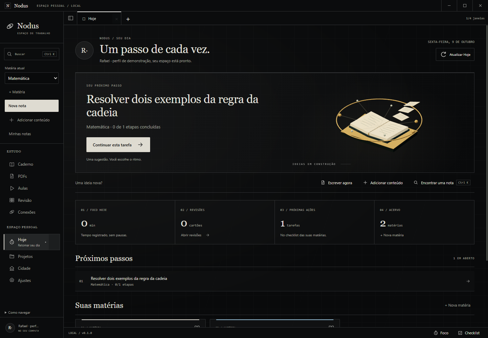
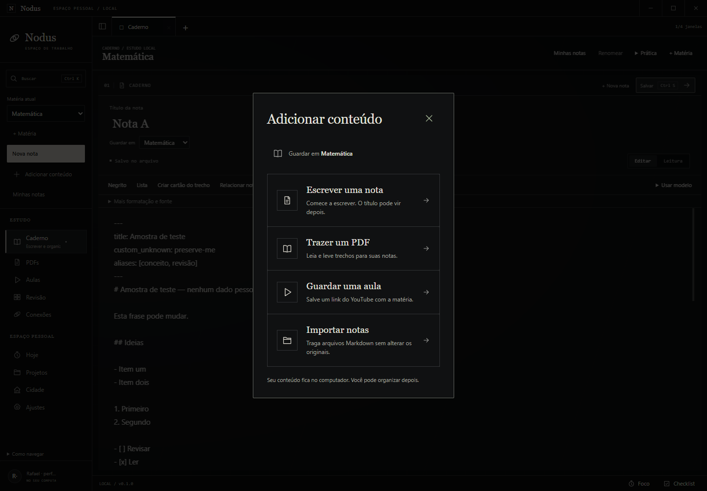
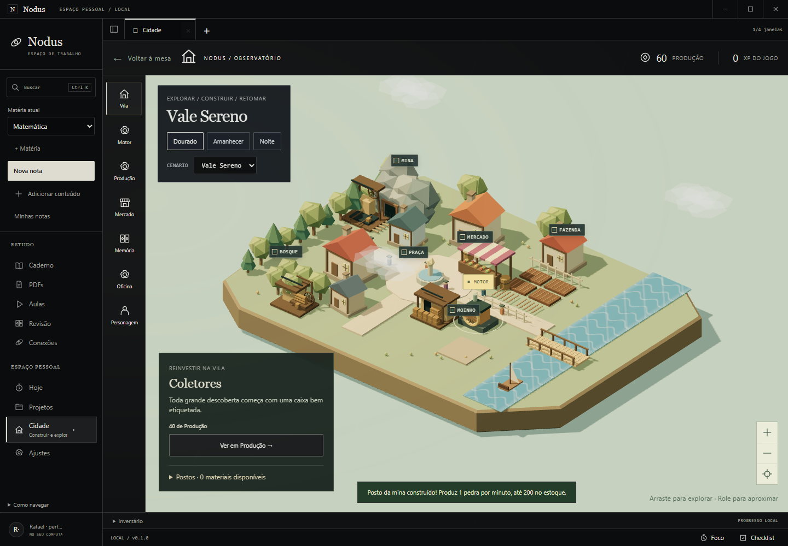
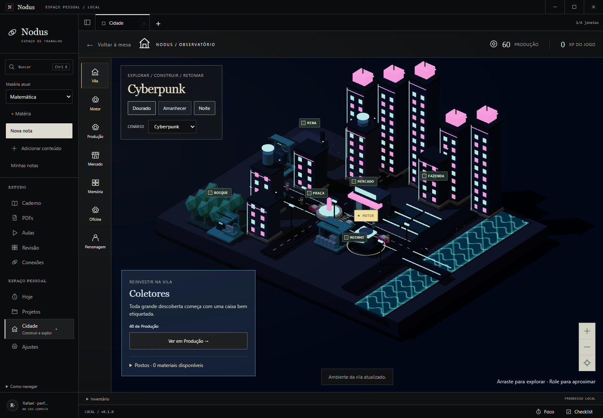

# Bom dia, Rafael! ☀️

Deixei o Nodus com uma entrada mais clara para estudar e uma Cidade mais viva. O trabalho se concentrou na navegação, no esforço de trazer conteúdo e na apresentação 3D dos módulos existentes. [Abrir a galeria com vídeos](BOM_DIA_2026-10-09.html).

## O que ficou mais fácil

**Hoje mostra uma próxima ação.** Ele encontra revisões pendentes, uma tarefa da última matéria ou a mesa para retomar. O botão de tarefa abre a matéria junto do checklist. Você pode continuar escrevendo ou adicionar material por ações diretas nessa tela.

**Adicionar conteúdo reúne quatro caminhos.** No menu lateral ou no Hoje, escolha escrever, trazer um PDF, guardar uma aula ou importar notas Markdown. A matéria de destino aparece antes da ação. A escrita conserva o título automático e abre diretamente na nota.

**A navegação explica o lugar atual.** A área selecionada ganha descrição e marca lateral, o acervo distingue a nota aberta e o primeiro uso orienta pasta → matéria → escrita. Na Cidade, os nomes dos locais aparecem na vista ampla; a janela compacta conserva espaço para o cenário e as ações.

## O que ganhou movimento 3D

Em Hoje e no primeiro uso, um livro aberto reúne páginas suspensas e ideias conectadas em órbita. A composição responde suavemente ao ponteiro. O texto e os botões continuam em uma superfície legível.

[Assistir ao livro e às ideias em movimento](../validation/evidence/visual-experience/ideias-3d.webm).

Na Cidade, o rio tem ondas por shader, nuvens se deslocam e pontos de luz aparecem à noite. Depósito, posto do bosque e posto da mina agora têm formas próprias. O próximo projeto aparece em contorno no terreno, e sua conclusão recebe uma animação 3D com partículas.

Rodas e cargas dos postos se movimentam durante a produção e pausam com estoque cheio. Recolher materiais e gerar um pulso válido recebem feedback visual. Antenas e indicadores do distrito produtivo também se movimentam. Esses efeitos acompanham o estado confirmado do jogo; o cálculo de ganhos continua no processo principal.

[Assistir à Cidade em movimento](../validation/evidence/visual-experience/cidade-viva.webm).

As três skins e os quatro temas continuam disponíveis. Movimento reduzido deixa as cenas estáticas; minimização, áreas ocultas e elementos fora do viewport pausam a animação. Se WebGL falhar, objetivos e ferramentas continuam acessíveis.

## O que foi conferido

**82/82 testes, typecheck e pacote Windows aprovados.** Executei sete jornadas no executável empacotado: interface/conteúdo/3D, notas, farm, distrito produtivo, abas, YouTube real e fluxo local do MVP. Elas cobrem rascunhos, importação, PDF, foco/checklist, conflito de arquivos, estoques, retomada, cinema/PiP e falha gráfica. Os 204 arquivos do build foram comparados com o ASAR e são idênticos.

Os resultados finais estão em [Validação técnica](../validation/VISUAL_EXPERIENCE.md), com 21 capturas, dois clipes, logs e hashes. O material nas imagens é de demonstração, em perfis isolados. As gravações mostram os canvases WebGL reais.

As alterações estão salvas localmente na branch codex/visual-experience, incluindo UX-01 e GAM-05 anteriores. Nenhum dado pessoal foi usado e nenhum commit, push ou publicação foi realizado. O pacote para experimentar está em release/win-unpacked/App Estudos.exe, dentro do projeto.

A avaliação com usuário leigo permanece pendente. O roteiro de GAM-05 continua disponível para observar se a pessoa entende o próximo objetivo e o benefício da construção sem explicação. Seleção manual do diálogo de arquivos, desempenho em outros GPUs e integrações externas da alpha continuam fora destas provas.

Para experimentar: abra a build local, entre em **Hoje**, use **Adicionar conteúdo** e visite **Cidade → Vila**. Os detalhes de uso também estão no [guia](../GUIA_DE_USO.md).
