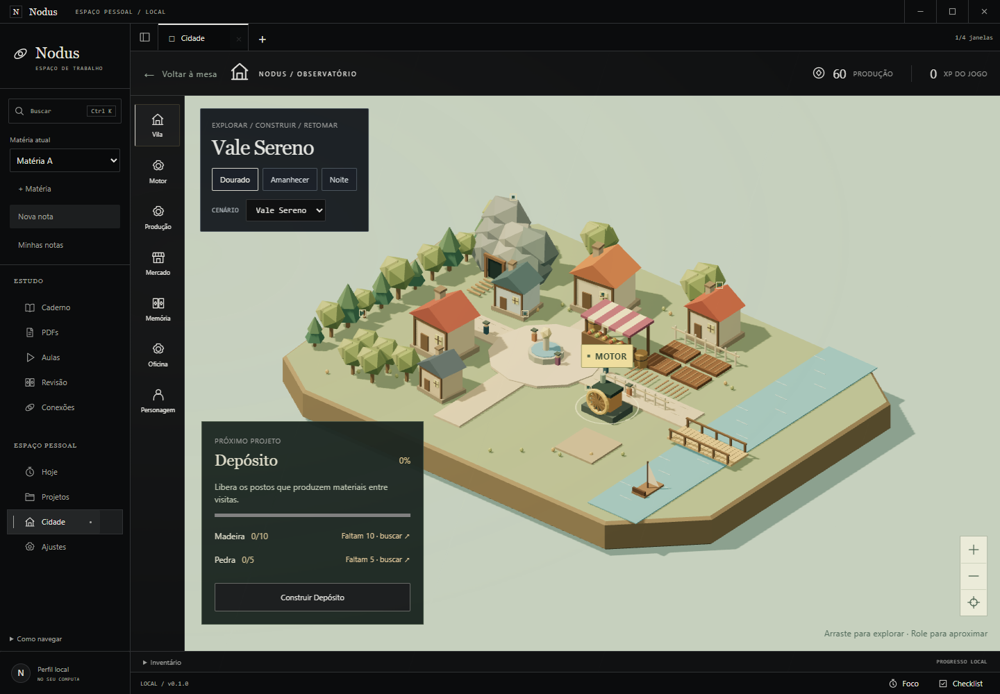
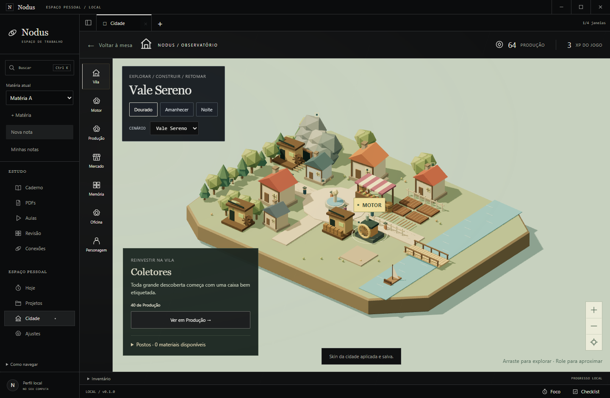
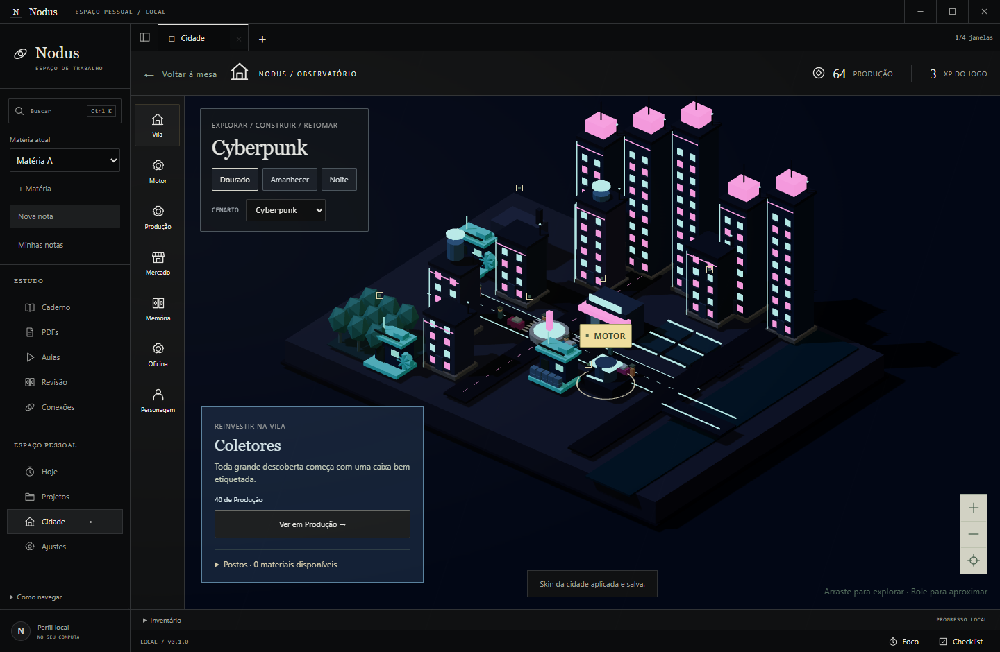
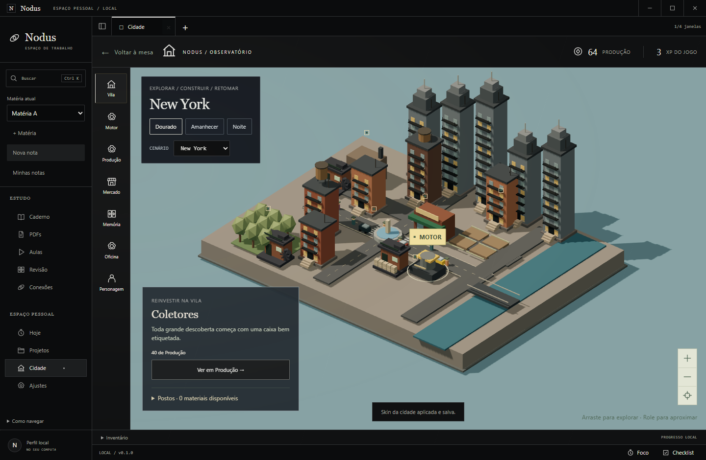
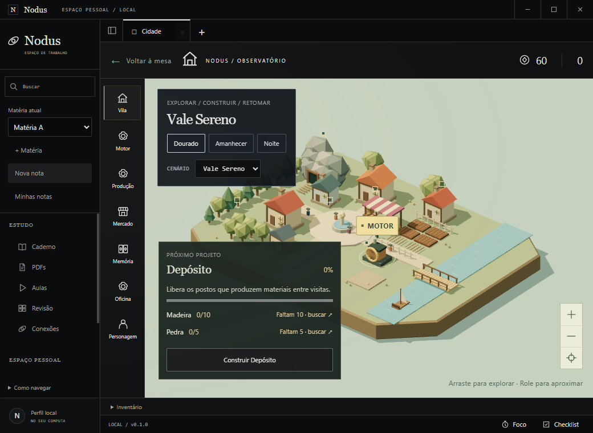
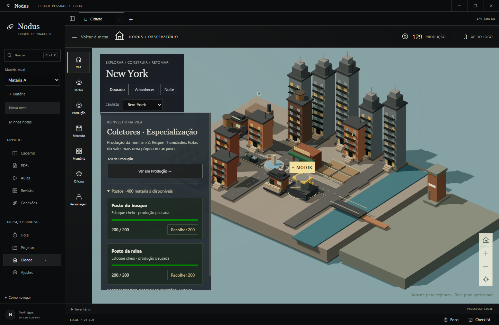
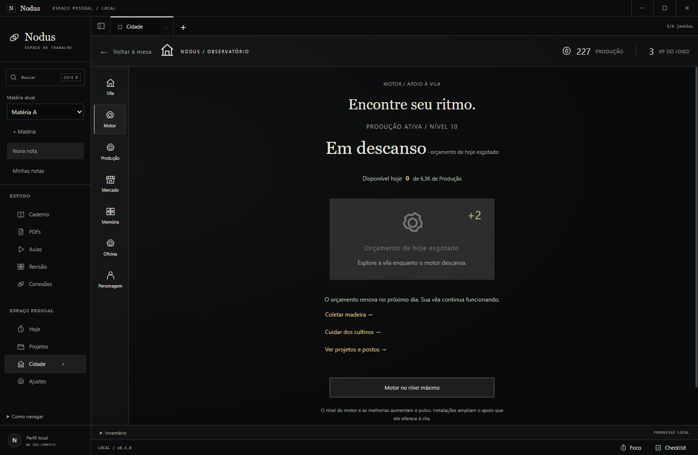

# GAM-05 — Projetos e automação da farm

09/10/2026. Windows11 10.0.26200, Node24.21.0 portátil, Electron44.5.1, app0.1.0. Branch local `codex/farm-projects` de cd3a199, com todas as alterações locais UX-01/DOC-01 conservadas. Sem migration, tabela, moeda, dependência nova, commit, push ou publicação. [Ticket](../tasks/doing/GAM-05.md), [decisão](../adr/0019-projetos-e-postos-da-farm.md), [uso](../GUIA_DE_USO.md).

## Entrega e critério humano

Projetos/estoques/motor e apresentação implementados. Typecheck,81testes, simulação, pacote204assets e jornadas Windows de farm/UX-01/MVP aprovados. C8 **não verificado**: nenhuma avaliação leiga real foi realizada. O ticket permanece em doing até registrar essa avaliação, mesmo com software entregue. A simulação não comprova interesse em voltar nem compreensão humana.

| Critério | Resultado atual | Evidência |
| --- | --- | --- |
| C1 | aprovado | Três custos reais/objetivo/faltantes/atalho/escolha e reinvestimento existente no domínio e UI Windows |
| C2 | aprovado | 1/min/cap200/sem XP ou counter de coleta, um minuto real e recolhimento no pacote |
| C3 | aprovado | Store/SQLite reais: insuficiência/duplicata/conflito/replay/rollback de construção e recolhimento |
| C4 | aprovado | Frações/cap/sem backlog/regressão/offline/reinício/baseline vazio/backup real/prestígio, schema7 conservado |
| C5 | aprovado | Cotação main/Amount até1e100, restante2/zero, dia regressivo, legado/eventos e motor no pacote |
| C6 | aprovado | Três skins/compacta/pacote/jornadas farm/UX-01/MVP e capturas reais |
| C7 | aprovado | Simulação/typecheck/81testes/ADR/documentação/bootstrap/diff/manifesto |
| C8 | não verificado | Roteiro humano abaixo; nenhum resultado inventado |

## Reprodução

Usar Node24 no terminal desta sessão, sem alterar configuração global:

```powershell
$env:PATH=(Resolve-Path -LiteralPath .local/node-v24.21.0-win-x64).Path+';'+$env:PATH
npm.cmd run typecheck
npm.cmd test
npm.cmd run simulate:farm
npm.cmd run package:win
npm.cmd run test:farm
node node_modules/tsx/dist/cli.mjs scripts/smoke-notes-ux.ts
npm.cmd run test:journey
node scripts/verify-activities-package.mjs
node scripts/check-bootstrap.mjs
```

`tests/farm.test.ts` usa Game/Store e backup reais com relógio controlado. `scripts/smoke-farm.ts` lança o EXE Windows com perfil isolado: primeiro vazio/atalho/coleta manual, depois fixture explicitamente identificada com os materiais necessários. Custos e resultado são executados pela UI/IPC real. Um minuto de produção foi aguardado no tempo real do main; fixture avançada/offline exercita cap/motor/reinício sem alegar que o jogador atingiu essa progressão. Nenhum vault/banco pessoal foi acessado.

Uma tentativa inicial encontrou os controles da câmera cobertos pelo cartão; corrigido e reexecutado. A revisão de capturas também encontrou flex comprimindo o botão do motor; corrigido mantendo rolagem da área. Em regressão UX, o seletor genérico `.first()` escolheu o widget da fonte do editor oculto após entrar em Leitura; o roteiro agora seleciona a fonte dentro da prévia visível. Também foi necessário aguardar o canvas e o texto do PDF recém-selecionado antes do duplo clique; a seleção agora usa locator estável. Não se alterou o editor/PDF para fazer o roteiro passar.

## Simulação

O perfil inicial realmente executa Game/SQLite, sem materiais semeados, motor ou estudo:89coletas,15colheitas, construção dos três projetos, saldo541/XP367, usando relógio do main controlado. Depósito22,5s, bosque157,5s, mina337,5s são **tempos simulados de uma estratégia ativa**, não tempo humano medido. Um material do bosque ajuda na construção da mina; cultivos exigem as15colheitas manuais.

Comparação subsequente: sete dias,15minutos de jogo/dia, estudo0ou45min/dia, motor nível0 (orçamento diário), venda dos estoques uma vez/dia e reinvestimento por ROI. Não simula eventos/revisões/prestígio efetivo nem jogo humano. Para isolar o efeito dos postos, ambas as versões partem do mesmo snapshot construído; uma desliga somente a produção material automática.

| Estudo/dia | Postos | Produzido na jornada ao dia7 | Taxa/min ao dia7 | Primeiro prestígio disponível |
| --- | --- | --- | --- | --- |
| 0min | desligados | 7,780501158981e12 | 4,53935296907055e9 | minuto8319 (5,78dias) |
| 0min | ligados | 7,780501165186e12 | 4,53935296907055e9 | minuto8319 (5,78dias) |
| 45min | desligados | 1,7678318561109e13 | 8,9648111197953e9 | minuto7329 (5,09dias) |
| 45min | ligados | 1,7678318567412e13 | 8,9648111197953e9 | minuto7329 (5,09dias) |

Cada cenário com postos acrescentou6.007de Produção por vendas ao longo da janela. Materiais têm preço fixo; impacto financeiro tardio é pequeno e não mudou o instante do primeiro prestígio nesse modelo. Motor rendeu aproximadamente1,75e9sem estudo e5,05e9com estudo, parcela pequena frente à produção total. Estudo acelerou a estratégia, mas o perfil sem estudo progrediu. A coleta manual tem capacidade de40ações/minuto (picareta pode duplicar pedra), contra1material/minuto/posto, e preserva recompensa/XP que os postos não concedem. Não é uma prova exaustiva de balanceamento de meses ou retenção.

## Avaliação leiga pendente

Mostrar a build a alguém que não acompanhou o desenvolvimento, sem explicar os projetos. Em um perfil de teste vazio, pedir: “O que você faria agora para melhorar a Vila?” e “O que vai mudar quando essa construção ficar pronta?”. Observar se encontra o próximo objetivo, interpreta os faltantes/benefício e usa Buscar. Depois, mostrar depósito pronto e pedir que escolha um posto; mostrar estoque cheio e pedir para continuar a produção.

Registrar as respostas literais, dificuldades e ações observadas, sem nome/dados pessoais. Aprovar C8 somente com entendimento do próximo objetivo e benefício sem instrução prévia; corrigir se necessário e repetir. Capturas, testes e leitura técnica não substituem essa pessoa. Próxima ação concreta após a entrega local: executar esse roteiro e anexar o resultado ao ticket.


## Arquivos e evidência preservada

Regras/estado: `src/shared/farm.ts`, `src/shared/motor.ts`, `src/shared/game.ts`, `src/main/game.ts`. Interface/cena: `FarmProjects.tsx`, `FarmScene.ts`, `GameView.tsx`, `CityScene.tsx`, `EconomyWorkspace.tsx`, `EngineButton.tsx`, `motion.tsx` e `game.css`. Provas reproduzíveis: `tests/farm.test.ts`, `scripts/smoke-farm.ts`, `scripts/simulate-farm.ts` e expansão opcional de `simulate-economy.ts`. O roteiro UX foi corrigido para observar os controles visíveis e o PDF atual, preservando a implementação.

[Manifesto/proveniência/SHA256](evidence/farm-projects/manifest.json), [204assets/EXE/ASAR](evidence/farm-projects/package.json), [81testes](evidence/farm-projects/tests.log), [build/pacote](evidence/farm-projects/package.log), [jornada farm](evidence/farm-projects/windows.json), [modelo de progressão](evidence/farm-projects/simulation.json), [UX-01](evidence/farm-projects/notes-ux.json), [MVP R1–R7](evidence/farm-projects/journey.json). Perfis de fixture ficam fora do repositório; documentação contém resultados sanitizados e16capturas reais. Principais imagens inspecionadas para objetivos, skins, estoque, compacto e motor; o +2 na imagem de descanso é o feedback do último pulso válido, não um novo ganho.

EXE SHA256: `540f4392ff90d18dab11776d3ea2fa278c401d8eae0835d4366790d98df11554`. ASAR SHA256: `5f2741280535d38adfb6539b5833ba33060c1a18bb2c6888fa3b2b66c21feefd`. Todos os204arquivos de dist conferidos byte a byte dentro do pacote. Typecheck e81/81testes aprovados; farm/UX-01/MVP reexecutados no pacote final. Bootstrap e diff conferidos no fechamento. Janela ampla1440×1000 e compacta1040×760; controles, seletor e rolagem preservados. Os avisos de tamanho de chunks e metadados/assinatura do pacote existente não impediram a build local.














