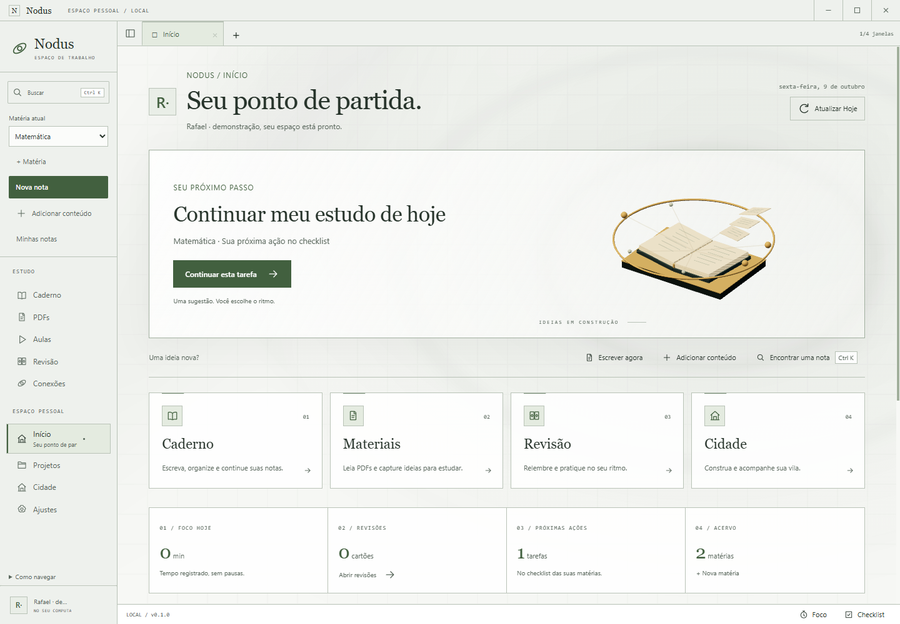
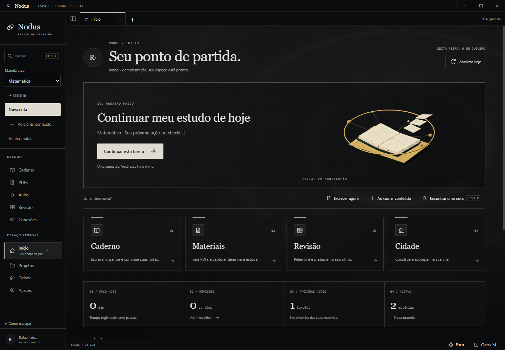
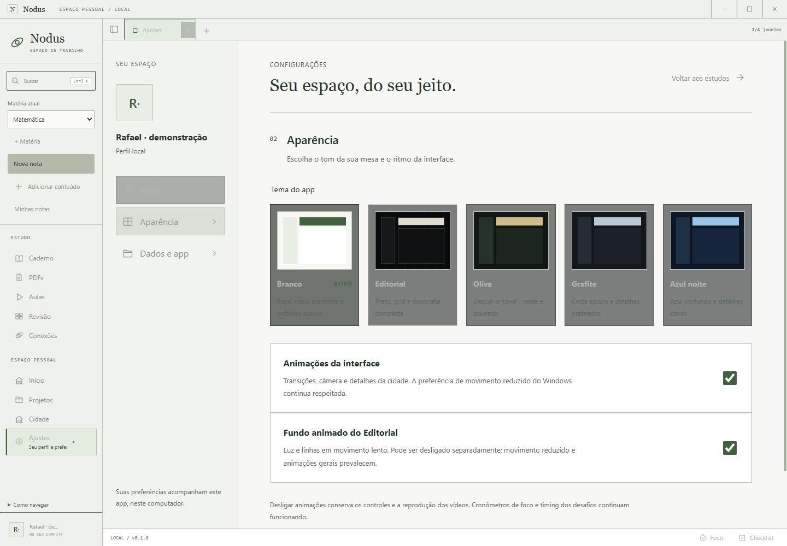
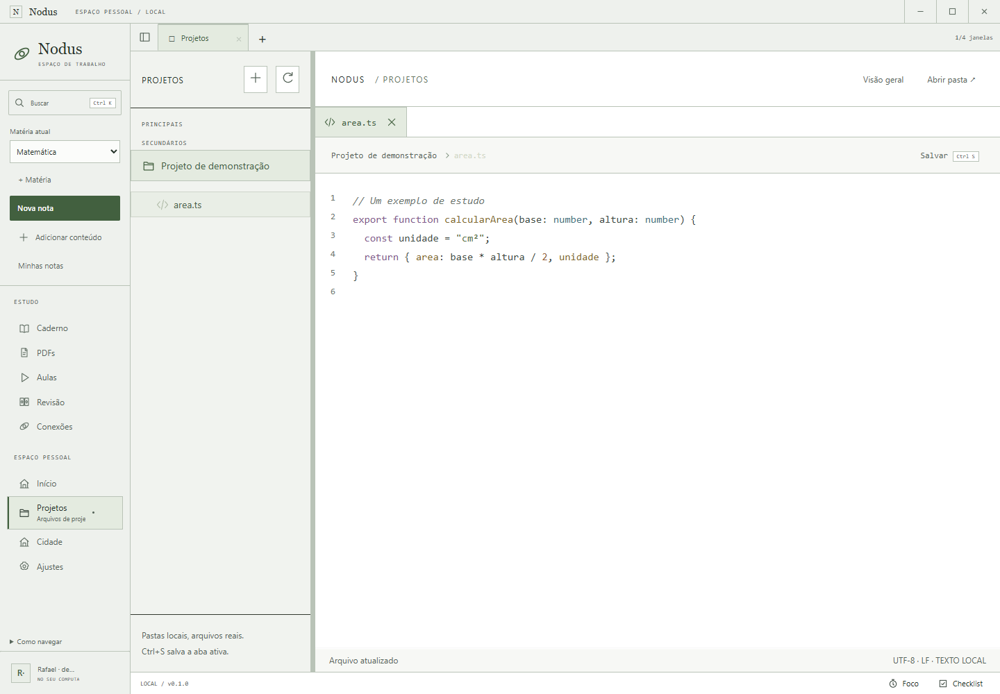

# UX-03 — Home animada e tema Branco

Windows nativo em 09/10/2026; branch local codex/home-white, sobre o checkout de UX-02/UX-01/GAM-05/DOC-01. Node 24.21.0 portátil, Electron 44.5.1, Three.js 0.186.1, app 0.1.0. Fixtures geradas, perfis isolados e operações reais. Sem dependência, lockfile, migration, dados pessoais ou publicação.

## Critérios

| Critério | Resultado | Evidência |
| --- | --- | --- |
| C1 | aprovado | Início reutiliza home/próxima ação; quatro atalhos, matéria/checklist e primeiro uso real; perfil novo em Home, legado conservado |
| C2 | aprovado | Entrada GSAP medida durante execução, hover real, tempo WebGL avança e retângulo do canvas idêntico após scrollTop 550 |
| C3 | aprovado | Movimento reduzido, controle geral pela UI, área oculta e minimização pausam; perda real WebGL mantém navegação; cleanup revisado |
| C4 | aprovado | Branco escolhido nos Ajustes, código com cor medida, grafo claro, fotos dos módulos/diálogo, tema/rascunho após restart; SQLite 7 sem reset |
| C5 | aprovado | Typecheck, 83/83 testes, pacote Windows, Home/Notas UX/Abas/MVP; 204 arquivos dist idênticos no ASAR |
| C6 | aprovado | ADR21, guia, quadro, retomada, relatório, 15 fotos originais, WebM, manifesto, preservação, bootstrap/diff e stage vazio |

## Reprodução

Use o Node 24 portátil no PATH do terminal; não altera o Node global. Scripts de jornada abrem o executável Windows e devem ser executados em sequência.

```powershell
npm.cmd run typecheck
npm.cmd test
npm.cmd run package:win
node.exe node_modules/tsx/dist/cli.mjs scripts/smoke-home-white.ts
node.exe node_modules/tsx/dist/cli.mjs scripts/smoke-notes-ux.ts
node.exe node_modules/tsx/dist/cli.mjs scripts/smoke-study-tabs.ts --packaged
node.exe node_modules/tsx/dist/cli.mjs scripts/smoke-journey.ts --packaged
node.exe scripts/check-bootstrap.mjs
git diff --check
```

## Resultados

| Verificação | Artefatos | Resultado |
| --- | --- | --- |
| Typecheck e domínio/persistência | [Typecheck](evidence/home-white/typecheck.log), [83 testes](evidence/home-white/tests.log) | aprovado; preferência branca/reopen/legado/rollback/setting/schema incluídos |
| Build/pacote Windows | [Log](evidence/home-white/package.log), [204 arquivos e hashes](evidence/home-white/package.json) | aprovado; executável e ASAR conferidos |
| Home/Branco e animações | [Resultado](evidence/home-white/windows.json), [log](evidence/home-white/home.log) | aprovado; errors/graphicsErrors vazios |
| Escrita/organização/captura | [Resultado](evidence/home-white/notes-ux.json), [log](evidence/home-white/notes-ux.log) | aprovado; fontes/rascunhos/restart/primeiro uso |
| Abas e divisões | [Resultado](evidence/home-white/study-tabs.json), [log](evidence/home-white/study-tabs.log) | aprovado; teclado/drag/PDF2/rascunhos/player oficial real/PiP/restart |
| MVP R1–R7 | [Resultado](evidence/home-white/journey.json), [log](evidence/home-white/journey.log) | aprovado; dois contextos/PDF2–3/layout/foco/checklist/conflito |
| Documentação e preservação | [Bootstrap](evidence/home-white/bootstrap.log), [diff](evidence/home-white/diff.log), [baseline](evidence/home-white/preservation.json), [manifesto](evidence/home-white/manifest.json) | aprovado; 164 arquivos anteriores presentes, 89 críticos byte idênticos |

A reconferência final de Home/Branco e hashes ocorreu após ajustar o contraste da raiz selecionada dos projetos e dos rótulos da Cidade. As regressões de Notas/Abas/MVP foram executadas imediatamente antes desses últimos ajustes exclusivamente CSS; código de domínio, persistência e componentes dessas jornadas permaneceu igual.

## O que foi exercitado

O perfil de demonstração tem duas matérias/notas, PDFs gerados, checklist e um projeto TypeScript gerado. O tema é escolhido na UI, usando o IPC validado e SQLite real. Navegação conserva rascunho não salvo; após fechar/reabrir, tema branco e Home permanecem, e o Markdown original é comparado byte a byte. Arquivo de código também permanece intacto.

O perfil novo usa a Home padrão, **Escrever agora**, preparação automática da pasta em Documents isolado, criação de matéria e editor real. Não usa o vault ou banco pessoal. A fixture histórica de regressão escolhe explicitamente a área estudo, conservando o seu ponto inicial anterior; isso não modifica o padrão do app.

O fundo tem plano/shader e câmera fixa, sem parallax nem pan. Sua posição é independente da rolagem. Entrada dos componentes é medida por opacidade/transformação antes de concluir; interação de cartão é medida após hover. O limite é aproximadamente 15 quadros/s, DPR até 1,25; a amostra final registrou avanço de quadros no host. Reduzido/desligado produzem quadro estático; áreas ocultas/minimização interrompem o loop. WEBGL_lose_context provoca perda real para verificar a navegação independente da GPU.

O WebM de aproximadamente quatro segundos é gravado do canvas real depois das fotos, em processo separado, devido ao artefato do compositor já registrado em O-027. Reprodução conferida no Edge Windows isolado: 1252×834, duração 3,93 segundos e 30 quadros decodificados na amostra. [Resultado da reprodução](evidence/home-white/clip.json). Nenhuma foto foi reconstruída ou editada. [Clipe do fundo](evidence/home-white/fundo-home.webm).

## Fotos reais









Outras capturas no [resultado](evidence/home-white/windows.json): rolagem, entrada de conteúdo, caderno, PDF, aulas, revisão, conexões, projetos, cidade, compacto 1040×760 e primeiro uso.

## Arquivos e limites

[HomeWorkspace](../../src/renderer/HomeWorkspace.tsx), [HomeBackground](../../src/renderer/HomeBackground.tsx), [DayOverview](../../src/renderer/DayOverview.tsx), [home.css](../../src/renderer/home.css), [white.css](../../src/renderer/white.css), [preferências](../../src/shared/preferences.ts), [GraphScene](../../src/renderer/GraphScene.tsx), [ProjectEditor](../../src/renderer/ProjectEditor.tsx), [jornada](../../scripts/smoke-home-white.ts), [testes de preferências](../../tests/preferences.test.ts).

Perfis válidos anteriores conservam abas/composições. Branco é o quinto tema; os quatro anteriores continuam disponíveis. Nenhuma alteração de economia ou recursos do main/preload neste incremento. A assinatura do pacote continua desativada conforme a configuração existente. Desempenho em outros GPUs, seleção manual de arquivos e compreensão por pessoa leiga não foram aprovados por esta prova; GAM-05/C8 e pendências externas da alpha permanecem nos tickets existentes. Alterações locais preservadas, sem stage, commit, push ou publicação.
