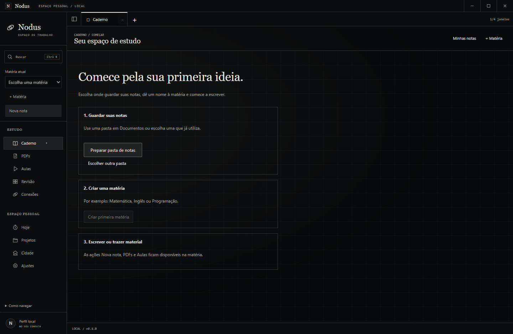
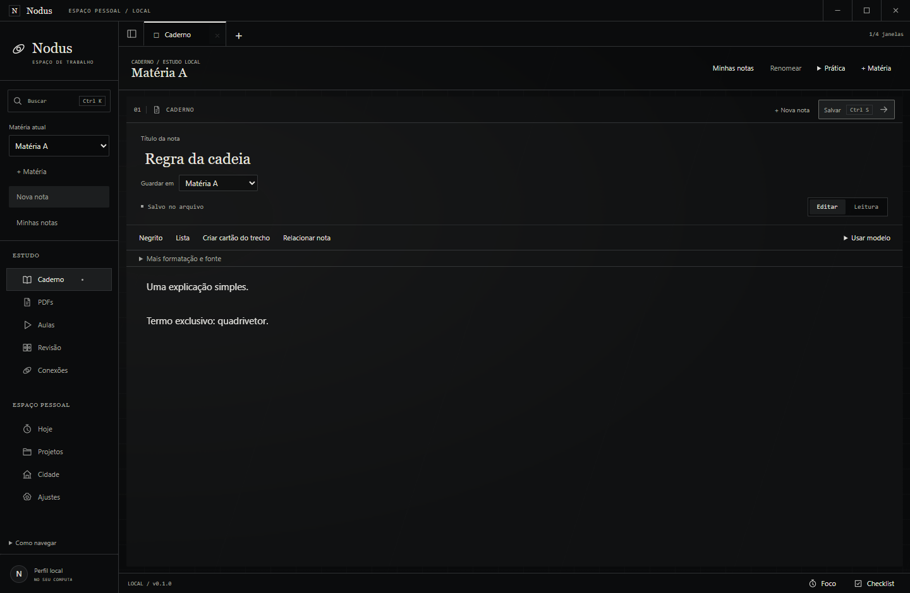
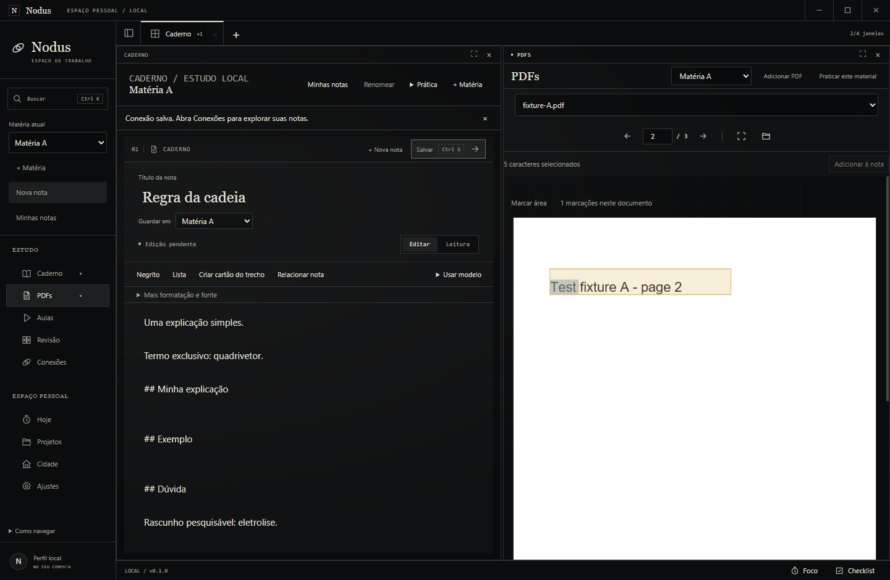
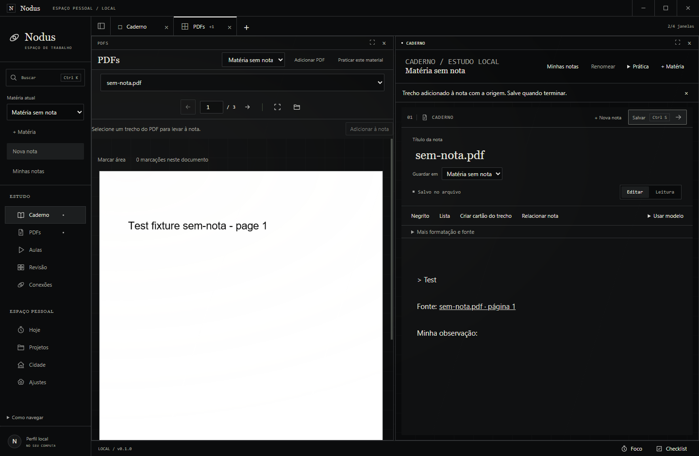
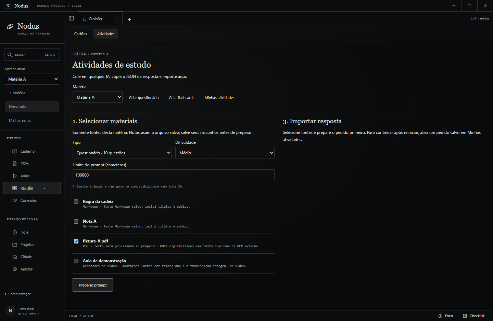
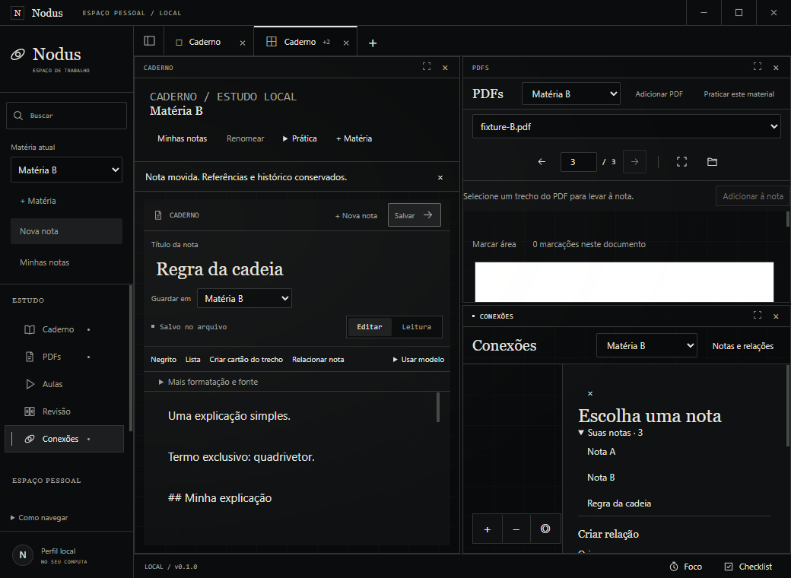

# UX-01 — Escrita simples e navegação

08/10/2026, Windows 11 10.0.26200, Node 24.21.0 portátil, Electron 44.5.1, app 0.1.0. Branch local codex/notes-navigation criada de codex/external-study-activities, com apresentação DOC-01 preservada de codex/readme-showcase. Código de IA-01 já existente foi reutilizado; nenhum merge remoto, commit, push, release ou serviço por este pedido. Perfis, vaults, banco e PDFs de prova são fixtures explícitas em .local, sem material pessoal.

## Critérios e evidências

| Critério | Resultado | Evidência |
| --- | --- | --- |
| C1 | aprovado | Jornada empacotada: um clique, foco no corpo vazio, nenhum diálogo de título; primeiro uso prepara Documentos isolados, cria matéria e nota. Fonte completa/metadados separados, rascunho buscável e reinício real |
| C2 | aprovado | Título sugerido/editável, modelo Conceito, recentes e matéria visível; mudança conserva ID/corpo/cartão/relação. Tests com BOM/CRLF/campos desconhecidos/título literal, hash externo/conflito, trigger de falha/rollback e restart |
| C3 | aprovado | Ctrl+K encontra palavra somente no rascunho; serviços importam arquivo externo real sem tocar original, conservam BOM/CRLF/campos, recusam UTF-8 inválido/ID duplicado, falha de audit não deixa catálogo órfão. Seleção nativa aceita múltiplos arquivos e tem relatório individual |
| C4 | aprovado | Duplo clique real na TextLayer de PDF2, captura no arquivo com UUID/página/hash; comentário reutilizado; fonte volta ao PDF2; momento75s entra na nota e player oficial abre start=75. Sem nota aberta, captura cria arquivo real |
| C5 | aprovado | Seleção cria cartão real, origem predefinida e formulário sem seletores extras; relação na escrita aparece no grafo após mudar matéria. Cartões/relações/snapshots históricos preservados |
| C6 | aprovado | Praticar este material abre exatamente PDF escolhido na prática existente; regressão de IA-01 exerce prompt/clipboard/correção/importação/prática/replay/reinício sem chamada de provedor |
| C7 | aprovado | Capturas amplas/1040×760 e primeiro uso inspecionadas; matéria/ações/menu com nomes consistentes, modelos/formatação opcionais, abas/divisões/recolher/reabrir/restart conservados. Referências técnicas ocultas por decoração, fonte Markdown intacta |
| C8 | aprovado | Typecheck, suíte76/76, build/pacote Windows, comparação de204assets, jornadas reais e docs/bootstrap/diff; quatro novos canais negados de outra janela, argumento move inválido rejeitado. Sem migration/dependência/reset |

## Verificação

Comandos executados com o runtime24 explícito; PATH ajustado somente no terminal do empacotamento:

```text
.local/node-v24.21.0-win-x64/node.exe node_modules/typescript/bin/tsc --noEmit
.local/node-v24.21.0-win-x64/node.exe node_modules/tsx/dist/cli.mjs --test tests/*.test.ts
npm.cmd run package:win
.local/node-v24.21.0-win-x64/node.exe node_modules/tsx/dist/cli.mjs scripts/smoke-notes-ux.ts
.local/node-v24.21.0-win-x64/node.exe node_modules/tsx/dist/cli.mjs scripts/smoke-journey.ts
.local/node-v24.21.0-win-x64/node.exe node_modules/tsx/dist/cli.mjs scripts/smoke-external-activities.ts
.local/node-v24.21.0-win-x64/node.exe node_modules/tsx/dist/cli.mjs scripts/smoke-videos.ts --packaged
.local/node-v24.21.0-win-x64/node.exe scripts/verify-activities-package.mjs
.local/node-v24.21.0-win-x64/node.exe scripts/check-bootstrap.mjs
git diff --check
```

A suíte final aprovou76 testes. Testes de domínio não fingem extração PDF: a jornada Windows usa PDF.js/TextLayer/SQLite/arquivos reais e player oficial. MVP Journey conserva R1–R7 (PDF2/3, matérias, notas, checklist, foco pausado/restart e conflito externo); R8 nuvem/celular continua não verificado, fora de UX-01. IA conserva quatro fontes, quiz10/10,10cartões, revisões, tentativas, três reaberturas, invariantes e nenhum HTTP(S) do renderer/provedor. Vídeo comprova reprodução oficial/isolamento/PiP/cinema/crash/retry e tempo75s.

O build conserva avisos existentes de chunks grandes, author ausente e referências duplicadas de dependências; não há assinatura de publicação. Manifesto [package.json](evidence/notes-ux/package.json) registra hashes de EXE/ASAR e204arquivos dist idênticos ao pacote. Relatórios/capturas referenciam apenas fixtures; executável, bancos e vaults não são versionados.

Pacote final: EXE SHA-256 `be3761fe9f268a492c3e04cdc4e68b1ce50dc8edd72ff3b068ee4c9718c3dd3c`; ASAR `ad3eb796f463e9465952f9e080ce6d1622491b56f37ae1a97a0b0048d9f5623c`. As quatro jornadas aprovadas usam esse pacote. Fechamento: bootstrap aprovado com28tickets/188critérios/130Markdown/580links; git diff --check aprovado e stage vazio. Nenhum dado pessoal foi copiado; os caminhos de fixtures foram relativizados nos relatórios.

## Correções observadas

A inspeção das primeiras capturas identificou regras CSS antigas alterando título/aviso e endereços de referência longos na escrita. CSS específico corrigiu a apresentação; decoração CodeMirror mostra nome/página/tempo sem transformar conteúdo. URLs completas continuam em Fonte completa. Menu compacto ganhou espaço para os nomes e capturas finais confirmam o resultado. O-023 registra a colisão CSS.

Falhas dos verificadores foram corrigidas com evidência posterior: caso novo de cartão usava nome de método incorreto; snapshot movido usava hash anterior ao salvamento da fixture; vídeo/PDF novos precisavam de seleção explícita na mesa; botão Criar matéria tinha dois nomes acessíveis idênticos. No roteiro de vídeo, a posição PiP deixada pelo teste de arraste cobria o formulário posterior; Home reposiciona pelo controle real antes da etapa, sem clique forçado. Seletores antigos de título/modal/PDF foram atualizados para o fluxo real. Nenhuma dessas falhas foi apresentada como aprovação.

## Limites

- Não há OCR, transcrição de vídeo, classificação automática ou envio automático à IA. Captura trabalha com texto digital, comentários e momentos anotados.
- Dialogar com a seleção nativa de múltiplos arquivos não foi automatizado. Importação de arquivos e falhas foi comprovada pelo serviço real; primeiro uso com pasta padrão foi comprovado na UI.
- Matéria/nota/PDF/player continuam compartilhados entre abas. Mover a nota mantém o caminho físico e as coleções históricas de cartões/marcações/atividades.
- Busca por corpo lê arquivos registrados sob demanda; desempenho com um vault grande não foi medido. A experiência ainda precisa de avaliação com usuários leigos; provas funcionais não medem compreensão humana.
- Pendências externas de ALP-02/C5 e ALP-09 continuam inalteradas.

## Capturas finais








Resultados completos: [jornada UX](evidence/notes-ux/results.json), [unidades](evidence/notes-ux/unit-final.txt), [MVP](evidence/notes-ux/journey-results.json), [prática](evidence/notes-ux/external-activities-results.json), [player](evidence/notes-ux/videos-results.json). [Guia](../GUIA_DE_USO.md), [decisão](../adr/0018-notas-e-navegacao.md), [ticket](../tasks/done/UX-01.md).
