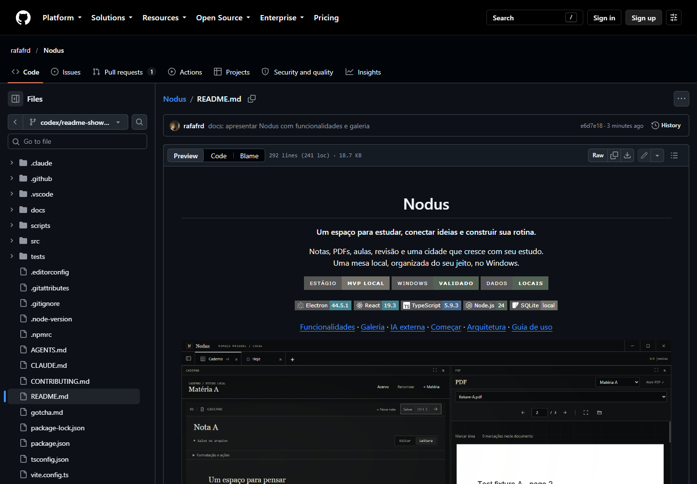
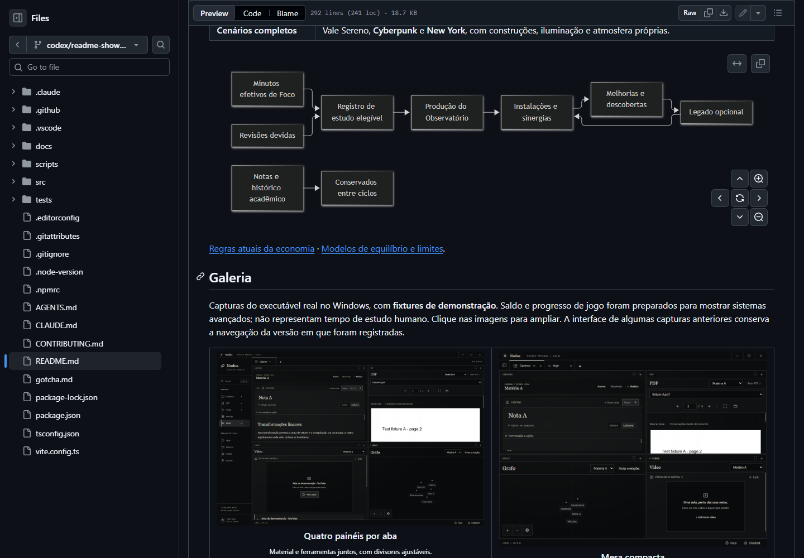
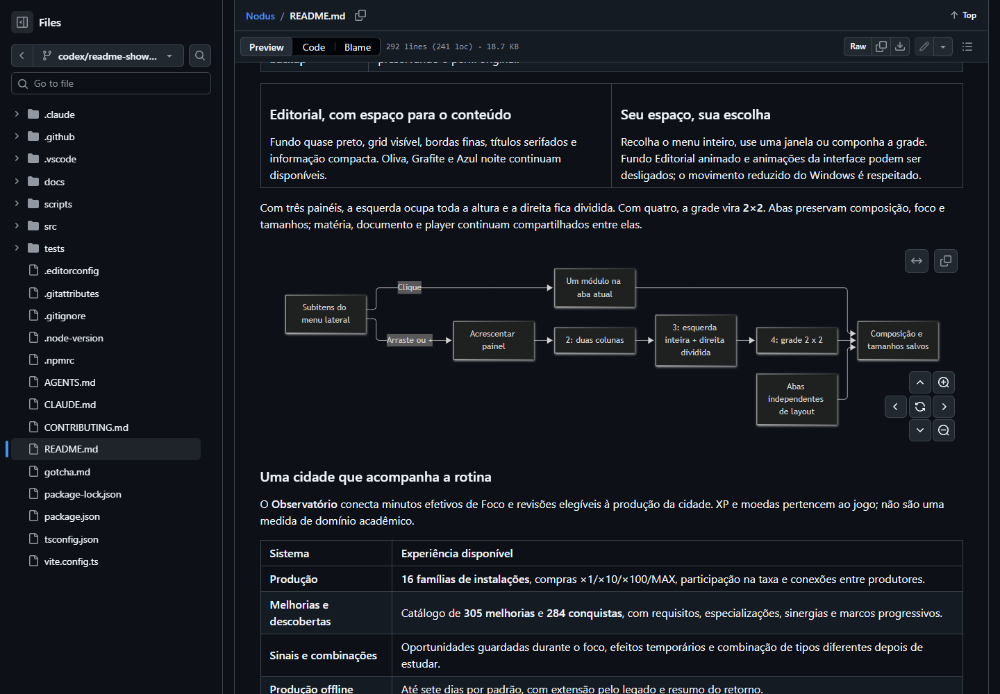
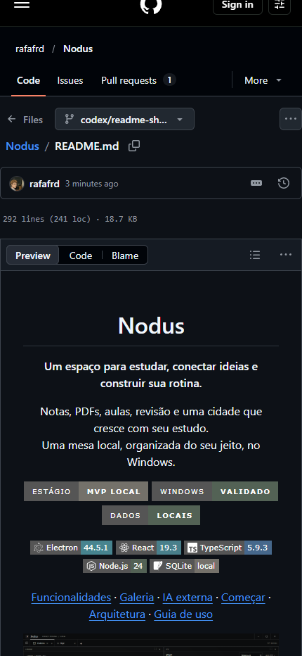
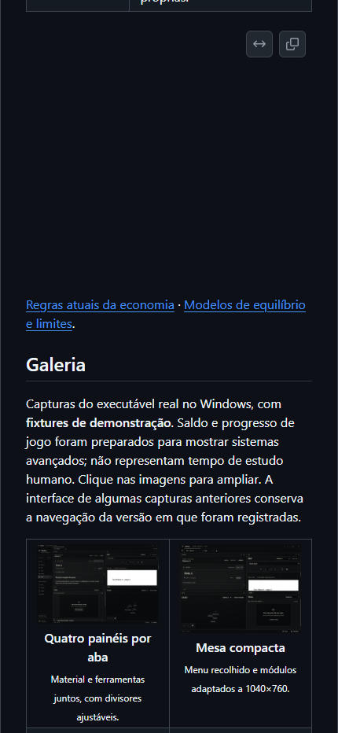
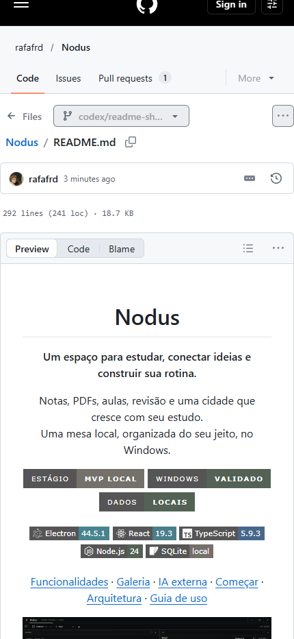

# DOC-01 — Apresentação do README

07/10/2026, Windows11, branch codex/readme-showcase criada de main/c95aabd, árvore inicialmente limpa. Alteração exclusivamente documental. README reúne funcionalidades integradas e identifica IA externa como implementada/validada no PR13 ainda aberto, sem trazê-la silenciosamente para main.

## Verificações executadas

| Verificação | Resultado |
| --- | --- |
| Conteúdo vs código/package.json/evidências/main | Aprovado:16famílias/305melhorias incluindo permanentes/284conquistas, quatro temas/até quatro painéis/36etapas, scripts e versões atuais |
| Recursos e GFM público | Aprovado:9badges Shields.io e2prints externos retornam200/image;8prints locais e14destinos HTML existem;19imagens com alt,12tabelas e3blocos Mermaid; API Markdown GitHub200 |
| Âncoras | Aprovado: cinco cliques nos links do cabeçalho na página GitHub chegam aos fragmentos corretos, inclusive título acentuado |
| Renderização no navegador | Aprovado na página GitHub real: Edge154.0.4258.62,19imagens carregadas/3SVGs Mermaid visíveis/12tabelas,1440×1000 e430×932; largura430sem overflow global, temas claro/escuro e galeria de cenários aberta |
| Bootstrap | Aprovado:26tickets/170critérios/119Markdown/504links antes deste relatório; não testa o app |
| Diff | git diff --check aprovado |
| Gitleaks e primeiro checkpoint Git | Aprovado:6arquivos exclusivamente documentais,40.705bytes de patch sem achados; e6d7e18 enviado com upstream |

Comandos locais realmente executados com Node24/Python do runtime, sem mudança global:

```text
python -X utf8 .local/check-readme-resources.py
node24 node_modules/tsx/dist/cli.mjs .local/check-readme-content.ts
node24 .local/check-readme-browser.mjs
node24 .local/inspect-readme-github.mjs
node24 scripts/check-bootstrap.mjs
git diff --check
git diff --cached --check
gitleaks dir .local/readme-pr-scan --redact --no-banner
```

Os verificadores temporários e HTML ficam em .local, ignorados. A checagem de recursos usa HTMLParser/HEAD/API GFM, sem baixar imagens para contornar restrições. Capturas do app reutilizam provas reais já versionadas; não são imagens geradas ou um novo teste do aplicativo. A renderização real complementa a API GFM. [Recursos](evidence/readme/resources.json) e [navegador](evidence/readme/result.json) registram os resultados, sem perfil pessoal/credenciais.

## Compatibilidade e fontes

GitHub remove estilos CSS inline e atributos class/id da entrada: [pipeline oficial](https://github.com/github/markup). README usa div align, tabelas, width/valign, legendas e details; os diagramas ficam em cercas Mermaid próprias conforme [documentação oficial](https://docs.github.com/en/get-started/writing-on-github/working-with-advanced-formatting/creating-diagrams). Badges estáticos via [Shields.io](https://shields.io/badges), sem anunciar CI inexistente. A [API oficial GFM](https://docs.github.com/en/rest/markdown/markdown?apiVersion=2022-11-28) conferiu a primeira conversão/sanitização.

Falhas dos verificadores foram corrigidas: regex inicial confundia query style= do badge com atributo HTML; API GFM não fornece as âncoras enriquecidas da página e muda table para table role. Nenhuma alteração no produto para contornar essas diferenças. O primeiro bootstrap com ticket recém-criado apontou retomada/validação ainda não cadastradas; cadastro completo passou.

O roteiro inicial abriu todos os details da página e acionou também os diálogos de ampliação do Mermaid, deixando as primeiras capturas escurecidas. Correção limita a ação ao summary dos cenários e aguarda iframe/SVG com largura real, em vez de contar ícones como diagramas. Espera networkidle não terminava devido às conexões da página; DOM/recursos/iframe são aguardados explicitamente. Seletores de navegação foram restringidos ao cabeçalho para evitar o permalink adicionado pelo GitHub. Execução completa posterior passou; somente capturas finais limpas, inspecionadas, são versionadas.

## Capturas da página GitHub real








## Retomada

C1–C4 aprovados pelos checks, apresentação real e entrega Git. Nenhum build/teste funcional repetido: não há fonte/dependência/lockfile alterado. PR13 continua aberto/não integrado na reconferência; main permanece c95aabd. Commits e6d7e18/ff11163 enviados com upstream; [PR #14](https://github.com/rafafrd/Nodus/pull/14) aberto para main/draft=false e anexado ao chat. API confirmou head/body/base; proposta exclusivamente documental. Stage de prova17.922bytes/Gitleaks sem achados, bootstrap26tickets/170critérios/120Markdown/510links aprovado. O checkpoint de fechamento move DOC-01 para done e conserva README/assets já renderizados. Próxima ação humana: revisar/integrar PR14; nenhum merge/release realizado.

Fechamento documental: bootstrap26tickets/170critérios/120Markdown/512links aprovado; diff cached/scan do stage final exclusivamente documental aprovados, sem segredos encontrados. README e recursos renderizados permanecem idênticos ao checkpoint visual.
