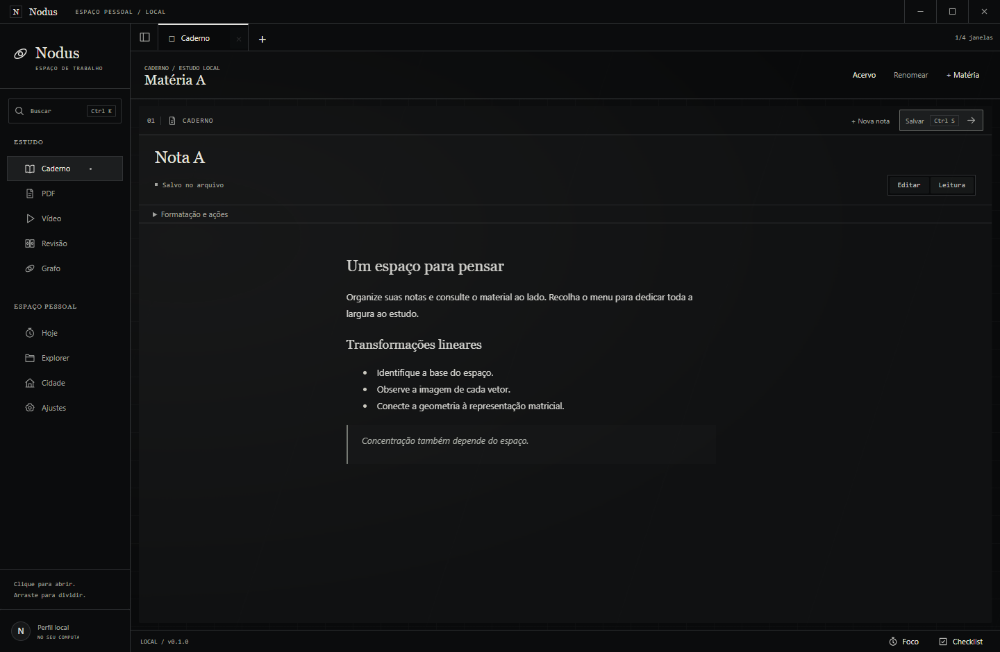
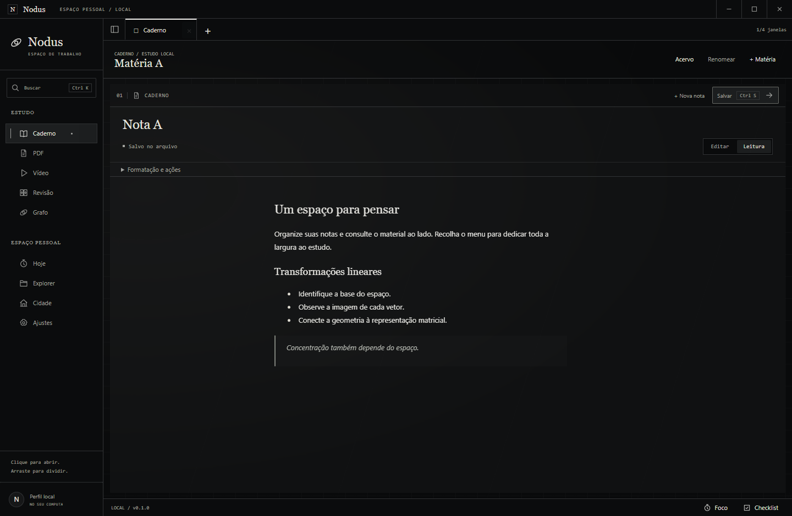
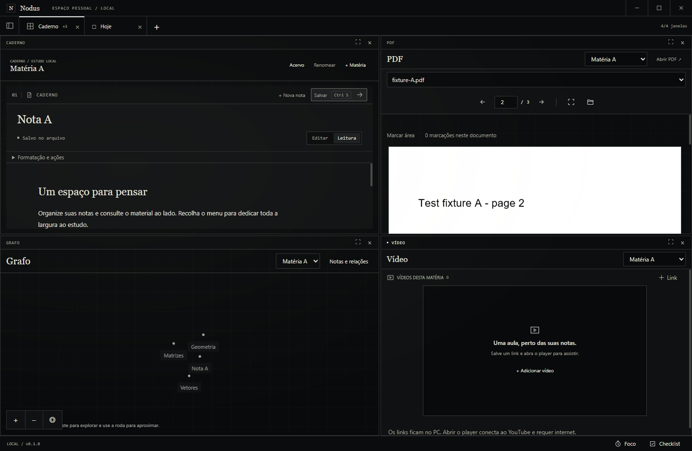

# UI-06 — Menu lateral recolhível

07/10/2026, Windows 11 10.0.26200, Node 24.19.0, Electron 44.5.1, branch codex/study-tabs. Incremento do [PR12](https://github.com/rafafrd/Nodus/pull/12); UI-05/GAM-04 preservados. [Ticket](../tasks/done/UI-06.md).

O indicador lateral agora aparece somente no hover/foco do teclado, com **16px entre a linha e o ícone** e 8px de recuo vertical. O botão antes das abas esconde o menu inteiro, liberando **188px** na janela ampla (156px na largura compacta), e o reabre por clique/Enter/Espaço. Preferência booleana salva, sem mudar abas/divisores/contexto dos módulos.

## Verificação executada

Comandos executados pela CLI do runtime Node24 local, evitando o npm.ps1 que seleciona outro Node neste host:

```powershell
node node_modules/tsx/dist/cli.mjs --test tests/preferences.test.ts tests/workspace.test.ts
node node_modules/typescript/lib/tsc.js --noEmit
node scripts/build.mjs
node node_modules/electron-builder/cli.js --win --dir
node node_modules/tsx/dist/cli.mjs scripts/smoke-sidebar.ts
node node_modules/tsx/dist/cli.mjs scripts/smoke-study-tabs.ts
node .local/verify-study-package.mjs
node scripts/check-bootstrap.mjs
git diff --check
```

- **10 testes aprovados:** compatibilidade de perfil antigo sem regravação, persistência/rollback de preferências, abas/geometria e argumentos inválidos. Typecheck e build aprovados; schema6 conservado, sem nova dependência/migration.
- **smoke-sidebar aprovado no executável:** linha oculta/hover/foco, distância medida, menu fora da árvore acessível quando oculto, reabertura por Enter/clique, largura1252→1440px, duas abas/divisores conservados, três e quatro painéis,1040×760, quatro temas, movimento reduzido, restart/PDF2/fontes intactas. Falha SQLite real injetada no audit conserva o menu aberto e permite retry após remover o trigger. Zero pageerrors. Fixtures isoladas; nenhum dado pessoal.
- **smoke-study-tabs aprovado no mesmo pacote:** clique/arraste/preview/limite, abas/divisores, Grafo responsivo, drafts/foco/PDF/fontes/restart. Player oficial YouTube carrega inline; recolher/reabrir reposiciona sua superfície e conserva o guest, além de drag/resize/PiP entre abas. Zero pageerrors. Não foi usado `--no-network`.
- **Pacote:**201arquivos dist idênticos ao ASAR. EXE SHA256 `6310a0ad6cb1761488cc6a238a7059cc9e407c38d3dd8961994d2ddb6953a2b6`; ASAR `cea5a7aad797f6c0fd9694bd0a8f7e7c03bb4fd86a6fb550ffdf162788b0eeaa`. [Manifesto](evidence/sidebar/package-evidence.json).

A primeira execução do novo roteiro falhou porque o seletor de texto encontrava duas mensagens do mesmo erro; foi limitado ao primeiro elemento visível e a limpeza do trigger ficou no finally. Nova fixture e roteiro completo passaram. Não foi uma falha de persistência: a captura confirmou que o estado anterior havia sido conservado.

Resultados medidos: [menu](evidence/sidebar/results.json), [regressão de estudo/player](evidence/sidebar/study-regression.json). As provas antigas de jogo/YouTube completo/Journey permanecem em STUDY_TABS; esses outros roteiros não foram repetidos neste ajuste. Alpha externa/nuvem continua parcial.

## Capturas do executável Windows

Menu em repouso:



Hover com margem:



Menu recolhido e três janelas:


Quatro janelas em1040×760:


Escolha restaurada após reinício:



## Entrega Git

Implementação/evidências em527ee7f, push para origin/codex/study-tabs aprovado. [PR12](https://github.com/rafafrd/Nodus/pull/12) atualizado para main com3diagramas Mermaid/4badges e15prints (5novos); corpo/head conferidos por API,15imagens públicas retornaram200/image/png. PR11 integrado durante este incremento; base409006c,50arquivos no diff e nenhum arquivo src de jogo/economia, mergeable=true no momento da consulta. Bootstrap25tickets/166critérios, diff sem erros e Gitleaks do stage91,71KB sem achados. Próxima ação: revisar PR12.
