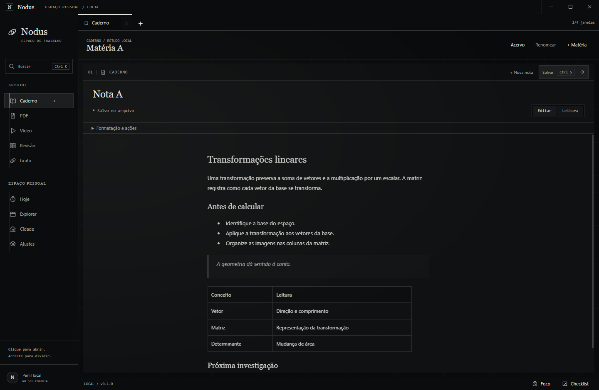
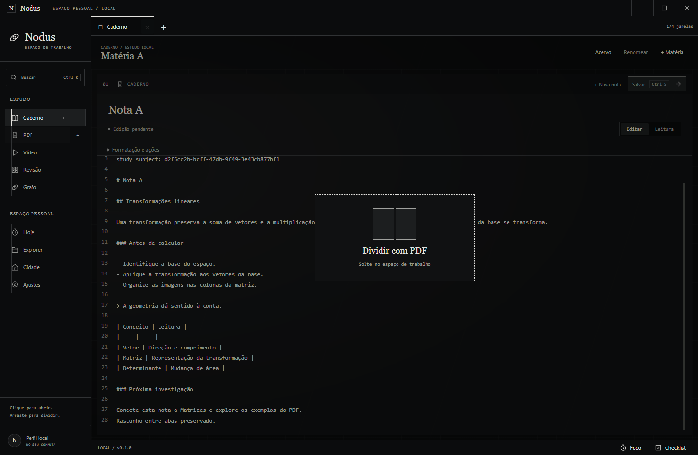
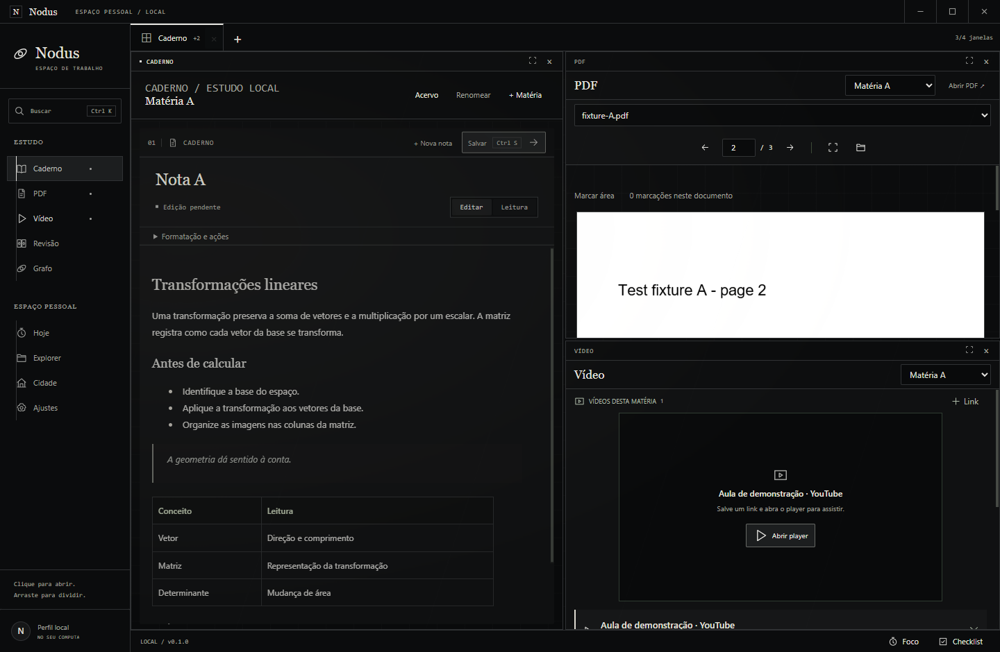
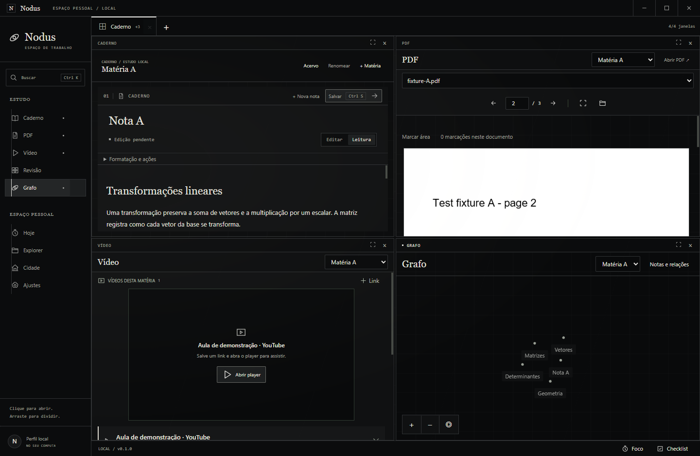
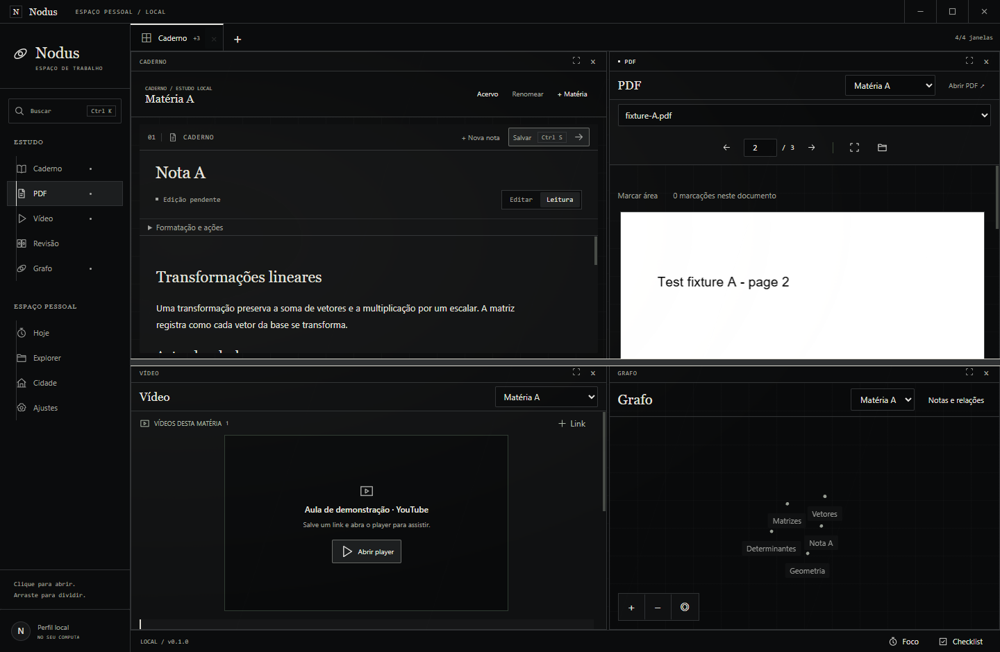
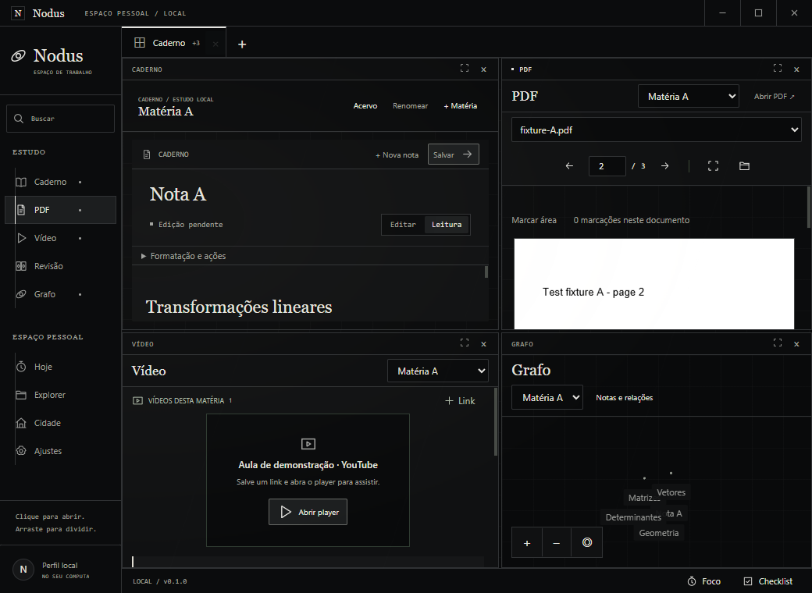
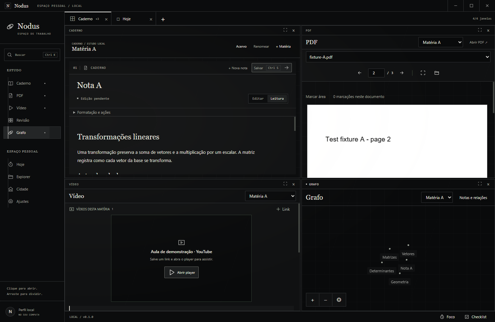
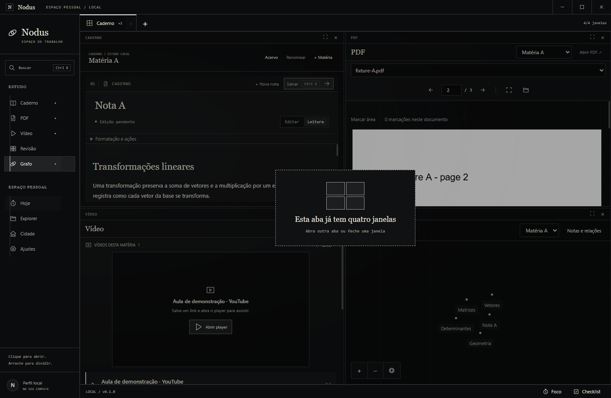
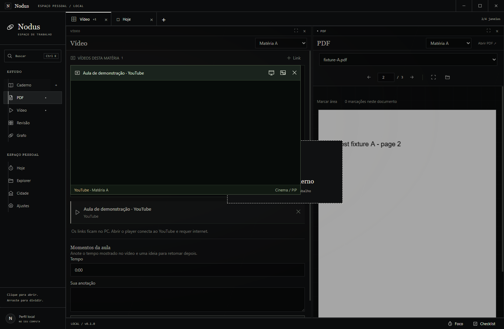
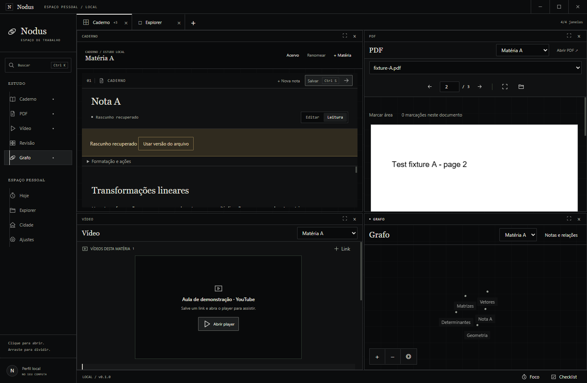

# UI-05 — Abas e grade de estudo

07/10/2026, Windows 11 10.0.26200, Node 24.19.0, Electron 44.5.1, app 0.1.0; branch codex/study-tabs de 8f6cbcb, GAM-04 preservado.

## Provas executadas

Typecheck/56 testes de domínio, build/pacote Windows e `scripts/smoke-study-tabs.ts` aprovados: nove módulos laterais, arraste real/preview, três com esquerda inteira, quatro em 2×2, limite/foco sem duplicação, mouse/teclado,1040×760, atalhos/fechamento/isolamento de abas, player oficial real conservando guest entre abas/PiP e sem interceptar arraste/resize, restart/drafts/fontes/PDF2/foco pausado e movimento reduzido; nenhum pageerror. [Resultados sanitizados](evidence/study-tabs/results.json); fixture isolada study-tabs-* passa pelos serviços reais de vault/SQLite/IPC. Passagem anterior `--no-network` prova somente trecho local. A prova final espera controles/canvas do Grafo dentro da janela ao retornar de aba ampliada, cobrindo O-021.

`smoke-videos.ts --packaged` aprovado antes do último ajuste CSS do Grafo: reprodução real, cinema/Escape, PiP/Configurações, scroll/retorno entre matérias, crash/retry remoto isolado, restrições do guest e PDF2. `smoke-journey.ts` aprovou R1–R7 (notas/salvamento/duas matérias/duas fontes PDF/checklist/foco/restart/edição externa/conflito); R8 nuvem/celular continua não verificado. A prova principal com player/abas foi reconferida no pacote final após O-021. `smoke-clean-workspace.ts` também passou no pacote final: relação real/câmera/zoom/pan do Grafo, movimento reduzido,61cliques exatos e40pendentes drenados ao fechar, Memória/Mercado/Personagem, QTE36 com36acertos em7017ms e calibração36 com36acertos em31503ms, sem preparo intermediário; fontes/drafts/foco/PDF/restart intactos. Não há implementação pendente em UI-05.

Execução com Node24 explícito: `node_modules/typescript/lib/tsc.js --noEmit`, `node_modules/tsx/dist/cli.mjs --test tests/*.test.ts`, `scripts/build.mjs`, `node_modules/electron-builder/cli.js --win --dir`, e os roteiros pela CLI de tsx. Nenhuma migration/dependência/configuração global adicional.

## Pacote final

[Manifesto conferido](evidence/study-tabs/package-evidence.json):201arquivos dist idênticos aos bytes extraídos do ASAR. Executável Windows SHA256 `bb6c801189335516a40880fe01fa3347c62c5de6eb7347bd7d832339373e6e72`; ASAR `a49ff74ec400d9767cbe4323770b3075dcd9b14294cddd36dc26a3ab2ed89003`. A última mudança de fonte após o primeiro pacote foi somente o CSS minmax(0,1fr)/min-width:0 do Grafo; o roteiro foi ampliado para verificar seus bounds.

## Capturas reais

Fixtures identificadas, capturadas do executável Windows e inspecionadas visualmente. Prévias não são montagens.

## Limites

Abas guardam composição, foco e divisores; matéria/nota/documento/player compartilhados. Até32abas, quatro módulos distintos/aba; nenhuma janela nativa extra. Player usa PiP quando a janela não comporta a superfície mínima. Capturas são fixtures identificadas; nenhum vault/material pessoal. Alpha externa conserva pendências.
