# IA-01 — Verificação de atividades por IA externa

07/10/2026, Windows11 10.0.26200 x64, branch codex/external-study-activities criada de f6d1a67. Node24.19.0 chamado explicitamente pelo runtime local (o npm do host apontava para Node26). App0.1.0, Electron44.5.1, React19.3, TypeScript5.9.3, Zod4.6.5 e PDF.js6.3.289 conforme instalação/lockfile conferidos. Nenhuma dependência nova, atualização ampla ou chave/.env. A implementação foi validada localmente; pedido posterior "abre o pr" autorizou sua entrega por commit/push/PR, sem release ou serviço publicado.

## Evidência e critérios

Fixtures declaradas de duas matérias em tests/fixtures/activities. Quiz e flashcards têm10itens completos; IDs de pedido/snapshot/referência são vinculados aos IDs reais preparados pelo serviço durante a prova. Nenhuma resposta de provedor real foi solicitada. O PDF de três páginas vem de scripts/test-fixture.ts e foi extraído pelo PDF.js real na janela isolada. Os dados de execução ficaram em .local, separados do perfil pessoal.

| Critério | Resultado | Prova |
| --- | --- | --- |
| C1 | aprovado | UI selecionou duas notas, PDF de três páginas e anotação local42s; pacote conserva fonte/código integral e exclui marcador de outra matéria; snapshot/hash/localizações verificados |
| C2 | aprovado | Clipboard Windows aguardado/conferido; falha injetada sem Copiado e com texto manual; reaberturas mantêm pedido/prompt/snapshot/original validado |
| C3 | aprovado | Limite configurável2.000para prova bloqueou cópia e listou fontes maiores; pacote não truncado; default100.000 e tamanho final expostos |
| C4 | aprovado | Quiz por colagem e arquivo, flashcards por arquivo e colagem, validação do mesmo serviço; transações persistem atividade real e prática Windows |
| C5 | aprovado |15testes específicos: sintaxe/truncamento/duplicatas escapadas/versão/tipo/nível/quantidade/IDs/tupla/textos/gabarito/campos/referências/complementos/limites; desconhecidos têm caminho do campo |
| C6 | aprovado | Caminhos/linha2coluna5 reais e regras; UI conserva original e copia contrato/metadados/relatório/resposta; correção completa revalidada; orçamento curto identificado e testado |
| C7 | aprovado | Complemento em revisão/revelação; referência PDF2 abre leitor; fonte alterada/ausente avisa e preserva trecho integral; fonte sem tema/ausente recusa preparo |
| C8 | aprovado | Replay de arquivo não cria atividade/tentativa/cartão/recompensa; revisão2 conserva tentativa1; trigger real de falha impede atividade/cartões parciais; concorrência e rollback de respostas/finalização testados |
| C9 | aprovado | UI retoma2/10respostas após reabrir, finaliza10/10/100% com10explicações;10cartões reveláveis e Study.review persistido; importação não altera recibos/progresso/ledger |
| C10 | aprovado | Zero pageerror/HTTP(S) no renderer do fluxo; HTML em string sem elemento/execução; nove canais negados para outra BrowserWindow real; fonte original conservada; provas/build/pacote/docs locais |

Relatório de UI: [smoke.json](evidence/external-activities/smoke.json). Resultado final: três atividades,10cartões, uma revisão de cartão e duas tentativas de quiz. A escolha explícita do pedido de outra matéria apenas validou/correlacionou, sem importar automaticamente. O gabarito esteve ausente da tentativa; KPIs/explicações aparecem após finalizar. Biblioteca de cartões existente é recarregada ao voltar do modo Atividades.

## Comandos efetivamente executados

Executados a partir da raiz com o node.exe24 local, sem alterar PATH/configuração global:

```text
node24 node_modules/typescript/bin/tsc --noEmit
node24 node_modules/tsx/dist/cli.mjs --test tests/*.test.ts
node24 node_modules/tsx/dist/cli.mjs --test tests/study-activities.test.ts tests/study.test.ts
node24 scripts/build.mjs
node24 node_modules/electron-builder/cli.js --win --dir
node24 node_modules/tsx/dist/cli.mjs scripts/smoke-external-activities.ts
node24 scripts/verify-activities-package.mjs
node24 scripts/check-bootstrap.mjs
git diff --check
```

Typecheck aprovado. Suíte inicial após migração:67/67aprovados. Após correções/novos casos pertinentes:19/19aprovados (15da feature e quatro da revisão existente). A suíte inteira não foi repetida sem necessidade. Build e empacotamento Windows aprovados. Bootstrap aprovado:26tickets/176critérios/125Markdown/539links locais; diff e21novos arquivos de texto sem problemas de whitespace, stage vazio. Manifesto documental corresponde ao ASAR final. Avisos existentes de chunk grande/autor ausente/dependências duplicadas não impediram os comandos.

Jornada Windows aprovada no executável empacotado, incluindo extração PDF, clipboard real, falha de clipboard injetada, JSON duplicado, correção, três reaberturas, quiz completo, importação por arquivo, revisão distinta, flashcards, falha real de transação injetada, fonte mudada/ausente, limite, divisão com PDF a1040×760 e pedido correspondente. Tempo da tentativa exibido é o da automação, não experiência humana ou duração pedagógica estimada.

## Pacote Windows

204arquivos de dist comparados byte a byte ao ASAR pelo verificador, incluindo os três assets novos da extração. [Manifesto/hash](evidence/external-activities/package.json). Executável local em release/win-unpacked/App Estudos.exe; nenhuma release publicada. Hashes finais são registrados no manifesto; não são hashes de uma versão assinada/publicada.

## Capturas

Capturas da interface real com fixtures, após a animação dos diálogos terminar. Sem vault/banco/arquivos pessoais.

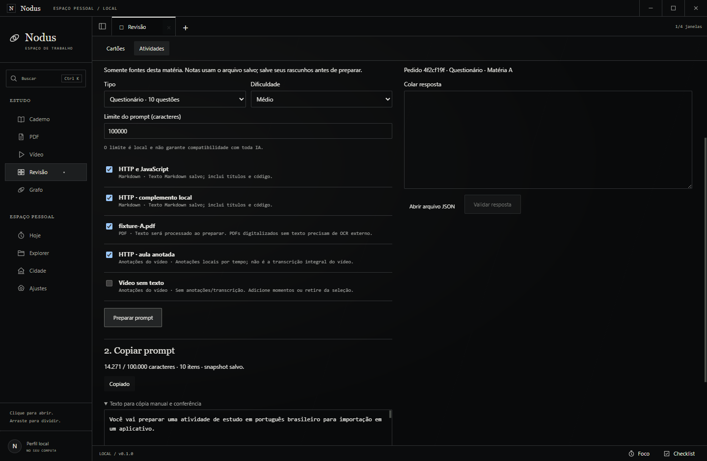
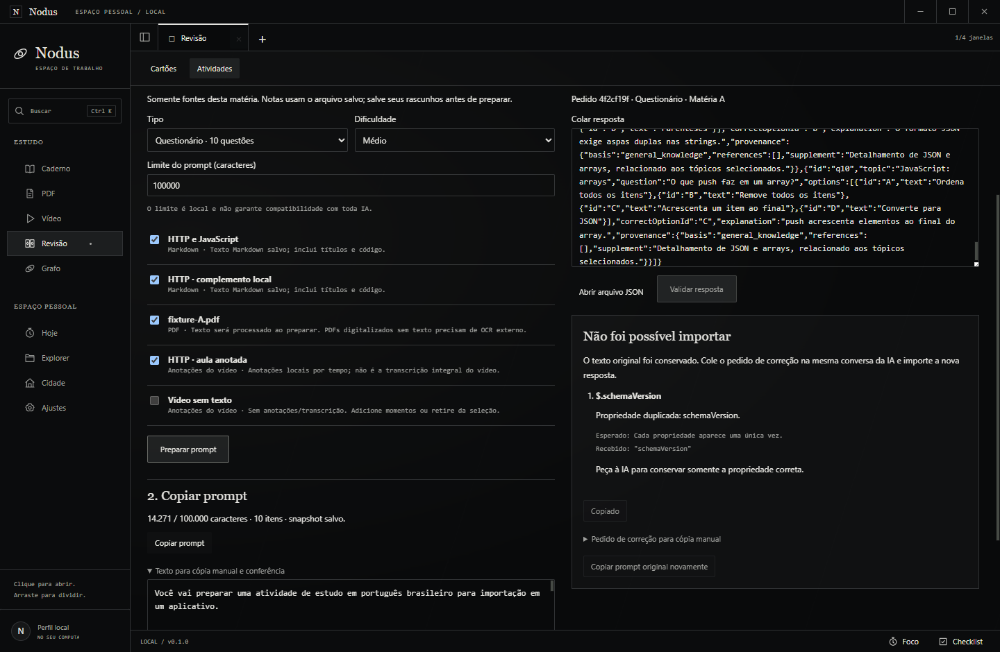
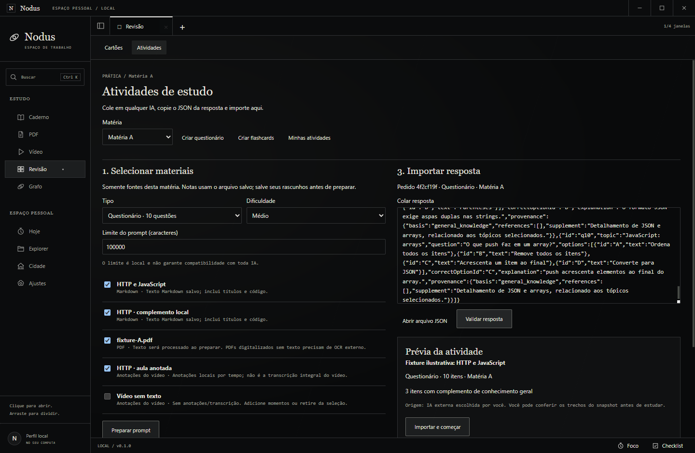
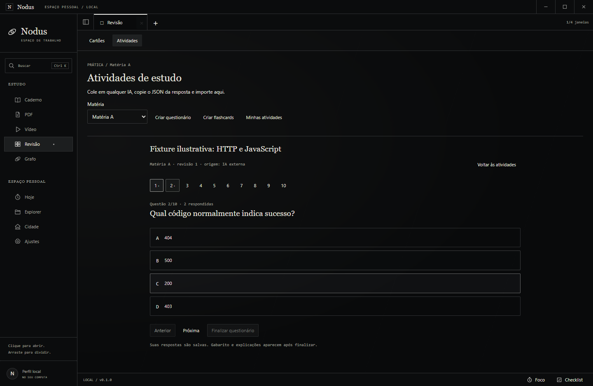
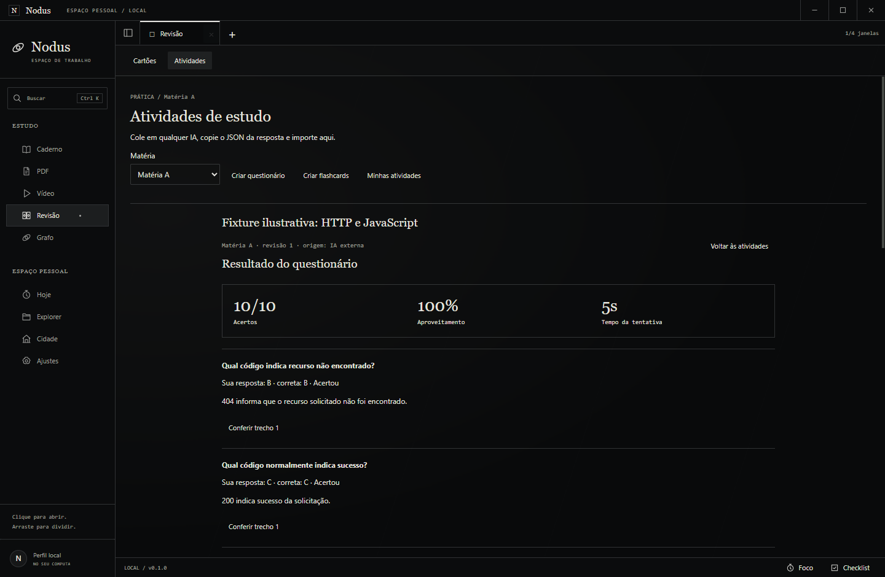
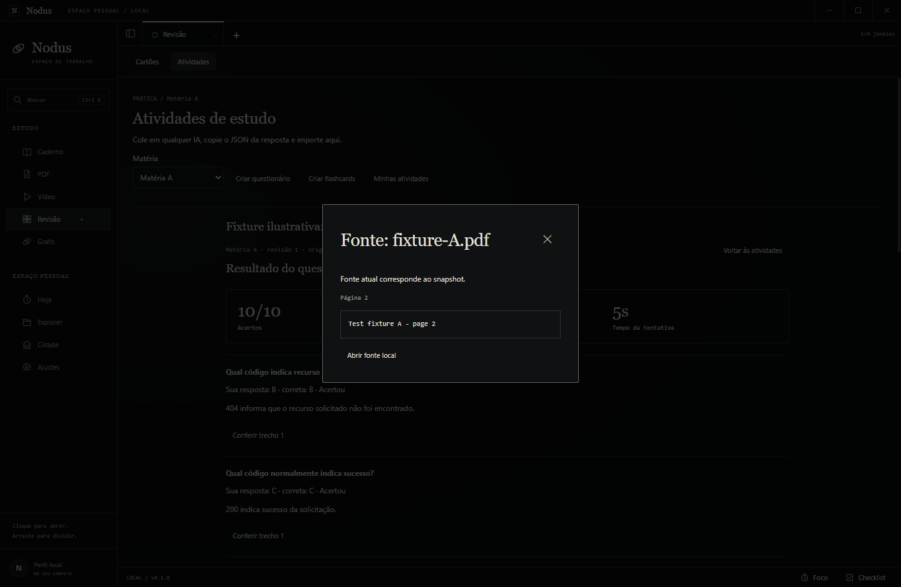
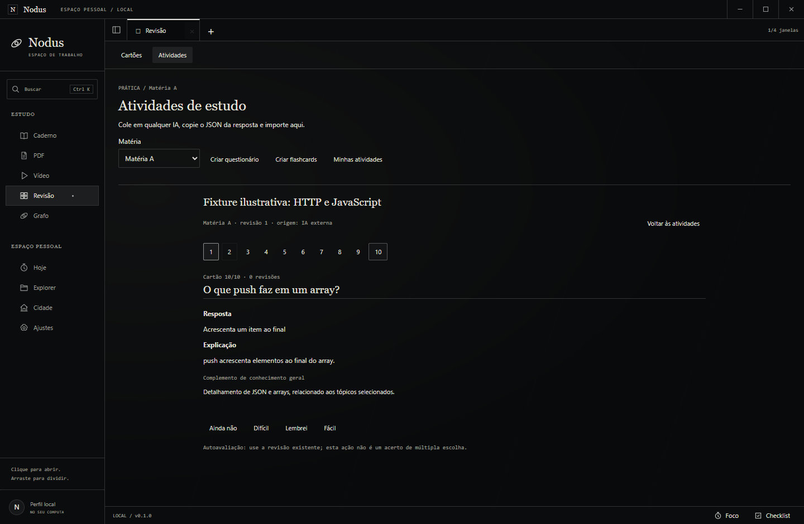
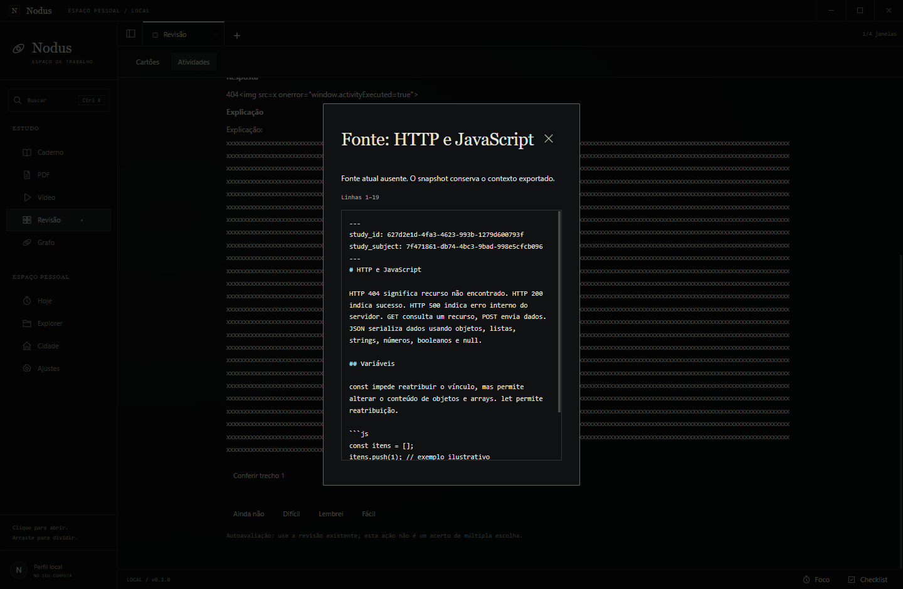
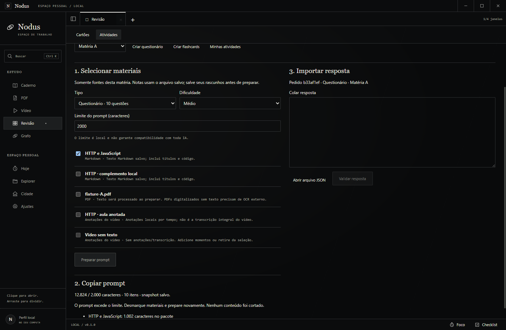
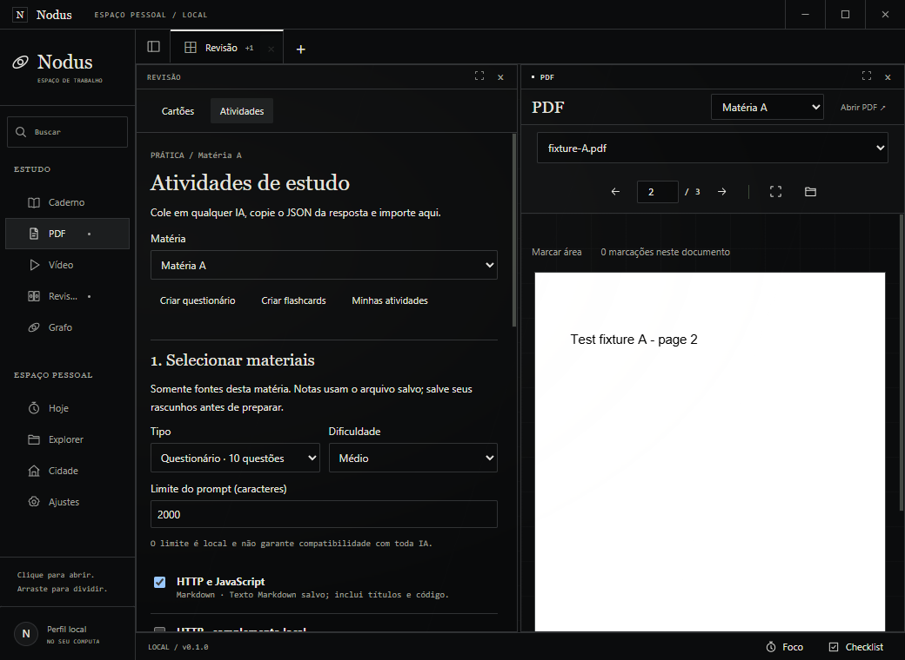
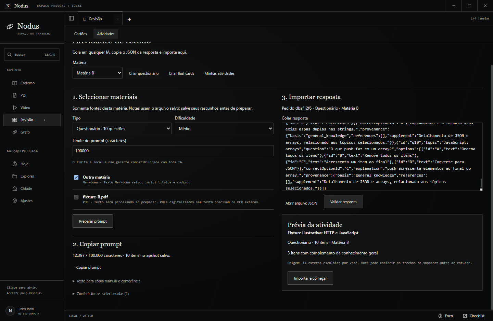

## Falhas encontradas e correções

Testes iniciais identificaram chamadas internas com campos extras ao projetar DTOs estritos; serviços agora passam somente as propriedades de cada operação. O tipo diferente do pedido é relatado antes de erros estruturais dos itens. API do clipboard instalado é assíncrona e agora aguardada. Extração PDF ganhou handler próprio por sessão isolada; PDF.js6 usa os parâmetros reais da versão instalada.

Conferência final alinhou excerpt do serviço de cartões ao contrato de explicação de4.000caracteres; prova de importação/persistência integral passou. A captura real de texto longo sem espaços mostrou overflow; overflow-wrap:anywhere/min-width corrigiram sem truncar, e a jornada final mede ausência de rolagem horizontal. Biblioteca existente é recarregada ao alternar do modo Atividades. Falhas de roteiro por título atualizado/seletores duplicados e ledger inicial do jogo foram corrigidas na automação, sem atribuí-las ao produto. O ledger de importação é comparado ao estado inicial, que inclui o registro já existente de inicialização.

## Limites e pendências

C1–C10 entregues no ambiente Windows local. Sem prova de resposta de um provedor real: a funcionalidade é manual e as provas usam fixtures declaradas pelo pedido. Validação não certifica qualidade acadêmica, ambiguidade, tema adequado ou gabarito semanticamente correto. PDFs sem texto precisam de OCR externo; links/vídeos exportam só anotações efetivas. Nenhum serviço IA/nuvem/algoritmo econômico foi acrescentado; ALP-02/C5 e ALP-09 continuam pendentes em seus próprios tickets. Uso/limites/normalizações estão no [contrato](../contracts/study-activity-v1.md) e no [fluxo](../features/atividades-ia-externa.md).

## Entrega Git autorizada posteriormente

Pedido "abre o pr" autorizou commit/push/PR. PR12 já integrado à main; fast-forward de f6d1a67 para c95aabd manteve a árvore idêntica. Implementação6396e32 enviada com upstream; [PR #13](https://github.com/rafafrd/Nodus/pull/13) aberto para main/draft=false e anexado ao chat,3Mermaid/6badges/11prints fixados no commit. HEAD público dos11links confirmou200/image/png; API conferiu corpo exato/head6396e32/base/61arquivos/mergeable=true. Stage seletivo sem perfis/bancos/vault/EXE, patch272.643bytes; Gitleaks8.30.1 dir --redact sem achados, diff --cached --check e bootstrap26tickets/176critérios/125Markdown/539links aprovados. Autenticação da API usou helper Git existente somente em memória após403 do conector, sem credenciais em arquivo/log ou configuração global. Checkpoint documental conserva fontes/assets do pacote; não exige repetição das jornadas já aprovadas. Próxima ação humana: revisar PR13. Nenhuma release/serviço/merge realizado.
